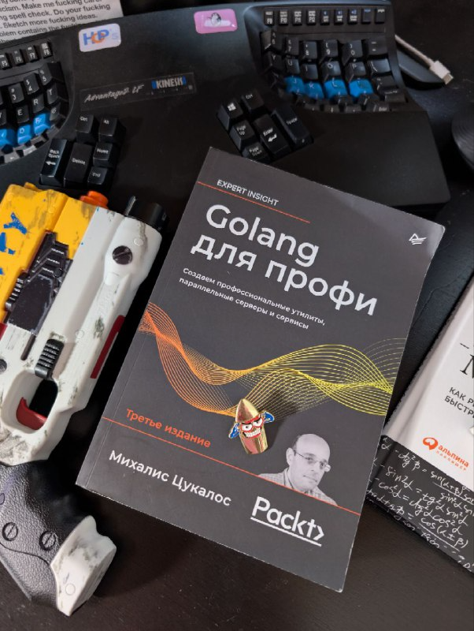

---  
title: Со-творчество с машиной
date: 2025-06-18 
authors:  
  - gardener  
slug: ai-component-tests-example-go  
description:   
    Со-творчество с машиной
    Пишем сервис на Go
categories:  
  - code
  - git  
  - component-tests
  - tests
  - ai
  - go
---

# Со-творчество с машиной

  


Дорогая, работа с AI-агентом превратила меня в супермена. Или супер-мема — сейчас это почти одно и то же.

Я учусь и создаю автоматизацию в разы быстрее. Это новый темп, новый стиль работы.

Помнишь «Джонни-мнемоника»? Как главный герой перевозил информацию в чипе, встроенном в череп? История материализовалась. До нас доходят фрагменты через текстовые каналы.

Где-то китайские специалисты везут 50 ТБ обученных моделей в самолёте из стран с более свободным интернетом. В неоновых лучах Токио якудза с лазерной нитью крадёт первоклассный датасет сверхновой нейросети и перепродаёт через даркнет военным подрядчикам. Проклятая Арасака.

А я тут со своим Go и unit-тестами — как уличный самурай с клавиатурой вместо катаны.

В отражениях небоскрёбов мегаполиса стильные корпораты в дизайнерских костюмах везут обученные модели в гоночных суперкарах. Машина улучшает машину. Recursive enhancement. БУМ.

Я словно с вшитым нейроимплантом: расширенная память, ускоренное написание кода на максималках, прямая связь с матрицей целей. Мои синапсы работают в режиме overdrive.

Быстрее тестирую гипотезы, исследую новые направления. Это прорыв. Digital awakening.

Я не могу объяснить всё — слишком много переварить. Я на эмоциях.

Даже читаю больше и быстрее.

<!-- more -->

## Компонентные тесты. Сервис-поставщик на Go

Я нахожусь в зоне «Прекрасное». В замкнутом цикле играет [саундтрек «Очень странные дела»](https://music.yandex.com/album/29628379). Немного тревожно, но остановиться невозможно.

Машина без устали генерирует варианты улучшений. Параллельно крутится мысль: «Кто из команды лучше справится с этой задачей? А есть ли вообще такая команда единомышленников?»

Шесть подходов по 45 минут и один в 30 (300 минут). Вместе с AI я создал [заготовку сервиса на Go](https://git.codemonsters.team/guides/wallet-balance) и доработал GitLab CI — всего за 5 часов. Планировал работать неделю по 90+ минут в день, рассчитывал на 500-600+ минут напряжённой работы c рискаими. 

На вход подал [AsyncAPI 3.0 спецификацию](https://git.codemonsters.team/guides/mq-rest-sync-adapter/-/blob/main/api-specification/asyncapi.yml?ref_type=heads) — получил результат молниеносно.

Сложнее всего адаптироваться к новой скорости и жить с опережением в будущем, которое незаметно стало настоящим.

Далее идет ROW LOG с инженерными заметками.

## Исходное состояние

Есть [обучающий сервис-перекладчик](https://git.codemonsters.team/guides/mq-rest-sync-adapter/) с проверкой формата и логики сообщений. Получает сообщение из очереди, просыпается и начинает работу.

Логика проста: валидирует запрос в "конверте" и передаёт его сервису-поставщику.

Компонент разработан на Kotlin, протестирован unit и компонентными тестами в изолированной среде.


AsyncAPI 3.0 спецификация валидируется автоматически, все красиво и четко.

Я взял [готовую спецификацию](https://git.codemonsters.team/guides/mq-rest-sync-adapter/-/blob/main/api-specification/asyncapi.yml) и [пример заглушки](https://git.codemonsters.team/guides/mq-rest-sync-adapter/-/blob/main/component-tests/wiremock/mappings/wallet-balance.json) сервиса-поставщика из компонентных тестов потребителя.

## Диалог с агентом:
``` 
 Андерсон, Есть AsyncAPI 3.0.0 спецификация
 Есть заглушка этого сервиса на WireMock:
```

```bash
{
  "mappings": [
    {
      "request": {
        "method": "POST",
        "url": "/api/client/Api-clientId-01/wallet/balance"
      },
      "response": {
        "status": 200,
        "headers": {
          "Content-Type": "application/json"
        },
        "jsonBody": {
          "status": "success",
          "actualTimestamp": 1607449018829,
          "data": {
            "createTime": 1600443296227,
            "operationId": "01",
            "balance": {
              "value": 999.9,
              "currency": "rub"
            }
          }
        }
      }
    }
  ]
}
```

```
Задача:
- Написать AsyncAPI 3.0.0 спецификацию на основе предоставленных данных
- Описать каркас сервиса на Go для дальнейшей разработки
- Наш сервис должен отдавать подобный ответ по HTTP.
```

## Результат:

1. [Подготовил API-спецификацию и настроил её валидацию в CI](https://git.codemonsters.team/guides/wallet-balance/-/blob/feature/asyncapi/api-specification/asyncapi.yml)

2. [Доработал pipeline для непрерывной интеграции с тестом спецификации](https://git.codemonsters.team/guides/wallet-balance/-/blob/feature/asyncapi/.gitlab-ci.yml?ref_type=heads#L1-12)

```yml
stages:
  - test-api-specification
  - unit-tests
  - component-tests

test-api-specification:
  image:
    name: asyncapi/cli:3.1.1
    entrypoint: ['']
  stage: test-api-specification
  script:
    - asyncapi validate ./api-specification/asyncapi.yml

```

3. [Добавил код сервиса с unit-тестами](https://git.codemonsters.team/guides/wallet-balance/-/blob/feature/asyncapi/main.go)
4. [Настроил сборку бинарника со встроенными зависимостями для запуска в минимальном Docker-образе](https://git.codemonsters.team/guides/wallet-balance/-/blob/feature/asyncapi/Makefile?ref_type=heads)

можно без установки Go на хосте протестировать, собрать и запустить, тебе нужен только Docker.

Прочитай [PROJECT-VALIDATION.md](https://git.codemonsters.team/guides/wallet-balance/-/blob/main/PROJECT-VALIDATION.md?ref_type=heads) 
чтобы локально протестировать проект.  
Также можно читать Makefile.

как протестировать:
```bash
docker compose --profile test run test
или
make test
```

как собрать:
```bash
docker compose --profile build run build
или
make build
```

5. [Добавил компонентные тесты и интегрировал их в CI](https://git.codemonsters.team/guides/wallet-balance/-/tree/feature/component-tests?ref_type=heads)

Следовал принципу «голого хоста с Docker» — локально можно проверить всё, имея только хост и Docker Compose.

> У меня есть идея встроить эту непрерывность в процесс разработки по подобию Quarkus.
> Сделал изменине в компонентных тестах, они автоматом запускаются в терминале.

## Следующий шаг: пишем компонентные тесты на Java

> Андерсон, Есть AsyncAPI 3.0 спецификация
> Есть заглушка этого сервиса на WireMock:
> Задача:
> - Написать компонентный тест на Java
> - Использовать Cucumber, AssertJ
> - Запускать тесты в Docker Compose

### Результат:

[Добавил компонентные тесты на Java](https://git.codemonsters.team/guides/wallet-balance/-/tree/feature/component-tests/component-tests?ref_type=heads)

Компонентные тесты на Java с Cucumber иAssertJ.
Код тестов простой и понятный, нет лишних абстракций.
Что еще нужно?
ничего.

### Как локально валидировать проект с компонентными тестами:  

Последовательность действий как в CI:
```bash
export USER_ID=$(id -u)
export GROUP_ID=$(id -g)

./scripts/validate-simple.sh

docker compose --profile test run test
docker compose --profile build run build
cd component-tests
./scripts/run-test-sut-v2.sh

```

Все.

### Еще раз, как зупускаются только компонентные тесты:

```bash
cd component-tests
./scripts/run-test-sut-v2.sh
```

### Что за скрипт ./scripts/run-test-sut-v2.sh?

SUT - system under test.

Скрипт запускает компонентные тесты в Docker Compose,
выводит лог теста и в зависимости от результата в отчете выдает завершающий сигнал.  

Это скрипт используется в CI и завершается с кодом ошибки, если тесты не прошли.

```bash
#!/bin/bash

# Запоминаем время начала выполнения в миллисекундах
START_TIME=$(date +%s%N | cut -b1-13)

# Формируем строку с переменными для docker-compose

echo "🚀 Starting tests for sut with stubs in containers..."
docker compose --file docker-compose-test-sut.yml up --build --force-recreate -d
echo "⏳ Waiting for test-runner container to start..."
docker logs -f test-runner & docker wait test-runner
EXIT_CODE=$?

# Проверяем результат тестов
if [ -f "./build/reports/cucumber.json" ]; then
    if grep -q '"status":"failed"' ./build/reports/cucumber.json; then
        echo "❌ Tests failed! Found failed scenarios in cucumber.json"
        docker logs sut 
        docker compose --file docker-compose-test-sut.yml down
        exit 1
    fi
else
    docker compose --file docker-compose-test-sut.yml down
    echo "⚠️ Warning: cucumber.json not found in ./build/reports/"
    exit 1
fi

docker compose --file docker-compose-test-sut.yml down
echo "✅ Test-runner container finished"


# Вычисляем время выполнения в миллисекундах
END_TIME=$(date +%s%N | cut -b1-13)
ELAPSED_MS=$((END_TIME - START_TIME))

# Конвертируем в минуты, секунды и миллисекунды
MINUTES=$((ELAPSED_MS / 60000))
SECONDS=$(((ELAPSED_MS % 60000) / 1000))
MILLISECONDS=$((ELAPSED_MS % 1000))

echo "⏱️  Script execution time: ${MINUTES}m ${SECONDS}s ${MILLISECONDS}ms"

# Возвращаем код ошибки от контейнера
exit $EXIT_CODE

```

### Валидация AsyncAPI спецификации происходит в докере

./scripts/validate-simple.sh:  
```bash
#!/bin/bash

set -e

ASYNCAPI_FILE="${1:-./api-specification/asyncapi.yml}"
OUTPUT_DIR="${2:-./build}"
CLI_VERSION="${3:-3.1.1}"

echo "🔍 Валидация AsyncAPI спецификации..."
echo "📁 Файл: $ASYNCAPI_FILE"

# Проверка файла
if [[ ! -f "$ASYNCAPI_FILE" ]]; then
    echo "❌ Файл не найден: $ASYNCAPI_FILE"
    exit 1
fi

# Создание директории вывода
mkdir -p "$OUTPUT_DIR"

# Определяем, запущен ли скрипт в интерактивном режиме
DOCKER_FLAGS="--rm"
if [[ -t 0 && -t 1 ]]; then
    # Интерактивный режим (есть TTY)
    DOCKER_FLAGS="--rm -it"
else
    # Неинтерактивный режим (CI, pre-commit hook, etc.)
    DOCKER_FLAGS="--rm"
fi

# Валидация (переведи)
echo "🚀 Запуск валидации..."
docker run $DOCKER_FLAGS \
    --entrypoint='' \
    -v "$(realpath "$ASYNCAPI_FILE"):/app/asyncapi.yml" \
    -v "$(realpath "$OUTPUT_DIR"):/app/output" \
    "asyncapi/cli:$CLI_VERSION" \
    asyncapi validate /app/asyncapi.yml

if [[ $? -eq 0 ]]; then
    echo "✅ Валидация прошла успешно!"
else
    echo "❌ Валидация не прошла!"
    exit 1
fi
```

Можно все завернуть в [Makefile](https://git.codemonsters.team/guides/wallet-balance/-/blob/main/Makefile?ref_type=heads)

Удобно.
Есть варианты куда дальше развивать пример и как упрощать.
Хорошее начало.

## Размер

Ничего нового, критерии эксперимента:

17 мб занимает докер с Go сервисом

Если компилить и упарываться с Грааль Java можно в 90-120 мб упаковать. 

Средний докер с Java приложением 500-800 MB

500Мб vs 9Мб

Экономия дисков и RAM на больших числах может быть существенной.
Эффективное использование ресурсов важно всегда.

## Выводы
Всё упирается в мою выносливость писать промпты и корректировать результаты.


Машина — как реактивный ранец, с которым нужно научиться летать. Работа идёт на совершенно других высотах и скоростях. Это круто, но и перегрузки другие.