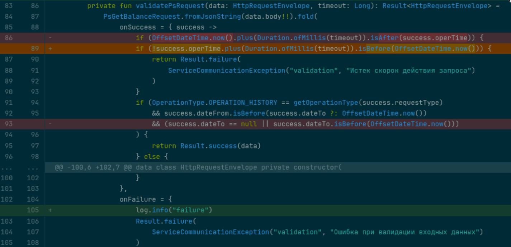
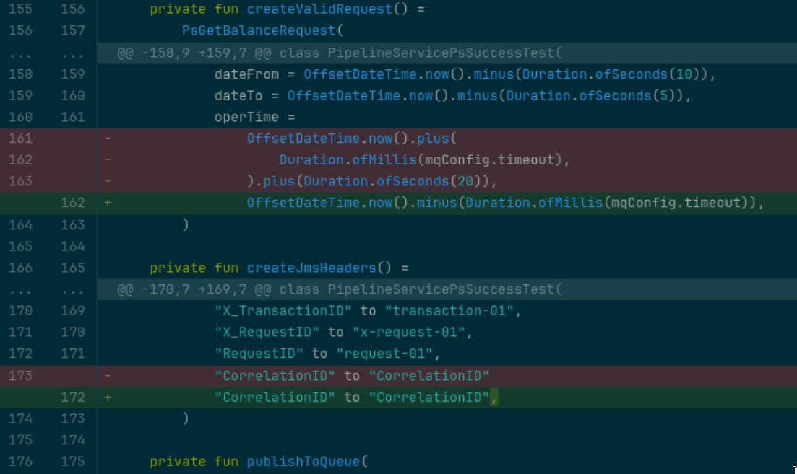
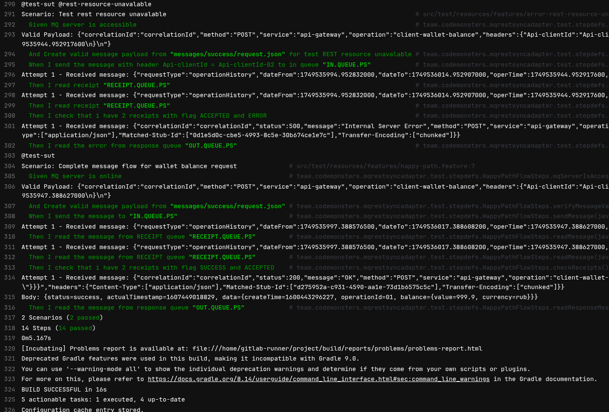
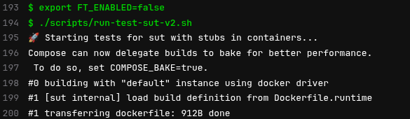
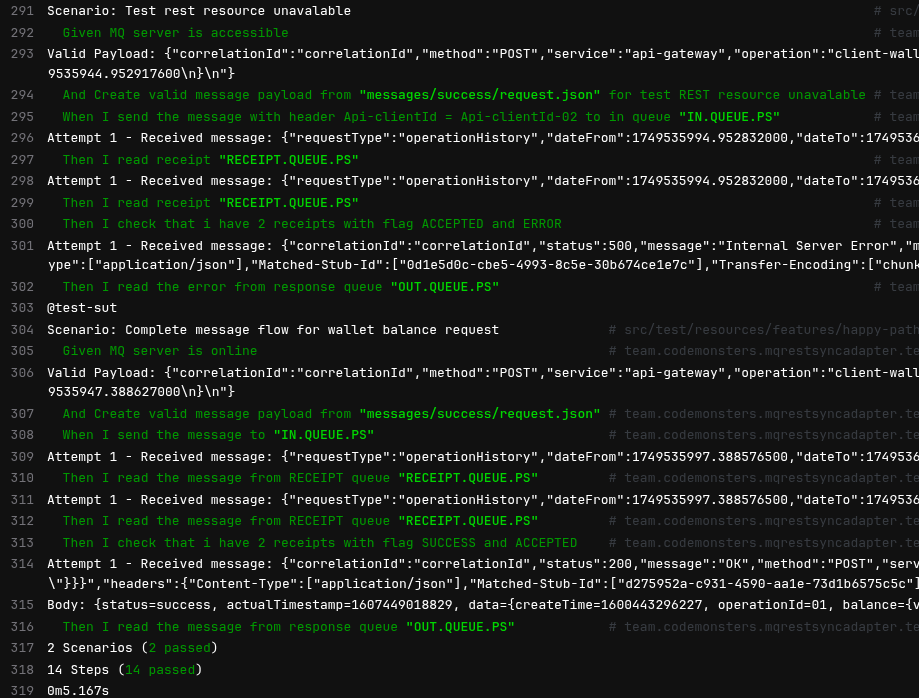

---  
title: Пример разработки с ИИ компонентного тестирования на проекте
date: 2025-06-10  
authors:  
  - gardener  
slug: ai-component-tests-example  
description:   
    Пример разработки с ИИ компонентного тестирования на учебном проекте
categories:  
  - code
  - git  
  - component-tests
  - tests
  - ai
---

# Симбиоз с машиной при разработке. Компонентные тесты  

Киберпространство в срезе кодописи изменяется стремительно.  

Голюцинация:
```bash
#gardener@core: закрываю глаза, обдумываю API компонента, проговариваю контекст, открываю глаза и вижу в git async api 3.0 спецификацию.
```
Я подключился к паре ИИ-имплантов в виде Claude и Cursor. 
VS Code в сочетании с cursor меня очень порадовал на практике. 
Возврат в IntelliJ IDEA теперь ощущается как деградация. 
Горячие клавиши, молниеносные переходы между кодом и терминалом, древо проекта слева — интерфейс стал продолжением нервной системы.

С машиной я взялся за старый учебный сервис. 

Задача: [вшить компонентные тесты в проект](https://git.codemonsters.team/guides/mq-rest-sync-adapter/-/tree/feature/component-tests?ref_type=heads). 

<!-- more -->

За час совместно с курсором настроил курсор. Вот такая интересная рекурсия. VS Code под мои потребности настроен.
Для kotlin проекта пока не удобно, но для java работает хорошо.
С учетом изменения стилистики работы и моего стремления упрощать - результат меня устраивает.  

Два часа в потоке. Результат — чистые компонентные тесты без избыточных абстракций. Код читается как техническая проза, тестирует изолированно компонент, без шума. Очевидно, есть что улучшить, но результат уже многое обещает.  

Настоящий джекпот — компонентные тесты выявили уязвимость в тестах на тест контейнерах (их принято называть на проектах Java - интеграционные тесты). Тесты на тестконтейнерах маскировали логические ошибки, 
подстраиваясь под баг как конформист со временем становится частью тонущего корабля, частью системы, которая кровоточит ошибками. 

Новые компонентные тесты пробили эту иллюзию насквозь и подсветили изьян.
[Переписанный бизнес-процесс](https://git.codemonsters.team/guides/mq-rest-sync-adapter/-/blob/feature/component-tests/src/main/kotlin/team/codemonsters/refactoringexample/walletBalance/application/WalletBalanceService.kt?ref_type=heads) вскрыл и исправил ошибки, которые утаились в коде.

Старая логика работала неправильно (но тесты на тестконтейнерах не выявили этого), я исправляю ее [коммит](https://git.codemonsters.team/guides/mq-rest-sync-adapter/-/commit/82003ca5c4e028cc104a4e18e6799dcab1bc2c2d#deecb4c36cbd25eb864f7edf1cb2d0469b83a7ee_87_89)  

  

Вот этот дефект в тестах на тестконтейнерах, [коммит](https://git.codemonsters.team/guides/mq-rest-sync-adapter/-/commit/82003ca5c4e028cc104a4e18e6799dcab1bc2c2d#3e1081ff7f0d96506faa9aa3b52210e9c6793f23_164_162)  



Точка входа в Бизнес-процесс на старом коде [в git](https://git.codemonsters.team/guides/mq-rest-sync-adapter/-/blob/feature/component-tests/src/main/kotlin/team/codemonsters/refactoringexample/service/PipelineServicePS.kt?ref_type=heads#L58).


С машиной накодил docker-compose для сборки [docker-compose.yml](https://git.codemonsters.team/guides/mq-rest-sync-adapter/-/blob/feature/component-tests/docker-compose.yml?ref_type=heads)  
```yaml
services:
  # Сервис для сборки
  builder:
    build:
      context: .
      dockerfile: Dockerfile.build
      args:
        USER_ID: ${USER_ID}
        GROUP_ID: ${GROUP_ID}
    user: $USER_ID:$GROUP_ID
    volumes:
      - .:/app
      - gradle-cache:/home/runner/.gradle
    command: | 
        bash -c '
          whoami
          pwd
          ls -la
          ls -la /home/runner
          ./gradlew build
          chmod -R 777 ./build
          chown -R $(id -u):$(id -g) ./build
          chmod -R 777 .gradle
          chown -R $(id -u):$(id -g) .gradle
        '
    profiles: 
      - build

  # Сервис для запуска приложения
  app:
    build:
      context: .
      dockerfile: Dockerfile.runtime
    ports:
      - "8080:8080"
    environment:
      - JAVA_OPTS=-Xms64m -Xmx256m
    profiles:
      - run

volumes:
  gradle-cache:

```
Для запуска компонентных тестов [docker-compose-test-sut.yml](https://git.codemonsters.team/guides/mq-rest-sync-adapter/-/blob/feature/component-tests/component-tests/docker-compose-test-sut.yml?ref_type=heads)  
```yaml
services:
  # IBM MQ Service
  ibmmq:
    image: docker.io/ibmcom/mq:9.2.4.0-r1-amd64
    hostname: ibmmq  # Важно для корректной работы MQ!
    container_name: ibmmq
    ports:
      - "1414:1414"
      - "9443:9443"
    environment:
      - LICENSE=accept
      - MQ_QMGR_NAME=QM1
      - MQ_DEV=true
      - MQ_ADMIN_PASSWORD=passw0rd
      - MQ_APP_PASSWORD=passw0rd
      - MQ_CHANNEL=DEV.APP.SVRCONN  # Канал по умолчанию
    networks:
      - test-network
    volumes:
      - ./scripts/mqsc/20-config.mqsc:/etc/mqm/20-config.mqsc:Z
    healthcheck:
      test: ["CMD-SHELL", "chkmqhealthy || exit 1"]
      interval: 10s
      timeout: 5s
      retries: 5

  # WireMock REST API Stub
  wiremock:
    image: docker.io/wiremock/wiremock:3.13.0
    container_name: wiremock
    hostname: wiremock
    ports:
      - "8080:8080"
    volumes:
      - ./wiremock:/home/wiremock
    command: 
      - --global-response-templating
      - --verbose
    networks:
      - test-network
    healthcheck:
      test: ["CMD", "curl", "-f", "http://localhost:8080/__admin/mappings"]
      interval: 5s
      timeout: 3s
      retries: 5
  
  sut:
    build:
      context: ../
      dockerfile: Dockerfile.runtime
    container_name: sut
    environment:
      - spring.profiles.active=dev
      - ibm.mq.queueManager=QM1
      - ibm.mq.channel=DEV.APP.SVRCONN
      - ibm.mq.connName=ibmmq(1414)
      - ibm.mq.user=app
      - ibm.mq.password=passw0rd
      - rest.configs.api-gateway.url=http://wiremock:8080
      - rest.configs.api-gateway.basic-auth.user=client
      - rest.configs.api-gateway.basic-auth.password=password
      - features.toggles.wallet-balance-workflow.enabled=$FT_ENABLED
    ports:
      - "8081:8080"
    networks:
      - test-network
    healthcheck:
      test: "curl --fail --silent localhost:8081/actuator/health | grep UP || exit 1"
      interval: 20s
      timeout: 5s
      retries: 5
      start_period: 40s 
    depends_on:
      ibmmq:
        condition: service_healthy
      wiremock:
        condition: service_healthy
  
  # Тестовый контейнер (если запускаете тесты как отдельный сервис)
  test-runner:
    image: docker.io/codemonstersteam/jdk21-deps:0.0.4
    container_name: test-runner
    environment:
      - MQ_HOST=ibmmq
      - MQ_PORT=1414
      - MQ_QMGR_NAME=QM1
      - MQ_CHANNEL=DEV.APP.SVRCONN
      - MQ_USER=app
      - MQ_PASSWORD=passw0rd
      - WIREMOCK_HOST=wiremock
      - WIREMOCK_PORT=8080
    volumes:
      - ./:/home/gitlab-runner/project:Z
    working_dir: /home/gitlab-runner/project
    command: |
      bash -c '
        echo "log of test-runner"
        id
        ls -la
        echo "pwd > $(pwd)"
        ./gradlew cucumber -Dcucumber.filter.tags="@test-sut"
        chmod -R 777 ./build
        chmod -R 777 .gradle
      '
    networks:
      - test-network
    depends_on:
      ibmmq:
        condition: service_healthy
      wiremock:
        condition: service_healthy
      #sut:
        #condition: service_healthy

# MQ-REST-Sync-Adapter Service
networks:
  test-network:
    driver: bridge

```
отладил с машиной CI [gitlab-ci.yml](https://git.codemonsters.team/guides/mq-rest-sync-adapter/-/blob/feature/component-tests/.gitlab-ci.yml?ref_type=heads)   
```yaml
stages:
  - test-api-specification
  - unit-tests
  - component-tests

test-api-specification:
  image:
    name: asyncapi/cli:3.1.1
    entrypoint: ['']
  stage: test-api-specification
  script:
    - asyncapi validate ./api-specification/asyncapi.yml

unit-tests:
  tags:
    - compose
  stage: unit-tests
  variables:
    DOCKER_HOST: "unix:///var/run/docker.sock"
  needs:
    - test-api-specification
  script:
    - export USER_ID=$(id -u)
    - export GROUP_ID=$(id -g)
    - docker compose --profile build up
    - ls -la build/
  artifacts:
    paths:
      - build/
    expire_in: 5 day

component-tests:
  tags:
    - compose
  stage: component-tests
  variables:
    DOCKER_HOST: "unix:///var/run/docker.sock"
  needs:
    - unit-tests
  script:
    - export FT_ENABLED=true
    - ls -la build/
    - cd component-tests
    - ./scripts/run-test-sut-v2.sh
    - export FT_ENABLED=false
    - ./scripts/run-test-sut-v2.sh
  artifacts:
    paths:
      - component-tests/build/
    expire_in: 5 day

```
настроил GitLab runner под конкретную задачу.  
Больше времени ушло на администрирование и полировку результатов тестов, чем на саму разработку.  

## Следующий уровень 
Что ждет меня дальше?  
Интеграция контрактных тестов в конвейер, сервис-поставщик на Go, связка пайплайнов через Pact. 
Финальная цель — непрерывная поставка в Kubernetes двух сервисов, работающих стабильно в изоляции и в как следствие стабильно работающие в связке в Kubernetes (на PROD полигоне).

## Вердикт 
Cимбиоз с ИИ уже сейчас ощущается как качественный скачок. 
Разработка стала не просто продуктивнее — она стала увлекательнее.

## Заключение: лог компонентных тестов в гитлаб раннере

  

  

  

