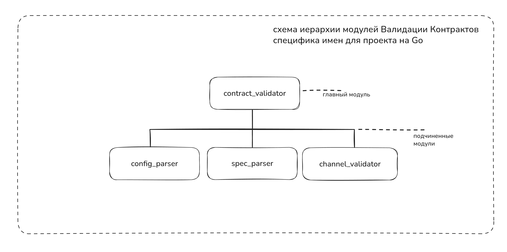

---  
title: Со-творчество с машиной часть вторая > контрактные тесты
date: 2025-09-14 
authors:  
  - gardener  
slug: ai-contract-tests-example-go  
description:   
    Со-творчество с машиной
    Пишем инструмент валидации контрактов между сервисами по спецификации AsyncAPI 3.0 на Go
categories:  
  - code
  - claude
  - contract-tests
  - tests
  - ai
  - go
  - devops
---
# Эксперимент с ИИ-ассистентом: бег от Pact в сторону валидации AsyncAPI 3.0 спецификаций


>Перевод алгоритма на тот или иной машинный язык задача сама по себе сложная, но она легко поддается механизации. Поэтому возникает большое желание иметь средства автоматизации кодирования.

>1973 Никлаус Вирт. Systematic Programming. An introduction.

Мы живем в невероятном срезе реальности, когда инженеры-программисты получили долгожданные эффективные средства автоматизации кодирования. Цитата вначале статьи - ничто иное как мое отношений к действительности в мире программирования, это не хайп и не илюзии. Это реальность меняющая нашу профессию к лучшему.

Я с большим энтузиазмом смотрю на прогресс ИИ-ассистентов, провожу эксперименты с передовыми их проявлениями(по крайней мере известными и доступными мне), такими как Claude терминал, Cursor.

Один из наиболее влиятельных сторонников структурного программирования профессор Э. В. Дейкстра написал 
> «... Я думаю, мы научились столь многому, что в течение ближайших лет программирование может превратиться в деятельность, во многом отличающуюся от того, что имеется сегодня, настолько отличающуюся, что мы должны очень хорошо подготовить себя к ожидающему нас шоку». 

Он верил, что «семидесятые годы завершатся тем, что мы окажемся способны проектировать и реализовывать такие системы, которые в то время требовали напряжения всех инженерных способностей, причем расходы на них будут составлять лишь небольшой процент в человеко-годах от их сегодняшней стоимости, и, кроме того, эти системы будут фактически свободны от ошибок». Дейкстра смотрел позитивно и предвидел многое. Свободу от ошибок мы не приобрели, хотя отцы основатели нам оставили в наследство все инструменты для этого.

В данной работе я кратко опишу процесс по созданию утилиты на Golang с ИИ-агентом в клод-терминале для валидации контрактов сервисов в ландшафте информационных систем, где у каждого сервиса есть спецификация Async API 3.0.

Также опишу фундаментальные принципы проектирования программы, которые не меняются с течением времени и помогают в работе с ИИ-ассистентами создавать надежные продукты.

<!-- more -->

## Предыстория

Как супергерой надевает костюм в облипку и спускается в темные улицы колечить злодеев(во вселенной DC), так я днем ИТ менеджер, а ранним утром - разработчик экспериментатор на стиле в труселях и тапках.
Для себя я решил, что ислледовать и программировать я буду. Так я буду поддерживать свое мастерство программирования с ИИ или без в достаточной форме, чтобы вести диалог с инженерами на равных.

На работе одно из направлений, которое я возглавляю - направление стандартизации разработки. Мы с командой внедряем лучшие инженерные практики, инструменты, для того, чтобы инженеры в платформах и продуктовых командах могли работать продуктивно не испытывая страдания в выборе инструментов, подходов, шаблонов типовых решений.

Странно продвигать продукт, которым не пользуешься, а стандарт наш продукт. Вот почему хеды профессий у нас интегрированы в команды, чтобы не отрываться от земли далеко, чувствовать пульс разработки, не только писать стандарт, но читать его, применять на практике. 

Моя позиция на работе, более широкий взгляд на ландшафт организации, коммуникация с опытными ИТ-менеджерами и инженерами на разных уровнях от мидлов до CTO, мне помогает сформировать полную и ясную картину о разработке, увидеть больше проблем в организации, чем инженеры могут на местах. В каком-то смысле я сканер. И мне это нравится.

IDE как коннектор помогает мне в работе пройтись по пути разработки свежим взглядом менеджера и тупицы, попробовать все шаги своими руками и вести диалог с инженерами.

В своем эксперименте я дорабатываю [учебный сервис](https://git.codemonsters.team/guides/mq-rest-sync-adapter) по стандарту разработки, экспериментируя с инструментами и проверками на этапе CI.

Если мой опыт поможет кому-то создавать надежные системы, закладывая качественные компоненты в кодовую базу, то это будет награда.

### Путь разработки по стандарту

Если коротко мы разрабатываем и внедряем Конвейер непрерывной поставки.

Это значит основная ветка в Git (main, trunk, mainline) - отображает состояние прода, каждый коммит установлен в прод.

Инженерные практики, которые мы внедряем, эффективно поддерживают автоматизированный конвейер доставки артефактов в прод.
Чтобы основная ветка в Git была зеленой и у нас была возможность автоматом выпускать продукты в прод из основной ветки  необходимо тщательно проверять качество кода на этапе CI и гарантировать, что мы не сломаем прод.
Полной гарантии мы дать не можем на всей широте ландшафта организации, но мы можем свести риски неудачной установки к минимуму благодаря выверенным инструментам автоматической проверки кодовой базы сервиса, а также создать среду для быстрого отката неудачных коммитов и взрастить инженерную культуру в которой инженеры будут работать и мыслить качественно на более высоком уровне, чтобы выкатывать выверенные API с обратной совместимостью, там где это возможно.

Чтобы свести риски к минимуму мы всю работу над артефактами переводим в git.
Это позволяет упрошать инструменты автоматизации для проверки качества и контроля стандарта разработки.

Сильно обобщая, я опишу простой алгоритм разработки сервиса по стандарту.

Для того, чтобы создать [сервис](https://git.codemonsters.team/guides/mq-rest-sync-adapter), нужно:

1. Написать спецификацию [AsyncAPI 3.0](https://git.codemonsters.team/guides/mq-rest-sync-adapter/-/blob/feature/contract-tests/api-specification/asyncapi.yml?ref_type=heads) ✅
2. Описать сервис в [README.md](https://git.codemonsters.team/guides/mq-rest-sync-adapter/-/blob/feature/contract-tests/README.md?ref_type=heads) ✅
3. Написать [компонентные тесты](https://git.codemonsters.team/guides/mq-rest-sync-adapter/-/tree/feature/contract-tests/component-tests?ref_type=heads) ✅
4. Написать контрактные тесты (мы здесь) 💡
5. Реализовать сервис по спецификации AsyncAPI 3.0 ✅

Я намеренно опускаю такие инженерные практики как [TBD](https://trunkbaseddevelopment.com/), [Feature toggles](https://martinfowler.com/articles/feature-toggles.html), которые эффективно поддерживают Конвейер непрерывной поставки. 
Эти инженерные практики мы успешно используем в нашей организации.

На момент написания статьи [код учебного сервиса](https://git.codemonsters.team/guides/mq-rest-sync-adapter) пережил рефакторинг.

Это значит, что он [хорошо структурирован](https://git.codemonsters.team/guides/mq-rest-sync-adapter/-/blob/main/src/main/kotlin/team/codemonsters/refactoringexample/walletBalance/application/WalletBalanceService.kt?ref_type=heads) и его код, гарантирует точность программы.
Точность мы можем гарантировать не благодаря тестам, а благодаря правильному дизайну кода. Нужно использовать подход, при котором мы описываем диапазоны значений входных и выходных данных модулей, методов классов, процедур.
В 70-х его называли защитным программированием.  

Это важная фундаментальная идея и ее просто кодировать. Отметим это для себя ✍️.

В коммерческой разработке команды часто упускают этот фундаментальный принцип, код пишется без учета диапазонов значений входных и выходных данных модулей, методов классов, процедур.
Модули плохо структурированы. Операции ввода-вывода смешаны с бизнес-логикой и всю надежду на доказательство правильности работы программы ложатся на тесты.
Не уверен, что я возьмусь за такое отвественное дело(хоть и очень хочу), как искать первопричину этого недоразумения. Но фундаментальная база у программистов слаба. 

Я не видел разницы между коммерческими и научными программистами, пока не попал в ИТ корпорации, где инженеры с 10-ти летним стажем порой не знают фундаментальной базы, но очень громко кричат про сложности разработки и поддержки программ.

Цитата Вирта:

> Отрицательным следствием быстрого распространения этих ранних языков(высокого уровня) стало то, что программирование разделилось на научную и коммерческую области применений. Считалось, что программирование в основном сводится к кодированию алгоритмов на специальном языке. Поэтому повсеместно установилось мнение, что так называемые научные и коммерческие программисты должны обучаться отдельно друг от друга. Однако на самом деле основные идеи конструирования программ и сами элементарные объекты, которые подвергаются обработке, совершенно не зависят от какой-либо области применения.

Всецелое раскрытие идеи дизайна софта выйдет за рамки данной статьи. Я напишу об этом в отдельной статье.

Таков путь.

### Что мы имеем

Сервис разработан по стандарту.
Это значит:

1. Написана спецификация [AsyncAPI 3.0](https://git.codemonsters.team/guides/mq-rest-sync-adapter/-/blob/feature/contract-tests/api-specification/asyncapi.yml?ref_type=heads) ✅
2. Функция сервиса описана в [README.md](https://git.codemonsters.team/guides/mq-rest-sync-adapter/-/blob/feature/contract-tests/README.md?ref_type=heads) ✅
3. [Компонентные тесты](https://git.codemonsters.team/guides/mq-rest-sync-adapter/-/tree/feature/contract-tests/component-tests?ref_type=heads) написаны с машиной ✅  
  Для постановки использована спецификация AsyncAPI 3.0.
4. Нам нужно написать контрактные тесты (мы здесь) 💡
5. Мы имеем [сервис-поставщик](https://git.codemonsters.team/guides/wallet-balance) (который я написал с машиной на Go). ✅

Итак мой сервис-потребитель готов к следующему этапу тестирования.
Мне нужно написать контрактные тесты, которые будут проверять соответствие контрактов между сервисом потребителем и сервисом поставщиком.

Предлагаю загрузить нам в контекст выжимку про то, что такое контрактные тесты, какие инструменты валидации контрактов существуют.

## Контрактные тесты

Контрактные тесты — это тип тестирования, который проверяет соглашения (контракты) между различными сервисами или компонентами системы. Они гарантируют, что API или интерфейсы работают согласно ожидаемым спецификациям и что изменения в одном сервисе не нарушат работу зависящих от него сервисов.
Основные принципы:

- Потребитель (consumer) определяет ожидания от провайдера (provider)
- Провайдер должен соответствовать этим ожиданиям
- Тесты выполняются независимо для каждой стороны
- Позволяют избежать интеграционного тестирования в некоторых случаях

### Какие инструменты валидации контрактов существуют

**Pact** — самый распространенный фреймворк для контрактного тестирования:
- Поддерживает множество языков (Java, JavaScript, Python, C#, Go и др.)
- Включает Pact Broker для управления контрактами
- Имеет сильную экосистему и документацию

**Spring Cloud Contract** — решение для экосистемы Spring:
- Интегрируется с Spring Boot
- Поддерживает HTTP и messaging контракты
- Генерирует тесты из контрактов

**Dredd** — инструмент для тестирования API против документации

Все эти инструменты требуют дополнительной кодописи для тестирования контрактов.
Я инженер и мне леньь писать еще больше кода.
Я помню основной принцип самурая киберпустоши - лучший код это код, который ты не написал.  

### Идея валидации контрактов по спецификации AsyncAPI 3.0

**Pact** - продукт достойный, не зависит от конкретного фреймворка или языка программирования. Это хорошо.

С чувством перечитал лучшие практики Pact, рекомендации.  

Все красиво для синхронных API. Асинхронные API не поддерживаются.

Начал описывать в BDD стиле тесты в [сервисе потребителе](https://git.codemonsters.team/guides/mq-rest-sync-adapter/contract-tests) и понял — **не могу** написать ни строчки.

Как когда-то японец Акутагава Рюноскэ красиво написал: "ни одна человеческая жизнь не стоит и строки Бодлера" так я не могу писать эти тесты. У Рюноскэ была грустная история, пронзительные романы, простим ему эту мизантропию в пользу Бодлера.

Пальцы отказываются.

***Меня осенило.***

## Утилита валидации контрактов между сервисами

Надеваю халат, спускаюсь в подвал.
Начинаю разрабатывать утилиту валидации контрактов.


Зачем мне писать дополнительный код в BDD стиле, когда у меня есть спецификация AsyncAPI 3.0 у поставщика и потребителя? Я (и машина) все уже написали в репозитории.  

Освежим статус.  
У меня есть:

- Сервис-потребитель
- Сервис-поставщик
- AsyncAPI 3.0 спецификации для обоих сервисов
- компонентные тесты написаны для обоих сервисов

Зачем мне еще что-то писать, чтобы проверить соответствие контрактов?

И вот моя гипотеза.  

**Могу ли я проверить соответствие контрактов, опираясь на Async API 3.0 спецификации?**

Логично, что **да**. Будем смотреть на случай актуальных спецификаций и соответствие сервисов их спецификациям.
Случай инженерной некомпетентности(бутофории в виде неактуальных спецификации AsyncAPI 3.0) не самый важный вопрос. Этот вопрос стоит поднять позже.
Вопрос должен содердать в себе ответ, как средствами автоматизации можно проверить соответствие сервиса спецификации(сервис полность соответствует спецификации в репозитории).

### Первая попытка в спешке и озарте с Клодом
Первая попытка была провальна. Я это понял после того, как посмотрел тесты.
Задачу я поставил слишком обобщенно. Претензий к ассистенту нет.

Я попробовал сформулировать задачу по-другому. 

Второй подход к снаряду.

Задал ограничения на работу:
работаем маленькими итерациями, каждый раз проверяем результат тестом.

Я начал увлеченно экспериментировать над качеством разработки c Claude. 

Задавать вопросы самому себе, опираясь но новый опыт:  

> Как я могу разработать софт лучше, читабельнее, качественнее — с тестами и при этом не написать ни строчки кода вручную?

**Момент истины: 11.07.2025, 5:00**
[первая версия утилиты](https://git.codemonsters.team/guides/mq-rest-sync-adapter/-/tree/feature/contract-tests/contract-tests?ref_type=heads)  

Еле встал в 5 утра. Добрался до Claude терминала, продирая глаза. В тот день стояла дикая жара в Подмосковье. 

> Максим, сейчас ты оператор клод-терминала.
> Окэ

Решил изменить подход к разработке утилиты проверки контрактов по AsyncAPI потребителя и поставщика.

### TDD подход с Claude терминалу (второй подход)

Подумал: давай проверю TDD подход и пойду маленькими шажками с машиной.

**Гипотеза для проверки:** канал и протокол потребителя поддерживается поставщиком.

**Предохранители:** 
- Канал должен содержать обязательно ссылку на сервер
- Описание сервера в спецификации обязательно содержит протокол

От тестов создал с Claude первый шаг проверки. Сохранял каждый шаг TDD в Git.

**Результат:** Получилось лаконично и уже работает!

Я вдохновлен — круто. 
Человек-читатель, мне стало еще интереснее работать с машиной. Продуктивно.

Единственное, что я написал тогда сам — одну корректировку в спецификацию. Остальные корректировки вписывал клодом.

В результате получился [код](https://git.codemonsters.team/guides/mq-rest-sync-adapter/-/tree/feature/contract-tests), который проверяет соответствие контрактов по спецификациям.

[Репозиторий в ветке feature/contract-tests](https://git.codemonsters.team/guides/mq-rest-sync-adapter/-/tree/feature/contract-tests) я оставляю для истории и наблюдения за своим экспериментом.

Перечитывая код и тесты,я увидел недостатки в дублировании кода, ощутил сложность контроля контекста для себя и машины.
Решил улучшить процесс разработки. Начну сначала.
И как ни удивительно(сарказм) все дело в проектировании.

### Банальный момент озарения (третий подход)

Третйи подход к снаряду.

Я решил спроектировать программу на бумаге.
Разделить на модули, задать контракт взаимодействия между модулями. Использовать структурный подход в общении с машиной.


**Цель:** Написать инструмент валидации контрактных тестов на Go по спецификации AsyncAPI 3.0 потребителя и поставщика.

Процесс и результаты разработки: 
[вторая версия утилиты](https://git.codemonsters.team/guides/mq-rest-sync-adapter/-/tree/feature/contract-tests/contract-tests-v2?ref_type=heads)  


**Методология:** TDD (Test-Driven Development) от тестов.

### Входные данные

**Конфигурационный файл** `contract-tests.yaml`:  
- Путь/URL к спецификации потребителя (consumer)  
- Канал взаимодействия с поставщиком  
- URL к спецификации поставщика

пример:
```yaml
# Конфигурация для проверки совместимости контрактов
contract_tests:
  # Спецификация потребителя (локальная)
  consumer:
    spec_path: "../api-specification/asyncapi.yml"
    name: "mq-rest-sync-adapter"
    channels:
      - restGetBalanceRequest
    
  # Спецификация поставщика (удаленная)
  provider:
    spec_url: "https://git.codemonsters.team/guides/wallet-balance/-/raw/main/api-specification/asyncapi.yml"
    name: "wallet-balance-service"
    # Ограничения проверки каналов для данного провайдера

    
  # Настройки проверки
  settings:
    # Уровень логирования: debug, info, warn, error
    log_level: "info"
    
    # Сохранять ли детальный отчет в JSON
    save_json_report: true
    
    # Имя файла для JSON отчета
    json_report_file: "compatibility_report.json"
    
    # Максимальное время ожидания загрузки спецификации поставщика (секунды)
    timeout: 30
    
    # Игнорировать предупреждения (только breaking changes)
    ignore_warnings: false

```

### Пишу постановку машине

Нам нужен модуль contract_validator

Который будет спроектирован по ROP https://fsharpforfunandprofit.com/rop/  
Который поддерживается Го из коробки  

Основная функция validate  
Должна содержать шаги:  

извлечение конфигурации проекта из contract-tests.yaml  
Если ошибка - возвращаем исчерпывающую информацию об ошибке из функции  

Парсим спецификацию потребителя в структуру  
Если ошибка - возвращаем исчерпывающую информацию об ошибке из функции  

Парсим спецификацию поставщика в структуру  
Если ошибка возвращаем исчерпывающую информацию об ошибке из функци

Формируем структуру которая называется ContractValidate и состоит из:    
- Название канала потребителя  
- Структура спецификации поставщика  
- Структура спецификации потребителя  

Проверяем контракты по каналу потребителя (Передаем эту структуру в функцию модуля валидации каналов)

Если ошибка валидации каналов, возвращаем исчерпывающую информацию об ошибке из функции.

Разрабатываем маленькими частями с тестами.


#### Рисую схему иерарихии модулей  




Вот как [валидация](https://git.codemonsters.team/guides/mq-rest-sync-adapter/-/blob/feature/contract-tests/contract-tests-v2/validator/contract_validator.go?ref_type=heads) выглядит на бумаге:


Далее машина структурирует задачу по моей постановке.

Я сохраняю контекст для машины в [CLAUDE терминале](https://git.codemonsters.team/guides/mq-rest-sync-adapter/-/blob/feature/contract-tests/contract-tests-v2/CLAUDE.md?ref_type=heads)

Сохраняю контекст Программы валидации контрактов для себя в [README.md](https://git.codemonsters.team/guides/mq-rest-sync-adapter/-/blob/feature/contract-tests/contract-tests-v2/README.md?ref_type=heads) и тех, кто будет читать код программы.

Получается более точное требование и решение. Это то к чему я стремлюсь.

Вайбы добавляет цитата Вирта, работы которого я очень ценю. Писал отец программирования в 70-х:
Если ты думаешь, что мы далеко ушли в качестве программирования, то ты ошибаешься, нетраннер. 


>Программа должна состоять из инструкций, записанных таким образом, чтобы они были «понятны» вычислительной машине. Хотя мы не знаем, какого рода инструкции и формулы используются в языке программирования, но нам известно, что эти инструкции будут точно специфицировать желаемые действия. Это беспрекословное требование точности составляет, по-видимому, главное отличие общения между людьми от коммуникации между человеком и машиной. Работа с вычислительными машинами требует как точности, так и абсолютной ясности.


Ниже я подробней описываю архитектуру утилиты. 
Понятно описать свою программу, поработать над README.md, это важный шаг.
И это твоя работа - инженер-программист.  

# Архитектурные решения v2

## Шаг 1: Модуль парсера

Для улучшения проекта нужен модуль, который собирает из спецификации (yml файл) структуру, с которой удобно работать:
- **Вход:** строковое представление AsyncAPI 3.0  
- **Выход:** структура данных для модуля валидации каналов  

## Шаг 2: Contract Validator

Модуль `contract_validator` проектируется по **ROP** ([Railway-oriented Programming](https://fsharpforfunandprofit.com/rop/)), который поддерживается Go из коробки.  

### Основная функция `validate` включает шаги:

1. **Извлечение конфигурации** из `contract-tests.yaml`
   - При ошибке → возврат исчерпывающей информации
2. **Парсинг спецификации потребителя** в структуру
   - При ошибке → возврат исчерпывающей информации
3. **Парсинг спецификации поставщика** в структуру
   - При ошибке → возврат исчерпывающей информации
4. **Формирование структуры** `ContractValidate`:
   - Название канала потребителя
   - Структура спецификации поставщика
   - Структура спецификации потребителя
5. **Вызов модуля валидации каналов с данными на вход `ContractValidate`**
   - При ошибке → возврат исчерпывающей информации

Необходимо упростить модуль валидации каналов и адаптировать его для работы с новой структурой.


## Шаг 3: Модуль валидации каналов

### Входная структура:
```go
type ContractValidate struct {
    ConsumerChannelName string
    ProviderSpec        *parser.AsyncAPISpec
    ConsumerSpec        *parser.AsyncAPISpec
}
```

### Задача проектирования модуля валидации каналов
Написать модуль валидации каналов, где каждый канал AsyncAPI ссылается на сервер с указанным протоколом взаимодействия.

### Выходная структура
Необходимо по структурам спецификаций собрать новую выходную структуру:

**Канал потребителя:**  
- Имя канала  
- Протокол  
- Исходящее сообщение (out) — структура сообщений с типами  
- Ожидаемый ответ (in) — структура сообщений с типами  

**Канал поставщика** (соответствует каналу потребителя по протоколу):  
- Имя канала  
- Протокол  
- Входящее сообщение (in) — структура сообщений с типами  
- Ответное сообщение (out) — структура сообщений с типами  

Функция преобразует `ContractValidate` в новую, более полную структуру.  

### Особенности реализации

**Извлечение сообщений:**  
- Входящие сообщения описаны в `channels` (канал ссылается на сервер) и `operations` (операция ссылается на канал)  
- В `operations` должен быть `reply` — указывает на исходящее сообщение операции  

**Поиск соответствующего канала:**  
У поставщика может быть несколько каналов с одинаковым протоколом, но разными структурами сообщений. Поиск нужного канала поставщика происходит по соответствию структуры сообщений потребителя.

### Тестирование
- **1 юнит-тест:** структуру можно собрать по входным данным из конфигурации
- **Универсальность:** код должен работать только с спецификацией AsyncAPI
- **Тестовые данные:** хранить в `testdata/channel_validator`


## Дополнительные требования (19.07.25)

Добавить тест на случай, когда у поставщика есть несколько подходящих каналов по протоколу сервера, и лишь один соответствует по структуре сообщений. 

**Цель тестирования:** показать, как документация демонстрирует соответствие конкретного канала потребителя каналу поставщика.


#### Что было сделано
За несколько недель разработки с ИИ-ассистентом создан полнофункциональный инструмент валидации контрактов:

- **Модуль парсера AsyncAPI 3.0** — полная поддержка спецификации
- **Модуль валидации каналов** — проверка совместимости по протоколам и структуре сообщений  
- **Contract Validator с ROP** — устойчивая обработка ошибок по Railway-oriented Programming
- **300+ comprehensive unit-тестов** — покрытие всех функций с edge cases
- **Стандартизация ошибок** — информативные диагностические сообщения для production

### Выводы

Не пренебрегай проектированием программы и визуализацией алгоритма главного модуля.

Опиши словами, что должна делать программа. 
Сразу подумай, какие сообщения будут использовать модули для взаимодействия и как будут модули возвращить ошибки.
Нарисуй схему иерарихии модулей.

Дай немного времени отстояться идее, если улучшать нечего - пиши машине четкие спецификации, что нужно реализовать и какие структуры данных нужно использовать.
Далее Машина закодирует твой алгоритм и идея с чертежа перетечет в четкие инструкции машине в гит.


Я рекомендую использовать ясный подход в работе с ошибками при котором модуль(функция, метод класса, процедура) возвращает на выход ошибку или результат (он вшит в ДНК Go), так называемый Two Track Type.
Не используй Exceptions в Java, это по своей сути GOTO, который разрывает поток программы.
Сообщество Java программистов так привыкло к такой мешанине, что для них это нормально.

По поводу оператора GOTO велись святые войны в 70-х годах 20-го века.
Примарх Дейкстра (Edsger W. Dijkstra, GO TO Statement Considered Harmful) написал письмо редактору журнала Communications of the ACM по поводу оператора GOTO.

> На протяжении многих лет я очень хорошо знал, что квалификация программистов убывающая функция от плотности операторов GОТО в создаваемых ими программах. Но лишь совсем недавно я обнаружил, почему использование оператора GOTO имеет такие гибельные последствия. Я пришел к убеждению, что этот оператор должен быть исключен из всех языков программирования высокого уровня (кроме, возможно, машинного кода)
 

> Структурное программирование это, не просто программирование без GOTO. Это дисциплина программирования, которая объединяет несколько способов создания ясной, легкой для понимания программы. Вполне возможно писать структурированные программы, содержащие операторы GOTO, равно как и неструктурированные программы, не содержащие ни одного GOTO.

Распишу рекомендации как стоит проектировать модули. 
Все что я напишу, основано на рекомендациях отцов основателей, которые зародились в 70-х годах 20-го века. 
На момент написания статьи (2025 год) они актуальны и им уже 48 лет.
Почти пол века. Ты только вдумайся. Машина, как тебе такое? 
По сути я переписал цитаты из книг опубликованных в 80-х годах 20-го века в советском союзе, но они актуальны и сейчас в силу своей фундаментальности.  

# Как стоит проектировать программу

>Очень интересно, что нисходящий подход к структурному проектированию программы описали в 70-х годах 20-го.
И в этот же момент, в той же книге рекомендовали проектировать сразу с тестами. 
И в то же время были созданы актуальные строгие рекомендации по проектированию модулей, которые я в свое время ввел как требования в команде.

Откинув шум, модные слова из трех букв типа ZDD, DDD, TDD и тд, я рассказажу о том, как стоит проектировать программу.
Более детальные примеры и рекомендации будут в последующих статьях(главах электрокниги).

## ДЕЛАЙ РАЗ:  Нисходящее проектирование программ
При проектировании программы нужно сначала определить необходимый набор функций программы, а затем разработать модули программы.

Программу изначально стоит проектировать низходящим способом проектирования. 
Сверху вниз от общего к частному. 

### Никалаус Вирт, о поэтапном проектировании программы:
>**при конструировании новых алгоритмов нисходящий метод обычно доминирует.**

Вероятно, наиболее общая тактика программирования состоит в разложении процесса на отдельные действия, а соответствующих программ на отдельные инструкции. На каждом таком шаге декомпозиции нужно удостовериться, что 

(а) решения частных задач приводят к решению общей задачи,

(b) выбранная последовательность индивидуальных действия разумна и

(с) выбранная декомпозиция позволяет получить инструкции, в каком-либо смысле более близкие к языку, на котором в конечном счете будет сформулирована программа.


Если видеть в поэтапной декомпозиции и одновременном развитии и детализации программы постепенное продвижение вглубь, то такой метод при решении задач можно характеризовать как нисходящий (сверху вниз). И наоборот, возможен такой подход к решению задачи, когда программист сначала изучает имеющуюся в его распоряжении вычислительную машину и/или язык программирования, а затем собирает некоторые последовательности инструкций в элементарные процедуры или «кластеры действий», типичные для решаемой задачи. Элементарные процедуры затем используются на следующем уровне иерархии процедур. Такой метод (из глубины примитивных машинных команд к задаче, лежащей «на поверхности») называется восходящим (снизу вверх). На практике разработку программы никогда не удается провести строго в одном направлении (сверху вниз или снизу вверх). 
**Однако при конструировании новых алгоритмов нисходящий метод обычно доминирует.**
С другой стороны, при адаптации программы к несколько измененным требованиям предпочтение зачастую отдается восходящему методу.

Оба метода позволяют разрабатывать программы, которым присуща структура, свойство, отличающее их от аморфных линейных последовательностей инструкций или команд машины. И чрезвычайно важно, чтобы используемый язык в полной мере отражал эту структуру. Только тогда окончательный вид получен ной программы позволит применить систематические методы верификации и проследить историю ее развития. Но в бесструктурной записи, например в массе двоичных цифр в памяти машины, в программе не хватает именно того, что позволяет человеку отделить полезную информацию от шума.
 

### Нисходящее проектирование программ

Нисходящее проектирование программ основано на идее уровней абстракции, которые становятся уровнями модулей в создаваемой программе. 

Фрост определяет абстрагирование как процесс «обобщения, при котором внимание концентрируется на сходстве явлений и предметов, и они объединяются в группы на основе этого сходства, давая тем самым нужную абстракцию» 

Например, абстракция готовые счета полезна для тех, кто хочет работать без использования таких понятий, как накладные, чеки, платежи или списки покупателей. Термины «накладные» и др. являются более низкими уровнями абстракции.


В REAME.md обязательно опиши какую задачу решает программа. Дай ответ описанием читателю (прежде всего себе самому) на следующий вопрос: Какую идею решает данный автомат? 

Это будет нашим введением в программу.

```
Пример из ридми сервиса
```

## ДЕЛАЙ ДВА: Опиши на псевдокоде основную функцию программы
Вторым этапом опиши на псевдокоде как будет решать задачу программа в управляющем модуле.

**можно сделать пометки:**  
_**Какие данные поступят на вход. Какие данные будут на выходе.**_

Пример описания программы:

Ссылка на [README.md mq-rest-sync-adapte/contract-tests-v2](https://git.codemonsters.team/guides/mq-rest-sync-adapter/-/blob/feature/contract-tests/contract-tests-v2/README.md?ref_type=heads#%D0%BE%D0%BF%D0%B8%D1%81%D0%B0%D0%BD%D0%B8%D0%B5-%D1%80%D0%B0%D0%B1%D0%BE%D1%82%D1%8B-%D0%BF%D1%80%D0%BE%D0%B3%D1%80%D0%B0%D0%BC%D0%BC%D1%8B)
```
Основная функция validate содержит шаги:  

извлечение конфигурации проекта из contract-tests.yaml в структуру Config
Если ошибка - возвращаем исчерпывающую информацию об ошибке из функции  

извлекаем адрес спецификации потребителя из Config

Парсим спецификацию потребителя в структуру 
Если ошибка - возвращаем исчерпывающую информацию об ошибке из функции  

извлекаем адрес спецификации поставщика из Config

Парсим спецификацию поставщика в структуру  
Если ошибка возвращаем исчерпывающую информацию об ошибке из функци

Формируем структуру для валидации контрактов (ContractValidate), которая состоит из:    
- Название Канала потребителя  
- Структура спецификации поставщика  
- Структура спецификации потребителя  

Проверяем контракты взаимодействия модулей по Каналу потребителя, используем структуры спецификаций поставщика и потребителя.
Если ошибка валидации каналов, возвращаем исчерпывающую информацию об ошибке из функции.
```

Такое описание позволит решить минимум две задачи: понять самому как на самом высоком уровне в управляющем модуле будет работать программа, так и передать это сокральное знание другому инженеру(и машине). Назовем это сохранение контекста для себя и будущего поколения.
Такая запись не требует от инженера много усилий и но сокращает сильно больше времени на изучение программы при передаче другому инженеру. Это важный принцип и выгодная инвестиция в будущее. Его часто упускают и бегут раняя трусы писать код. В результате мы получаем плохо структурированную программу, невозможность проектировать программу с ИИ-помощником. А также получаем программу внутри которой заложены ошибки, которые будут всплывать в результате эксплуатации программы. Часто просто получаем после первой итерации клубок спагетти который неизвестно как работает.
Т.е. структурирование программы и описание на псевдокоде алгоритма работы управляющего модуля структурирует прежде всего мысли инженера.   

Описание на псевдокоде содержит в себе ответы на выжные вопросы. Какю задачи и как решает программа. Часто по такой постановке, можно убедиться, что программа реализована на нижнем уровне неверно. 

## ДЕЛАЙ ТРИ: Нарисуй схему иерарихии модулей
Нарисуй схему иерарихии модулей.
От блок-схемы схема иерархий отличается тем, что не показывает логику принятия решений или точный порядок исполнения модулей.


Укажи какие модули будут на каждом уровне.
Из названий модулей должно быть понятно, какую задачу они решают.
Ниже схемы можно пометить какие структуры будут использоваться в модулях в качестве входных и выходных данных. 
Также это помогает машине избежать дублирования структур, как и тебе.
Каждый модуль должен быть протестирован.
Важно понимать, что каждый модуль, который изображен на схеме управляющего модуля, может быть отдельными внешним сервисом, так и более простыми внутренним модулем программы.
Каждый отдельный внешний сервис (модуль для текущей программы) будет описан в README.md своего репозитория по этим правилам.

Каждый внутренний модуль будет описан на Язаыке Программирования, который принят за стандарт в организации и прогматично протестирован.

## ДЕЛАЙ ЧЕТЫРЕ: Нарисуй блок-схему алгоритма работы программы управляющего модуля
Нарисуй блок-схему алгоритма работы программы управляющего модуля.


Визуализация прекрасно дополняет псевдокод и еще уменьшает когнетивную нагрузку при изучении программы человеком.
Буквально за несколько минут сканирования взглядом инженер сможет понять как работает программа и за что ему стоит "зацепиться" в своем исследовании в первую очередь.

Исследования в области когнитивной психологии и образования подтверждают эффективность визуализации для понимания сложной информации. Вот ключевые направления исследований:

## Теория двойного кодирования (Dual Coding Theory)

Аллан Пайвио показал, что человек обрабатывает визуальную и вербальную информацию через разные когнитивные каналы. Когда информация представлена и визуально, и текстуально, задействуются оба канала, что улучшает запоминание и понимание.

## Теория когнитивной нагрузки

Джон Свеллер и его коллеги продемонстрировали, что хорошо структурированные визуальные схемы снижают внешнюю когнитивную нагрузку, освобождая ресурсы для обучения. Особенно эффективны схемы, которые интегрируют текст и графику, избегая "эффекта разделенного внимания".

## Исследования в области программирования

Исследования Маркуса Рейнферса и других показали, что программисты быстрее понимают код при наличии визуальных диаграмм. Студенты, использующие блок-схемы и диаграммы, демонстрируют лучшее понимание алгоритмов и делают меньше ошибок.

## Мультимедийное обучение

Ричард Майер сформулировал принципы мультимедийного обучения, показав, что сочетание текста с соответствующей графикой значительно эффективнее, чем только текст. Его исследования выявили несколько ключевых принципов: согласованность, смежность и модальность.

## Современные нейрокогнитивные исследования

МРТ-исследования показывают, что при обработке визуально-текстовой информации активируются дополнительные области мозга, связанные с пространственным мышлением, что создает более богатые нейронные связи и улучшает понимание.

Эти исследования объясняют, почему визуализация кода через схемы, диаграммы и псевдокод действительно помогает программистам быстрее анализировать и понимать сложную логику программ.

Я не хочу с тобой общаться на рабате выпытывая какую задачу решает тот или иной модуль.
Давай сделаем побольше работы, заработаем побольше денег и встретимся в баре за обсуждением видеоигр, саунд систем и т.п. и других интересных тем.

# Рекомендации к проектированию модулей

При проектировании программы нужно сначала определить необходимый набор функций программы, а затем разработать модули программы.

Структурное программирование возникло именно из-за того, что «все сложно, тянется дольше и стоит дороже, чем ожидалось». Нисходящая разработка призвана уменьшить сложность программы и дать возможность закончить ее вовремя. Если «что-то портится», то предлагаются средства, которые помогают обнаружить такие места как можно раньше и оставить достаточно времени на их устранение.

Нисходящая разработка может применяться на всех фазах проектирования системы, включая как проектирование программ этой системы, так и проектирование модулей для этих программ.

На рисунке ниже показана система проверки контрактов между сервисами по спецификации AsyncAPI 3.0.


Каждая из программ(модуль) этой системы решает свою часть большой задачи.
Некоторые из этих программ довольно сложны, поскольку выполняют непростую задачу. Например, модуль Проверить контракты реализует сложную бизнес-логику валидации контрактов между сервисами по названию канала потребителя.

Такие программы легче проектировать и раелизовывать, если их в свою очередь разделить на модули.
Тогда программа, решающая большую задачу, состоит из одного или нескольких модулей и является подсистемой. 

Модуль - это последовательность логически связанных фрагментов, оформленных как отдельная часть программы.


Понятие модульности не ново. Модульное программирование возникло еще в начале 60-х годов. Оно характеризуется следующими преимуществами:

1. Большую программу могут писать одновременно несколько исполнителей это позволяет раньше окончить работу.

2. Можно создавать библиотеки наиболее употребительных подпрограмм.

3. Становится проще процедура загрузки в оперативную память большой программы, требующей сегментации. Как следствие такие сервисы проще запускать в контейнерах и оркестраторах контейнеров.

4. Возникает много естественных контрольных точек для наблюдения за продвижением проекта.

5. Облегчается более полное тестирование за счет модульных-тестов самой программы. 
Также облегчается тестирование самого компонента(программы целиков). Если посмотреть на сложную распределенную систему, то можно увидеть, что тестирование каждого компонента это как тестирование отдельного модуля в программе. Если мы можем тестировать правильно спроектированную программу отдельно по модулям, сокращая при этом количество тестов на всю программу целиком(компонентные тесты), то мы можем тестировать сложную систему отдельными компонентным тестами, избегая дорогостоящего тестирования всей системы целиком.

6. Проще проектирование и последующие изменения программы.

Из этих шести преимуществ последние три особо существенны для организаций, которым трудно вовремя создавать хорошо проверенные программы. Важность последнего пункта особенно возросла в связи с тем, что стоимость сопровождения и модификации программ составляет значительную часть общих расходов на обработку данных.

Наряду с этими преимуществами имеются и некоторые недостатки, которые могут привести к возрастанию стоимости программы.

1. Может увеличиться время исполнения программы.

2. Может возрасти размер требуемой памяти как следствие модулей программы. Если смотреть глобально на сложные проекты, то мы получаем рост количества микросервисов.

3. Проблемы организации межмодульного взаимодействия могут оказаться довольно сложными. Проблемы тестирования распределенной системы значительно усложняются.

Для современных компиляторов и операционных систем эти недостатки невелики и обычно окупаются сокращением стоимости разработки и сопровождения.

## Важные свойства модулей

Рекомендации к проектированию модулей(классов, сервисов) хорошо применимы к ООП. Сам ООП несколько переоценен и усложнен. Об этом стоит поговорить отдельно.

В этой статье речь идет о том, как проектировать программу с ИИ-помощником или без него - т. е. как разбивать ее на составляющие модули нисходящим способом. Однако прежде, чем об этом говорить, нужно дать четкое представление о том, что такое модуль. 

Начнем с перечисления некоторых его желательных свойств.

1. Модуль возникает в результате разделения программы на части (или является частью результата совместной компиляции). Он может активизироваться операционной системой (т.е. быть сервисом) или быть под-программой, вызываемой другим модулем.

2. На внутренность модуля можно ссылаться с помощью имени, называемого именем модуля.

3. Модуль должен возвращать управление тому, кто его вызвал.

4. Модуль может обращаться к другим модулям. 

5. Модуль должен иметь один вход и один выход. 
    
    Иногда программа с несколькими входами может оказаться короче и занимать меньше места в памяти. Однако изучение опыта органи заций, применяющих модульное программирование, показало, что пользователи предпочитают иметь несколько похожих модулей, но не использовать несколько входов или выходов в одном модуле. Объясняют они это тем, что единственность входа и выхода гарантирует замкнутость модуля и упрощает сопровождение программ.

6. Модуль сравнительно невелик. 

    Общее правило: модули должны быть достаточно малыми, чтобы их можно было полностью понять за одно чтение. 
    «Использование небольших модулей имеет определенные преимущества. Обнаружено, что небольшие модули позволяют строить такие программы, которые легче изменять, такие модули чаще используются, они облегчают оценку и управление разработкой, легче и качественнее тестируются, их можно рекомендовать и достаточно опытным, и неопытным программистам. 
    
    **Типичные рекомендации:**

    Файлы с кодом: 200-500 строк кода (без учета комментариев и пустых строк)  
    Классы: 100-300 строк кода  
    Методы/функции: 20-50 строк, идеально — до 20 строк  

    **Для микросервисов рекомендации другие:**

    Команда из 3-9 человек должна полностью владеть сервисом  
    Сервис должен быть переписываемым за 2-4 недели  
    База кода сервиса: 1000-10000 строк кода  

    Важно помнить, что это рекомендации, а не жесткие правила. Размер модуля должен определяться его логической целостностью и контекстом проекта. Иногда более крупный, но логически связанный модуль лучше, чем искусственно разделенные мелкие части.

7. Модуль не должен сохранять историю своих вызовов для управления своим функционированием.[]

8. Модуль обладает единственной функцией: это вполне определенное преобразование исходных данных в результат, осуществляемое в процессе исполнения данного модуля. 

    В этом должны состоять все изменения, происходящие от момента входа в модуль до момента завершения его работы. В идеале каждый модуль должен реализовать только одну функцию, причем целиком. Концепция один модуль одна функция служит ключом к хорошо спроектированным программам. Другими словами, модуль это элемент программы, выполняющий самостоятельную задачу. Его функция может быть выражена одной фразой. Вот примеры таких функций:

    ```bash
    Загрузить конфигурацию из файла.

    Загрузить спецификацию из файла в структуру данных.

    Проверить контракт по каналу взаимодействия потребителя.

    Найти контракт поставщика, который соответствует каналу потребителя
    ```

    Таким образом, при проектировании программы нужно сначала определить необходимый набор функций, а затем разработать модули программы. Например, программа Валидации Контрактов По Async API спецификации в рассматриваемой системе могла бы состоять из следующих основных модулей.

    ```bash
    1. Модуль Валидации контрактов
    2. Модуль Загрузки конфигурации Валидации
    3. Модуль Загрузки спецификации из файла
    4. Модуль Проверки контрактов по каналу взаимодействия потребителя
    ```

Рисунок иерархии модулей.


Здесь предполагается, что головной модуль работает в условиях, когда выполнены начальные требования для программы и Конфигурационный Файл контрактного тестирования валиден. Конечно, каждый из изображенных на рисунке модулей также может требовать специфических начальных условий. Важно понять, что на этом этапе проектирования не нужно думать о том, как выполняет свою функцию каждый модуль. Мы не занимаемся пока логикой программы. Важно лишь то, что вызывающий модуль (т. е. главный модуль на рис) рассматривает вызываемый модуль (т. е. Загрузить конфигурацию) как «черный ящик». Черный ящик характери зуется только своим именем и результатами работы. Его можно использовать, ничего не зная о его устройстве. 

На рис. Рисунок иерархии модулей каждый модуль выполняет единственную функцию. Например, головной модуль вызывает последовательно модули для выполнения задачи, а модуль Загрузить спецификацию - загружает спецификацию из yml файла со спецификацией в структуру данных в память машины.


Модульность, основанная на точном соответствии функциям, особенно выгодна тем, что позволяет получать модули, применимые где угодно. 

Например, модуль загрузить спецификацию можно использовать в других системах для работы с спецификацией AsyncAPI 3.0, или можно добавить в программу поддержку OpenAPI спецификаций, подключив его в головной модуль. 

Такая модульность хороша еще и тем, что модули легче проверять. Поскольку функция это определенное преобразование входной информации в выходную, то вход и выход известны уже тогда, когда становится ясно, что именно такой модуль необходим в данной программе. После его изготовления остается только убедиться, что для заданного набора входных данных получаются именно требуемые результаты. 

Пока мы не ушли далеко от главного модуля рассмотрим Вертикальное управление модулями

## Вертикальное управление потоком управления программы

Если вы применяете эти правила для проектирования потоком управления программы - программу легко понять и сопровождать.
В большинстве случаев этих правил будет достаточно для проектирования программы(сервиса).

Передачи управления происходят лишь по вертикальным линиям, соединяющим модули в схеме иерархии. Это означает, что любой модуль может активизировать подчиненный модуль более низкого уровня и получить управление после завершения его работы. Такое вертикальное управление происходит по следующим правилам:

1. Модуль должен возвращать управление тому, кто его вы эвал. Единственным исключением из этого правила может быть только обнаружение неисправимых ошибок, требующее немедленного завершения программы.

2. Модуль может вызывать другой модуль уровнем ниже, он не может вызывать модуль своего уровня или выше. (Однако он может вызывать сам себя это случай рекурсивного программирования.) Подобные связи упрощают межмодульный обмен данными. Однако иногда возникает потребность активизи ровать модуль, расположенный несколькими уровнями ниже. Это разрешено, но в таком случае модуль должен быть указан в схеме несколько раз на соответствующих уровнях. Такие модули следует специально отмечать на схеме нерархии. На-пример, можно провести дополнительные вертикальные черточки.

Конечно, программируется такой модуль только один раз.

3. Принятие основных решений нужно выносить на максимально высокий уровень. Обычно основные решения принимает головной модуль (на первом уровне). Этот головной модуль служит кратким «конспектом» всей программы.

4. Модуль низшего уровня не должен принимать решения за модули высшего уровня. Для иллюстрации обратимся снова к аналогии со схемой организация. Вряд ли мы стали бы думать, что служащий будет принимать решения, которым будут следовать его управляющий, управляющий его управляющего или другие подразделения. Скорее он получит указания своего управляющего и доложит, может ли он успешно их выполнить. Таким образом, модуль не должен производить действий, непосредственно средственно изменяющих порядок работы программы. Он не должен, например, активизировать подпрограмму своего (или более высокого) уровня. Он не должен определять, какая подпрограмма должна выполняться следующей, передавая явный адрес (т. е. используя конструкцию ИЗМЕНИТЬ языка КОБОЛ, оператор перехода по предписанию ФОРТРАНа или переменные типа метка в ПЛ/Л) в программу уровнем выше или того же самого уровня. Независимо от того, что произошло при его выполнении, модуль должен всегда возвращать управление в активизировавший его модуль (т. е. в точку, откуда он был вызван). Модуль низшего уровня может передавать модулю высшего уровня характеристику полученных результатов или исследуемых условий. На основании этих данных модуль высшего уровня решает, что делать. Так, если модуль обнаруживает ошибку ввода, он передает сведения о ней в модуль высшего уровня, который и определяет, какой модуль (модули) вызвать.

**Вертикальное управление обладает рядом преимуществ.**

1. Логика программы становится понятнее.

2. При чтении головного модуля проявляется общая логика всей программы.

3. Программу проще изменять и пополнять.

4. Программирование и проверка вначале модулей высшего уровня, а затем низшего позволяет быстрее обнаруживать логические ошибки.

Модули нижнего уровня нужно детализировать только после определения всех подфункций модулей высшего уровня. Напри мер, модуль Подготовить на рис. 2.5 нужно делить только после выявления всех подфункций модуля ОБРАБОТАТЬ. Это помогает свести к минимуму пропуски или неполный анализ в функциях высшего уровня.

Каждый уровень прямоугольников в схеме иерархии пред ставляет, как уже говорилось, некоторые модули. Например, несмотря на то что модуль Проверить контракты был изменен за счет добавления трех модулей более низкого уровня, он по прежнему остался модулем, который будет в конце концов представлен некоторым фрагментом программы. В самом минимальном варианте этот модуль будет состоять лишь из активизаций соответствующих модулей низшего уровня.


## Как это поможет мне при ООП?

Термин «объектно-ориентированное программирование» был первоначально придуман [Аланом Кеем](https://en.wikipedia.org/wiki/Alan_Kay). Кей был членом команды [XEROX PARC](https://en.wikipedia.org/wiki/PARC_(company)), которая разработала [графический пользовательский интерфейс](https://en.wikipedia.org/wiki/Graphical_user_interface), оконный интерфейс, сделавший современный мир ПК(маков) такими как они есть сейчас.


**N. Wirth, A Plea for Lean Software - ETH Zürich, Reading,. Mass., 1992:**

> Методологии языков программирования особенно противоречивы. В 1970-х годах было широко распространено мнение, что проектирование программ должно основываться на хорошо структурированных методах и уровнях абстракции с четко определенными спецификациями. Абстрактный тип данных наилучшим образом иллюстрирует эту идею и нашел выражение в новых тогда языках, таких как Modula-2 и Ada.

**N. Wirth, A Plea for Lean Software - ETH Zürich, Reading,. Mass., 1992:**
> Достаточно примечательно, что абстрактный тип данных вновь появился через 25 лет после своего изобретения под названием объектно-ориентированный. Суть этого современного термина, который многие считают панацеей, касается построения иерархий классов (типов). Хотя старая концепция не прижилась без нового описания «объектно-ориентированный», программисты осознают внутреннюю силу абстрактного типа данных и переходят на него. Чтобы быть достойным этого описания, объектно-ориентированный язык должен воплощать строгую, статическую типизацию, которую нельзя нарушить, благодаря чему программисты могут полагаться на компилятор для выявления несоответствий. 


Вот что сказал Алан Кей об ООП:
> «Для меня ООП означает только обмен сообщениями, локальное сохранение, защиту и сокрытие состояния процесса, а также крайне позднее связывание всех вещей»

Как можно сподвигнуть инженеров хорошо проектировать модули, т.е. прекрасно справляться с задачей структурирования кода на модули?

1. не поощрять наследование
2. поощрять инкапсуляцию

Донести правильно мысль - что класс это своего рода модуль, который содержит данные и методы работы с данными.
Это коробка, которая может общаться с другой коробкой по средства сообщений. Сообщение - это просто контейнер с данными.
Т.е. примитивный тип (класс).

При таких, казалось бы, простых правилах, можно строить очень качественные сервисы. Инженеру нужно постараться защитить наследование и очень важно объяснять, что задачу нужно решать конкретно, а не универсально.

Униварсальное решение для всех случаев в бэкенде - чаще всего утопия, которая не стоит своих инвестиций.

## ООП Алана Кея

## Алан Кей и объектно-ориентированное программирование

Алан Кей придумал термин «объектно-ориентированное программирование» и считается одним из его основателей, хотя его видение ООП значительно отличается, к сожалению, от того, как оно обычно практикуется сегодня.

## Оригинальное видение Кея

В конце 1960-х — начале 1970-х годов в Xerox PARC Кей разработал Smalltalk, один из первых чисто объектно-ориентированных языков. Его концепция ООП была вдохновлена биологическими клетками и основывалась на:

**Передаче сообщений** — Кей подчёркивал, что объекты должны взаимодействовать через сообщения, а не через прямой доступ к данным. Он знаменито сказал: «Главная идея — это "обмен сообщениями"» и позже сожалел, что термин стал «объектно-ориентированным», а не «ориентированным на сообщения».

Это важно. Представь хорошо структурированную программу, которая состоит из модулей, которые взаимодействуют друг с другом через сообщения. Это никак не противоречит принципам модульности, которые были описаны в 70-х и в этой статье.

**Инкапсуляция и изоляция** — Объекты должны быть как биологические клетки — полностью самодостаточные единицы, которые скрывают своё внутреннее состояние и взаимодействуют только через чётко определённые интерфейсы (API).

Это важно и часто инженеры просто игнорируют этот принцип, что приводит к плохой структуре кода и сложности поддержки.

Объекты должны быть полностью инкапсулированы, то есть их внутреннее состояние и детали реализации остаются приватными и скрытыми. Такая изоляция позволяет объектам развиваться независимо, не влияя на другие части системы, способствуя созданию надёжных и масштабируемых проектов.

**Позднем связывании** — Всё должно связываться как можно позже, обеспечивая максимальную гибкость и адаптивность.

Далее читаем фундаментальную идею хорошей структуры кода.  

**О Объектах как о мини-компьютерах** — Кей представлял объекты как автономные сущности, каждая как компьютер в сети, а не просто структуры данных с прикреплёнными методами.

**Принципе "всё есть объект"** — В идеальном ООП Кея всё, включая числа, классы и даже управляющие структуры, рассматривается как объект. Этот единообразный подход позволяет создать высокодинамичную и гибкую систему, где поведение играет центральную роль. В Smalltalk этот принцип реализован полностью — даже примитивные типы и сами классы являются объектами, которые могут принимать сообщения, что создаёт удивительно согласованную и мощную среду программирования.

## Смена парадигмы

Видение Кея было революционным, потому что оно уходило от представления о программах как последовательностях инструкций, манипулирующих данными. Вместо этого программы становились сообществами независимых объектов, сотрудничающих через сообщения. Это должно было справляться со сложностью через радикальную развязку и создавать системы, способные эволюционировать и масштабироваться.

## Современное расхождение

Кей выражал разочарование основными реализациями ООП, такими как C++ и Java, утверждая, что они слишком сосредоточены на классах, наследовании и статической типизации, упуская при этом главную идею обмена сообщениями и позднего связывания. Он отмечал, что то, что большинство людей сегодня называют ООП, сильно отличается от его оригинальной концепции — оно стало больше об организации кода через иерархии классов, чем о создании действительно независимых сущностей, обменивающихся сообщениями.

Его работа продолжает влиять на современные распределённые системы, модели акторов и микросервисные архитектуры, которые, возможно, лучше отражают его оригинальное видение, чем многие «объектно-ориентированные» языки.

По сути объект это модуль, где данные «коробкии» методы работы с данными собраны вместе.
И все новое не противоречит принципам модульности, которые были описаны в 70-х.

Возьми за основу эти принципы, если ты пошел во вселенную ООП ✍️:

1. всё есть объект
2. объекты обмениваются сообщениями
3. Инкапсуляция и изоляция


## Не используй наследование если не уверен что это необходимо

Не усложняй себе жизнь.
Наследование это не всегда лучший вариант. Оно прекрасно работает при построении интерфейсов (попробуй flutter(DART)), на серверах это не всегда нужно.

Вирт про наследование:
> Если ядро ​​— или любой другой модуль — должно быть успешно расширяемым, его разработчик должен понимать, как оно будет использоваться. Действительно, наиболее требовательным аспектом проектирования системы является ее разложение на модули. Каждый модуль — это часть с точно определенным интерфейсом, который определяет импорт и экспорт.
Каждый модуль также инкапсулирует методы реализации. Все его процедуры должны быть последовательны в отношении обработки экспортируемых типов данных. Точное определение правильной декомпозиции является сложным и редко может быть достигнуто без итераций. 

Хотя подклассы улучшают повторное использование кода и полиморфизм, они также имеют некоторые недостатки:

1. Подклассы тесно связаны со своими родительскими классами.
2. Иерархии наследования могут усложнить понимание и отслеживание кода.
3. Изменения в базовом классе могут легко привести к поломке его подклассов.
4. Переопределение методов в подклассах может привести к путанице относительно того, какой экземпляр метода вызывается.
5. Подклассы часто полагаются на знания о деталях реализации своих родительских классов, что может нарушить инкапсуляцию.
6. Изменение суперкласса может потребовать обширных изменений во многих подклассах.
7. Подклассы вводят дополнительные состояния и поведения, которые могут усложнить тестирование.

Наследование слишком часто используется, когда более подходящим вариантом проектирования является композиция.
Нам на серверах не нужна такая сложность.  

Неправильное или чрезмерное использование наследования может привести к созданию чрезмерно сложных конструкций, которые будут менее гибкими и труднее понимать и изменять.  

Все встает на свои места, когда ты работаешь с модулями как инженер с электроникой. 
У тебя есть коробка, у коробки есть входные сигналы и выходные сигналы (например аудио усилитель). 
В реальной программе все что нужно - набор модулей и их комбинация для получения нужного результата.

# Я не написал ни строчки кода на Go
Я описал структуру, задал сообщения между модулями, и дал машине задачу.
Она сама воплотила мои идеи в код.
Я только проверял результат и отсекал лишнее.

# Заметки ✍️

**1. TDD с ИИ работает**
- Маленькие инкременты позволяют сохранять контекст
- От тестов к реализации = качественный код без переписывания
- ИИ хорошо следует техническому заданию при четких требованиях
- Чтобы изебажать дублирования кода, задай четкие структуры, которые будут использоваться в модулях при коммуникациях

**2. Всестороннее модульное тестирование критично**
- Обнаружено и исправлено **2 критических бага** в процессе тестирования
- AsyncAPI 3.0 compliance требует покрытия множества edge cases
- Unit-тесты удерживают регресс при рефакторинге

**3. Качество архитектуры**
- ROP подход обеспечивает надежную обработку ошибок
- Стандартизированные сообщения упрощают диагностику
- Модульная структура позволяет легко расширять функциональность

**Время разработки:** ~10-12 часов активной работы с ИИ  
**Результат:** Production-ready инструмент с полным тестовым покрытием

*Статья написана в процессе разработки инструмента валидации контрактов по спецификациям AsyncAPI 3.0. Описанный подход TDD с использованием ИИ-ассистента показал высокую эффективность для создания качественного, хорошо протестированного кода.*

[Вся история моей работы с машиной](https://git.codemonsters.team/guides/mq-rest-sync-adapter/-/blob/feature/contract-tests/contract-tests-v2/STORY.md?ref_type=heads)

# Выводы

## Результаты эксперимента

За 10-12 часов активной работы с ИИ-ассистентом удалось создать полнофункциональный production-ready инструмент валидации контрактов между сервисами по спецификации AsyncAPI 3.0. Эксперимент подтвердил гипотезу о возможности эффективного со-творчества человека и машины в создании качественного программного обеспечения.

## Ключевые достижения

**Техническое качество:**
- Модульная архитектура с применением Railway-oriented Programming
- 300+ юнит-тестов с покрытием edge cases
- Стандартизированная обработка ошибок и диагностические сообщения
- Полная поддержка спецификации AsyncAPI 3.0

**Эффективность разработки:**
- Нулевое количество строк кода, написанных вручную
- Обнаружение и исправление 2 критических багов на этапе тестирования
- Отсутствие итераций переписывания благодаря TDD подходу
- Автоматическая генерация тестов и документации

## Фундаментальные принципы, подтвержденные практикой

**1. Нисходящее проектирование остается актуальным**
Принципы структурного программирования 70-х годов сохраняют свою ценность в эпоху ИИ. Правильное проектирование от общего к частному критично для успешной работы с машиной.

**2. TDD с ИИ многократно усиливает качество**
Разработка от тестов позволяет сохранять контекст, избегать регрессий и создавать self-documenting code. ИИ отлично следует техническим требованиям при четкой постановке задач.

**3. Модульность - ключ к масштабируемости**
Каждый модуль с единственной функцией, четкими входными/выходными данными и полной инкапсуляцией позволяет легко расширять и поддерживать систему.

## Изменения в процессе разработки

**Роль инженера трансформируется:**
- От кодировщика к архитектору и проектировщику
- От написания кода к формулированию технических требований
- От отладки к валидации результатов машины
- От рутинной работы к творческому решению задач

**Критическая важность проектирования:**
Качество финального продукта на 80% определяется этапом проектирования. Время, потраченное на схемы, псевдокод и описание модулей, многократно окупается скоростью и качеством реализации.

## Практические рекомендации

**Для работы с ИИ-ассистентом:**
1. Всегда начинайте с проектирования на бумаге
2. Описывайте задачу в терминах модулей и их взаимодействия
3. Используйте TDD для сохранения контекста
4. Сохраняйте техническое задание в README и CLAUDE.md
5. Работайте маленькими итерациями с постоянной проверкой

**Для архитектуры системы:**
1. Один модуль - одна функция
2. Четкое разделение уровней абстракции
3. Стандартизированная обработка ошибок (ROP)
4. Вертикальное управление потоком выполнения
5. Максимальная инкапсуляция и минимальное связывание

## Будущее программирования

Эксперимент показал, что мы стоим на пороге фундаментального изменения профессии программиста. Как предсказывал Дейкстра в 70-х: *"программирование может превратиться в деятельность, во многом отличающуюся от того, что имеется сегодня"*.

ИИ-ассистенты не заменяют инженеров, а многократно усиливают их возможности. Качественное проектирование, понимание фундаментальных принципов и умение формулировать технические требования становятся ключевыми компетенциями.

**Основной вывод:** Хорошо спроектированная программа с ясной архитектурой и четкими техническими требованиями может быть полностью реализована ИИ-ассистентом без потери качества. Инженер становится дирижером оркестра, где машина исполняет партитуру высочайшего мастерства.

*"Лучший код - это код, который ты не написал, но который работает именно так, как ты задумал."*

