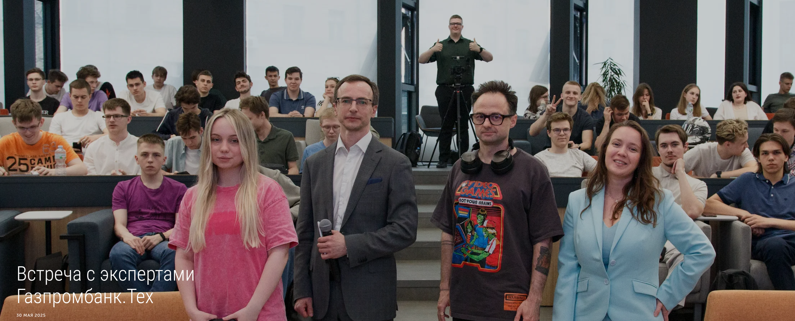
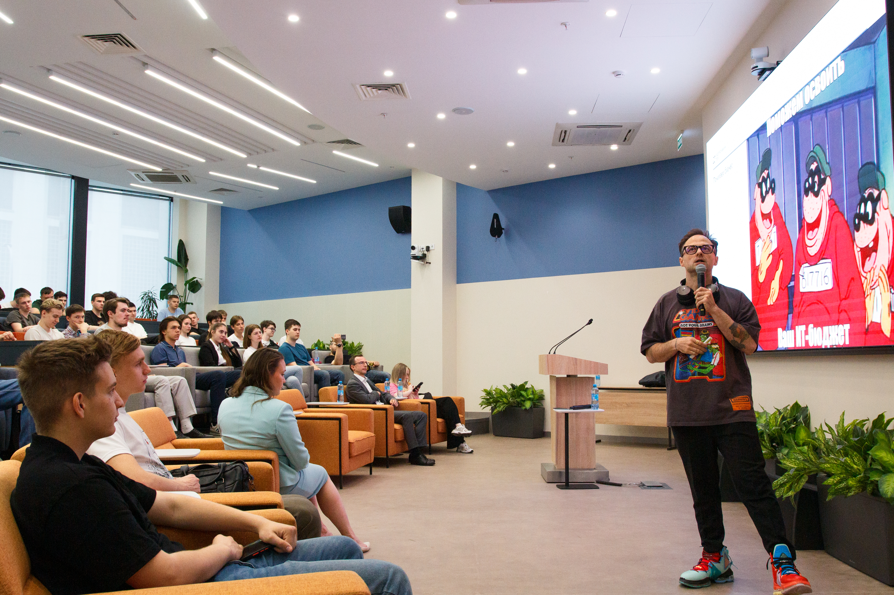
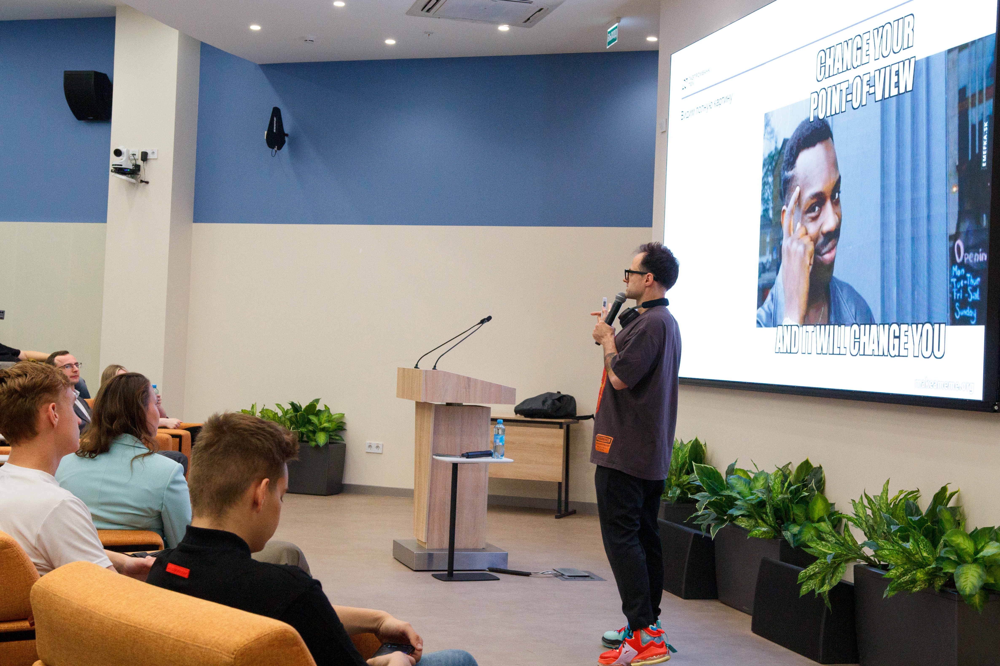

---  
title: О важности коммуникации в IT
date: 2025-06-12  
authors:  
  - gardener
slug: baumantech-0
description:   
    Встреча со студентами Бауманки
categories:  
  - code
  - communication
---

# О важности коммуникации в IT: встреча со студентами Бауманки
  
 
Пообщался в Бауманке со студентами и рассказал им о сложностях коммуникации на работе. В конце было много интересных вопросов.

Казалось бы, у программистов работа про код: взял задачу — сиди, кайфуй, программируй. Но нет.
Код - это только часть работы. 

> Код - побочный эффект коммуникации.

Важно разузнать, порой вытащить клещами и уточнить требования. Договориться, пробиться, суметь показать свою идею.

Мне нравится думать об этом через фразу:

> **Make me fucking care**

Профессионал отличается от любителя тем, что умеет уточнять ожидания заказчика(руководителя) и понимает важность этого шага.  
Не я как руководитель должен бегать за тобой, а ты должен быть заинтересован в результате и точности своей траектории. Это бизнес.  И если ты лажаешь, то в следующий раз к тебе не придут за заказом.  
 

<!-- more -->

## Универсальность навыков коммуникации  
  

В любой сфере пригодится этот опорный навык — я проверял сам. Работал ассистентом, развивал свой бизнес, общался с клиентами, уточнял требования, отстаивал позицию, заказывал работу у подрядчиков, исполнял заказы. Получал и по носу, и бонусы. Было всё.  

> **Навыки коммуникации и клиентоориентированности прекрасно работают в IT. Мне как инженеру важно ими овладеть — и это реально.**

Уточняешь, выверяешь, качественно изготавливаешь продукт в срок, выдаёшь заказчику. Круг простой, но редкий.

  

## Проблема качества в современных командах

Стремления качественно выполнить работу сильно не хватает в моих командах. Строить Core Platform DevOps очень непросто при таком подходе.

Люди уходят делать задачи — сделали, закрыли, проверили или не проверили — непонятно. Но итог чаще один: нужно доработать и переделать.

Если обобщить: много вопросов в IT сводится к качеству исполнения задач и вовлечённости при доведении их до конца.

Менеджмент накидывает удавки контроля, внедряет SCRUM, люди приходят просто делать свою работу — порой хуже роботов. Весь этот круговорот создаёт довольно посредственную рабочую атмосферу.

## Личное отношение к делу

  

Катастрофически не хватает личного отношения к делу. Можно долго размышлять о причинах (стоит ли вообще искать первопричины — мне лично непонятно), но как это поможет в деле?

Инженерам не хватает личного вклада в дело. Вот что я имею в виду:

**Я лично отвечаю за то, что сделал** — это качество, тесты, код — моя печать в git. Это про неравнодушие к делу, которое ты оставишь после себя. Я отвечаю за каждую букву в этом коде.

Одна из причин такого пофигизма — когда человек не на своём месте, ему не нравится своя работа, и это заметно.

## Выбор правильной работы

Важно выбрать работу, от которой тебя прёт. Когда тебе нравится думать о работе, тогда тебе нравится хорошо делать работу. И поверь, даже если у тебя недостаточно опыта, любовь к работе  будет заметна, и в результате всё будет хорошо.

Когда тебе нравится твоя работа, тогда приходят и озарения и бессонные ночи, ранние подъемы. Работа это -  часть твоей жизненной энергии вот почему важно ее любить.

В манифесте моих команд записано:

> **Хорошо думай  
> Хорошо делай  
> Хорошо будет**  
> И задавай вопрос: А не фигню ли я делаю?  

## Клиентоориентированность

Думай о своём клиенте, проживай его путь. Донеси результат до заказчика, убедись лично, что он ожидал именно это. Для этого тебе не нужен ещё один человек.

Машины уже могут делать много рутины не хуже тебя. Самое сложное — это общение с людьми, и тебе нужно овладеть этим мастерством.

## Заключение

К этому тексту прекрасно подходят книги Роберта Мартина. Самое банальное и простое порой важнее всего, но мы так яростно всё усложняем играми разума.

> Не будь говнюком. Будь проще.

## Ссылки

- Фотоальбом [baumantech.gallery.photo](https://baumantech.gallery.photo/gallery/vstreca-s-ekspertami-gazprombank-teh/)  
- Почитай [Правила](https://codemonsters.team/effective-developer/rules/)  
