# Правильность программы

> *«Тестирование программ может служить для доказательства наличия ошибок, но никогда не докажет их отсутствия!»*
>
> — Edsger W. Dijkstra

## Введение

В [предыдущей статье](program-modules.md) мы разобрали модульность программ и нисходящее проектирование. Теперь возникает фундаментальный вопрос: **как убедиться, что спроектированная программа работает правильно?**

Традиционный подход — тестирование — имеет принципиальное ограничение: он может показать наличие ошибок, но не может доказать их отсутствие. Для этого нужен другой метод.

**Правильная программа** — это программа, корректность которой доказана формальными методами. Доказательство строится на математических утверждениях о состоянии программы до и после выполнения каждой инструкции.

Ключевой инструмент такого доказательства — **защищенное программирование**: контроль диапазонов допустимых значений на входе и выходе каждого модуля. Если каждый модуль гарантирует корректность своих результатов для допустимых входных данных, то вся программа работает правильно.

В этой статье изучим классические работы Edsger W. Dijkstra, Niklaus Wirth и Harlan D. Mills, заложившие математические основы верификации программ. Эти принципы остаются актуальными и сегодня — они лежат в основе Domain-Driven Design, Type-Driven Development и контрактного программирования.

<!-- more -->

В этой главе рассмотрим:

- [Надежность через проектирование](#nadezhnost-cherez-proektirovanie)
- [Проблема правильности программ](#problema-pravilnosti-programm)
- [Тестирование vs Верификация](#testirovanie-vs-verifikatsiya)
- [Правила аналитической верификации](#pravila-analiticheskoy-verifikatsii)
- [Инварианты циклов](#invarianty-tsiklov)
- [Защищенное программирование](#zashchishchennoe-programmirovanie)

## Разделение научной и коммерческой областей

**Niklaus Wirth:**

> Отрицательным следствием быстрого распространения ранних языков (высокого уровня) стало то, что программирование разделилось на научную и коммерческую области применений. Считалось, что программирование в основном сводится к кодированию алгоритмов на специальном языке. Поэтому повсеместно установилось мнение, что так называемые научные и коммерческие программисты должны обучаться отдельно друг от друга. Однако на самом деле основные идеи конструирования программ и сами элементарные объекты, которые подвергаются обработке, совершенно не зависят от какой-либо области применения.

## Надежность программного обеспечения достигается проектированием, а не тестированием {#nadezhnost-cherez-proektirovanie}

Известно, что надежность системы программного обеспечения нельзя достичь путем тестирования. Это означает, что если программа удачно разработана в отношении как структуры данных, так и структуры управления, то нет смысла программисту состязаться с машиной в нахождении ошибок.

**Лучшей гарантией отсутствия ошибок являются надлежащее проектирование программы и доказательство ее правильности, сделанное автором.**

Эффективная разработка характеризуется не только тем, что ошибки легко обнаруживаются. Такая разработка может привести к:

- уменьшению размеров системы
- сокращению перекрестных связей в ней
- упрощению программных спецификаций

Следовательно, хороший проект позволяет создать систему, не содержащую ошибок и состоящую из правильных программ.

Так как при структурном программировании каждый уровень разработки программы описывается в идентичных терминах (в противоположность описанным от слов на верхнем уровне и кодам на нижнем уровне), проект, выполненный на верхнем уровне, может быть исследован и подвергнут критическому анализу так же, как это можно сделать для нижнего уровня разработки.

Это объясняет высокую эффективность проектирования, которое ведется, начиная с верхнего уровня.

**Важным фактором процесса проектирования и доказательства правильности программы является возможность отслеживания требований к системе на каждом уровне проектирования.** Это позволяет проявлять гибкость в решении проблемы бюджета или оценки качества на любом уровне в процессе.

## Проблема правильности программ {#problema-pravilnosti-programm}

**Вирт. Некоторые примеры простых программ.**

Программа задает характер поведения для неопределенного (часто даже бесконечного) числа возможных процессов. Один от другого процессы отличаются значениями переменных в соответствующих интервалах времени, и в частности начальными значениями или аргументами.

Однако возникает вопрос: **каким образом можно убедиться, что в любом из процессов, которые можно выполнить в соответствии с данной программой, получатся правильные результаты?**

**Этот вопрос правильности программ является одним из самых основных, решающих и неизбежных вопросов программирования.**

Рассмотрим простую программу:

```
шаг 1: z = 0
       u = x
шаг 2: повторять инструкции
       z = z + y
       u = u - 1
       до u=0
```

Выполняемый этой программой процесс при условии, что переменным x и y заданы начальные значения, можно представить в наглядной форме, если записать значения, которые присваиваются переменным z и u во время счета. Для x=5 и y=13 мы получим таблицу:

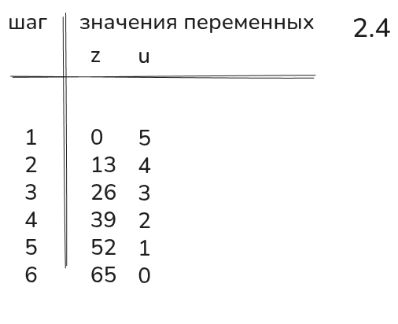

Правильность программы демонстрируется таблицей для нескольких фиксированных пар значений x и y.

## Тестирование vs Верификация {#testirovanie-vs-verifikatsiya}

**Такой метод проверки правильности называется тестированием программы.** Он заключается в том, что выбираются аргументы (x и y), процесс выполняется с этими выбранными аргументами и полученные результаты сравниваются с заранее известными правильными результатами. Такое экспериментальное тестирование повторяется для нескольких аргументов с помощью вычислительной машины, которая является идеальным для этого инструментом.

**Для проверки правильности модулей мы используем юнит-тесты.**

Тем не менее этот традиционный способ дорог, обременителен и связан с большими затратами времени. Но, кроме того, он неудовлетворителен еще и потому, что рассеять все сомнения относительно правильности программы можно лишь тогда, когда будут выполнены все возможные вычисления, а не некоторые отобранные варианты.

Если же результаты всех процессов известны заранее, то едва ли есть смысл писать программу для вычислительной машины. Стоит ли говорить, что такое исчерпывающее тестирование программы просто невозможно.

Предположим, например, что некоторая вычислительная машина выполняет сложение двух чисел за 1 мксек, и допустим также, что максимальное значение абсолютных величин, представимых в этой машине, равно 2^60. Тогда на 2^(2*60) различных сложений нужно было бы затратить:

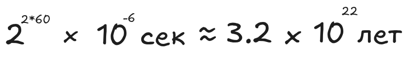

### Основное правило

Поскольку такого рода исчерпывающее экспериментальное тестирование и бессмысленно, и невозможно, мы можем сформулировать следующее важное, основное правило:

**Экспериментальное тестирование программ может служить для доказательства наличия ошибок, но никогда не докажет их отсутствия.**

В те же годы Дейкстра пишет книгу, где приводит математическое доказательство этого утверждения.

> Тестирование программ может служить для доказательства наличия ошибок, но никогда не докажет их отсутствия!

Насколько известно по книгам, Дейкстра и Вирт тесно общались.

### Верификация программ

Следовательно, необходимо абстрагироваться от индивидуальных процессов и постулировать некоторые общезначимые условия, которые можно вывести из характера поведения.

**Этот аналитический метод проверки называется верификацией программ.**

В отличие от тестирования программы, где исследуются свойства индивидуальных процессов, верификация имеет дело со свойствами программы.

Верификация программ использует те же принципы, что и эмпирическое тестирование, и могла бы, следовательно, рассматриваться по аналогии с верификацией процесса. Но вместо записи индивидуальных значений переменных в трассировочной таблице мы после каждой инструкции задаем общезначимые диапазоны значений и отношения между переменными.

**Слово «общезначимые» следует понимать в смысле «допустимые для каждого процесса, соответствующего данной программе, и допустимые в той точке, где они встречаются, независимо от ранее выполненных инструкций».**

## Правила аналитической верификации программ {#pravila-analiticheskoy-verifikatsii}

Сформулируем четыре основных правила аналитической верификации программ:

### 1. Утверждения (Assertions)

Перед и после каждой инструкции задаются одно или несколько условий, которые должны удовлетворяться соответственно до и после выполнения этой инструкции.

Эти условия называются **утверждениями**.

- Утверждения, которые предшествуют инструкции S, мы назовем **антецедентами P**
- Следующие за S — **сукцедентами или консеквентами Q**

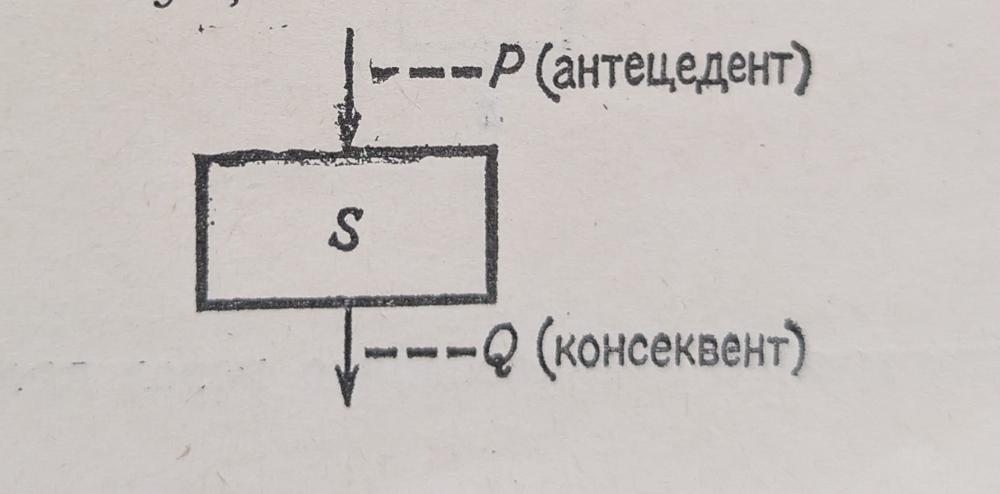

### 2. Объединение путей

Если несколько путей на блок-схеме объединяются в один перед инструкцией T, то антецедент P инструкции T должен логически вытекать из консеквентов Q всех предшествующих инструкций S.

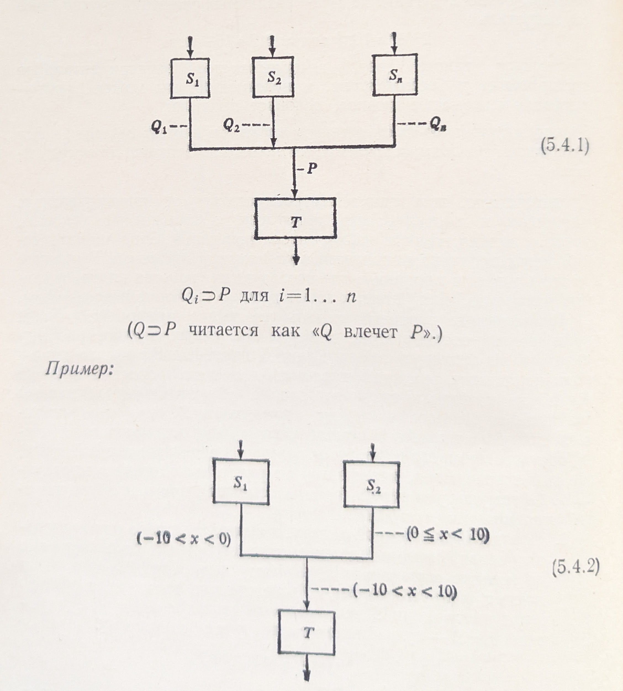

### 3. Условные переходы

Если утверждение P справедливо перед проверкой условия B, то двумя консеквентами будут:
- P ∧ B (условие истинно)
- P ∧ ¬B (условие ложно)

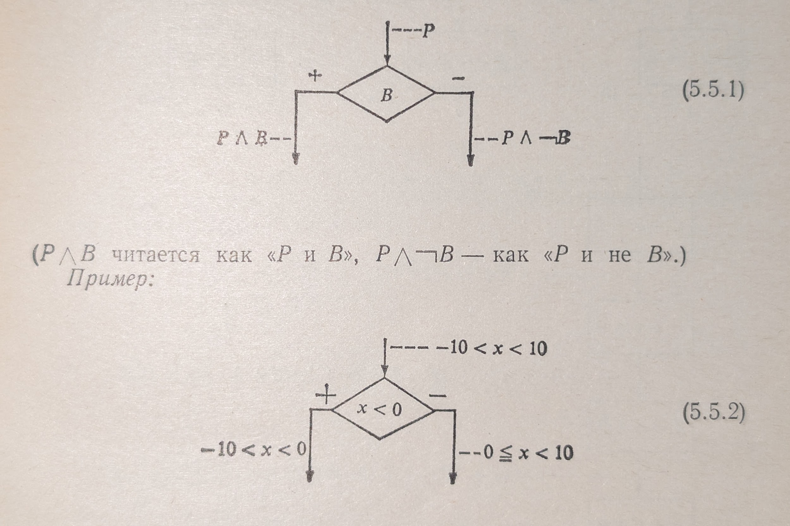

### 4. Присваивание

Если утверждение P справедливо после присваивания значения переменной u, то антецедент присваивания получается подстановкой вместо всех свободных вхождений u в консеквент P.

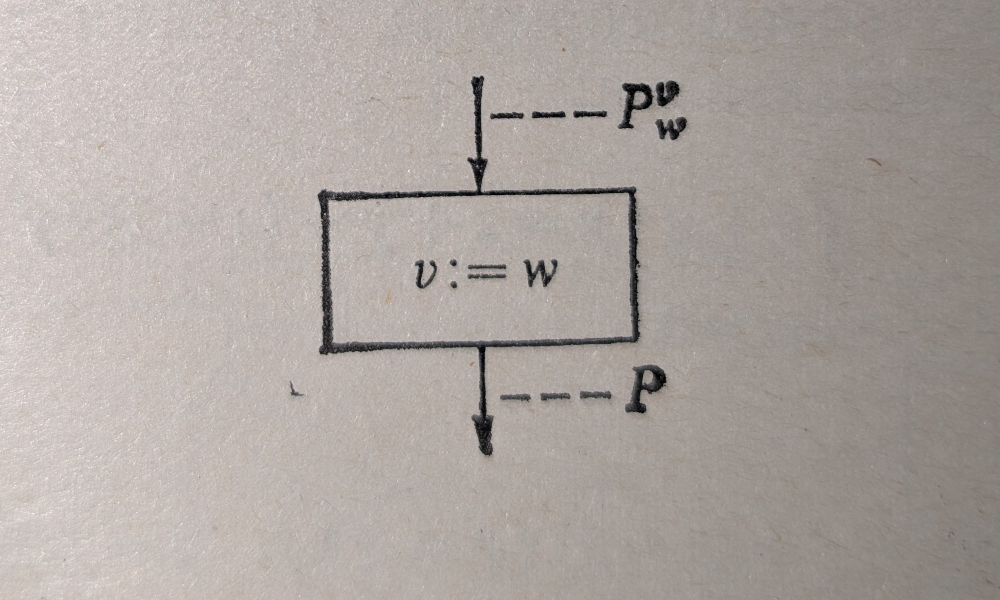

(Это правило можно также рассматривать как определение эффекта присваивания.)

Вообще говоря, основываясь на этих правилах, очень просто определить утверждения в последовательности инструкций, если задан антецедент первой или консеквент последней инструкции.

Однако возникают определенные трудности, если блок-схема содержит замкнутые циклические пути, т.е. если в программе имеются циклы.

## Инварианты циклов {#invarianty-tsiklov}

В этом случае лучше всего рассечь цикл в некотором месте и в точке разреза постулировать некоторую **гипотезу H**. Приняв эту гипотезу за исходную, можно построить вывод утверждений, двигаясь теперь уже по линеаризованной последовательности либо в прямом, либо в обратном направлении.

Результирующее утверждение Pn в конце (т.е. в месте разреза) должно логически следовать из (или быть следствием H) с тем, чтобы можно было склеить разрез. Если последнее условие не удовлетворяется, то следует принять другую гипотезу и всю процедуру повторить заново.

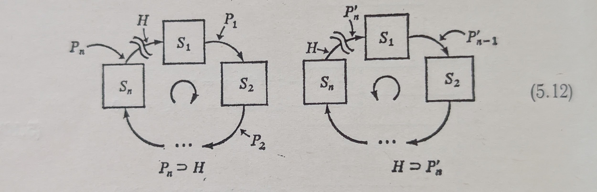

Разумно сделать разрез перед условием B, при выполнении которого заканчиваются повторения цикла. Тогда логическая комбинация условий H и B будет представлять собой консеквент всей группы повторяемых инструкций.

**Такое утверждение, истинное независимо от числа ранее выполненных повторений, называется инвариантом цикла или просто инвариантом, так как оно представляет условие, которое не изменяется в ходе выполнения процесса.**


### Что такое инвариант?

**Инвариант** — это нечто постоянное, неизменное, остающееся неизменным при определённых преобразованиях или изменении условий. Это может быть математическая величина, свойство объекта или состояние, которое сохраняется, в то время как другие характеристики могут меняться.

Примеры инвариантов в разных областях:

- **Математика**: Свойство некоторого класса (множества) математических объектов, остающееся неизменным при определенных типах преобразований.
- **Программирование**: Состояние объекта, которое должно оставаться допустимым на протяжении всего времени его жизни, и формально определяется контрактом инварианта.

**Ключевые характеристики:**

1. **Неизменность**: главная черта инварианта — его постоянство в рамках заданного контекста преобразований.
2. **Классификация**: инварианты помогают классифицировать объекты и понимать их структуру, выделяя общие черты при различных изменениях.
3. **Средство доказательства**: в математике инварианты используются для доказательства теорем и установления свойств объектов.

### Правила вывода для циклов

Поскольку повторения или циклы являются фундаментальными частями процессов и программ, рассмотренный выше прием мы можем сформулировать в виде правил вывода.

**1. Если задано утверждение P, являющееся инвариантом инструкции S** (т.е. задан как ее антецедент, так и ее консеквент), и, кроме того, известно, что


(5.13.1)

то можно построить следующее утверждение относительно повторяемой инструкции S:

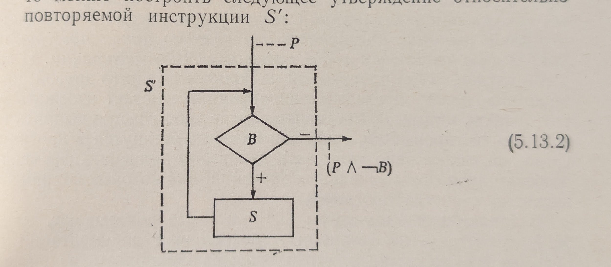

(5.13.2)

**2. Если заданы две посылки для инструкции S**

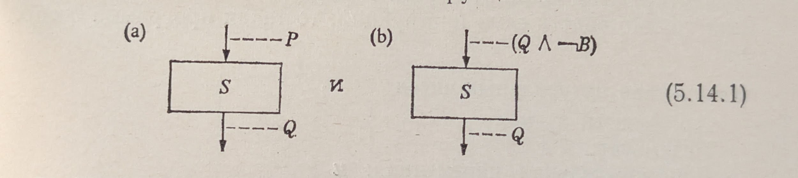

(5.14.1)

то справедливо следующее утверждение относительно повторяемой инструкции S:

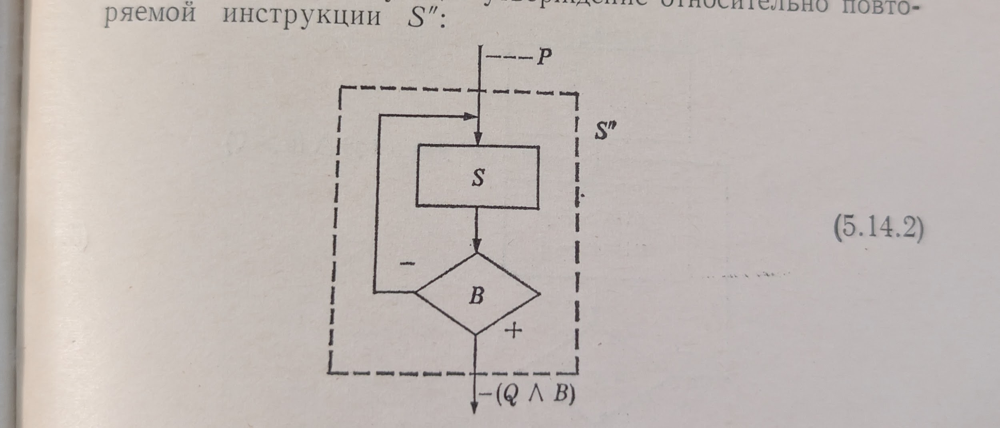

(5.14.2)

Заметим, что для циклов данного вида правило вывода можно применить лишь тогда, когда удовлетворяются оба условия.

Такой цикл не без основания можно назвать более «опасным», так как часто ошибки программирования возникают из-за того, что программисты упускают из вида одну из этих посылок.

**В сомнительных случаях рекомендуется использовать первый вид цикла, когда условие конца цикла B предшествует инструкции S.**

### Важность инвариантов

По существу, эти указания следует рассматривать как неформальный подход к проблеме аналитической верификации свойств программ.

**Особенно важно понять трудности, касающиеся проблемы нахождения инвариантов.**

Следует усвоить всем программистам, что **явное указание инварианта для каждого цикла представляет наибольшую ценность в любой программной документации.**

И даже в том случае, когда программой не пользуется никто другой, кроме ее автора, явное определение инвариантов помогает избежать многих ошибок, которые в противном случае либо удастся выявить тщательным тестированием, либо они навсегда останутся в программе.

Столь же важно явно указывать диапазоны значений переменных, особенно диапазоны начальных значений, для которых сохраняются заданные свойства программы.

## Документация программы

В заключение важно помнить, что программа может быть излишне документирована.

**Если в программе так много комментариев, что среди них трудно видеть сами инструкции, то такая программа бесполезна!**

## Защищенное программирование {#zashchishchennoe-programmirovanie}

**Требование достижения полной правильности приводит к идее «защищенного» программирования** (т.е. защищенного по отношению к вычислениям для недопустимых значений данных).

В этом случае идея защищенного программирования предполагает переопределение путем использования полной области определения P. При этом вычисления по программе P для всех добавленных аргументов в области определения состоят в соответствующей обработке исключения.

### Дейкстра о тестировании и постусловиях

> Как я уже много раз говорил и во многих местах писал: тестирование программы может вполне эффективно служить для демонстрации наличия в ней ошибок, но, к сожалению, непригодно для доказательства их отсутствия.
>
> Другим проявившимся тем временем обстоятельством явилось обнаружение необходимости того, чтобы всякая дисциплина проектирования должным образом учитывала тот факт, что само проектирование конструкции, предназначенной для какой-то цели, тоже должно быть целенаправленной деятельностью.
>
> **В нашем конкретном случае это означает естественность предположения, что отправной точкой для проектных рассмотрений будет служить заданное постусловие. В каком-то смысле мы будем «работать вспять».**

**В математике (и программировании) постусловие — это условие, которое проверяется после выполнения блока действий.**

Таким образом мы приходим к важной практике — **контролю допустимых значений перед выполнением операций модуля и после окончания его работы.**

## Непосредственные утверждения относительно функций программ

Метод непосредственных утверждений относительно функций программ является главным, когда мы имеем дело с большими программами и когда в математическом доказательстве необходимо соблюдать правильное соотношение между строгостью и трудоемкостью.

**Математическое доказательство является своеобразным экспериментом, успех которого с учетом психологического фактора определяется рациональным и согласованным применением формального метода в доказательстве.**

Может оказаться, что простую часть большой программы лучше верифицировать путем прямого утверждения того, что ее функция удовлетворяет имеющимся спецификациям, а не посредством более детального доказательства.

Таким утверждением является заявление, которое может быть:
- зарегистрировано
- подтверждено (или нет) другим лицом
- если необходимо, повторно верифицировано на новом базисе

Уровень формализации должен зависеть не только от самой программы, но и от ее назначения.

- Если срок службы программы зависит от ее правильности, то, возможно, программа заслуживает строгого доказательства правильности, которое потребует значительных усилий.
- В других случаях риск, связанный с некорректностью доказательства, которое выполнено недостаточно формально, может оказаться оправданным по сравнению с усилиями, которые следует приложить для соблюдения строгой формализации процесса доказательства.

**Важно отметить, что, вероятно, не степень усилий обеспечивает простоту доказательства.** Даже при умеренных усилиях вопреки существующему скептицизму можно корректно и качественно вести проектирование рассматриваемыми способами.

### Пример разбиения программы

Например, если 100-строковая программа разбивается на 10 программных частей и создается дополнительная программа из 15 строк, то:

- каждую из 10 программных частей (содержащих по 10 строк) можно верифицировать прямым утверждением
- оставшуюся 15-строковую программу легче, чем 100-строковую, можно верифицировать более формально

Следует заметить, что примеры выбраны, небольшие. В практике программирования программные части такого размера обычно бывают больше и сложнее, но решение едино.

## Применение на практике

**Пример полотна кода, который после разбиваем на модули**
[ссылка на git](https://git.codemonsters.team/guides/correctness-program/-/blob/feature/01-acceptable-values/src/main/java/team/codemonsters/App.java?ref_type=heads)

```java
package team.codemonsters;

import java.time.LocalDate;
import java.time.Period;
import java.time.format.DateTimeFormatter;
import java.util.ArrayList;
import java.util.List;

// Класс-контейнер для хранения данных о клиенте
class Client {
    String fullName;
    String email;
    boolean emailConfirmationStatus;
    String birthDate;

    Client(String fullName, String email, boolean emailConfirmationStatus, String birthDate) {
        this.fullName = fullName;
        this.email = email;
        this.emailConfirmationStatus = emailConfirmationStatus;
        this.birthDate = birthDate;
    }
}

public class App {

    public static void main(String[] args) {
        System.out.println(getGreeting());
        // Инициализация хранилища клиентов в памяти
        List<Client> clients = new ArrayList<>();

        // Получение входных данных из аргументов командной строки
        String lastName = args[0];
        String firstName = args[1];
        String patronymic = args[2];
        String fullName = lastName + " " + firstName + " " + patronymic;
        String email = args[3];
        String birthDateString = args[4];

        // Статус подтверждения email по умолчанию
        boolean emailConfirmationStatus = false;

        // Парсинг даты рождения
        DateTimeFormatter formatter = DateTimeFormatter.ofPattern("dd.MM.yyyy");
        LocalDate birthDate = LocalDate.parse(birthDateString, formatter);

        // Вычисление возраста клиента
        LocalDate currentDate = LocalDate.now();
        int age = Period.between(birthDate, currentDate).getYears();

        // Проверка возрастного ограничения
        if (age >= 18) {
            // Создание объекта клиента
            Client client = new Client(fullName, email, emailConfirmationStatus, birthDateString);

            // Добавление клиента в хранилище
            clients.add(client);

            // Вывод успешного результата
            System.out.println("Клиент успешно зарегистрирован: " + fullName);
        } else {
            // Вывод сообщения об отказе
            System.out.println("Регистрация отклонена: клиент младше 18 лет");
        }

        // Вывод информации о всех зарегистрированных клиентах
        System.out.println("Всего зарегистрировано клиентов: " + clients.size());
    }

    public static String getGreeting() {
        return "Введите через пробел: фамилия имя отчество email дату_рождения(dd.MM.yyyy)";
    }
}
```

**Переработанный код в процедурном стиле с верификацией диапазонов значений:**


[ссылка на Git](https://git.codemonsters.team/guides/correctness-program/-/blob/feature/02-structured-programming-02-errors-result/src/main/java/team/codemonsters/App.java?ref_type=heads)

```java
package team.codemonsters;

import java.time.Clock;
import java.time.LocalDate;
import java.time.Period;
import java.time.format.DateTimeFormatter;
import java.time.format.DateTimeParseException;
import java.util.ArrayList;
import java.util.List;

// Класс-контейнер для хранения данных о клиенте
record Client(String fullName, String email, boolean isEmailConfirmed, LocalDate birthDate) {
}

// Класс-контейнер для хранения входных данных запроса
record Request(String lastName, String firstName, String patronymic, String email, String birthDateString) {
}

public class App {

    // Константы для валидации
    private static final String DATE_FORMAT = "dd.MM.yyyy";
    private static final String NAME_PATTERN = "^[А-Я][а-яА-Я\\-]*$";
    private static final String EMAIL_PATTERN = "^[a-zA-Z0-9._%+-]+@[a-zA-Z0-9.-]+\\.[a-zA-Z]{2,}$";

    public static void main(String[] args) {
        System.out.println(getGreeting());
        // Передача управления головному модулю регистрации
        processClientRegistration(args);
    }

    /**
     * Головной модуль регистрации клиента
     * Координирует весь процесс: валидацию, создание и регистрацию клиента
     * @param args аргументы командной строки
     */
    private static void processClientRegistration(String[] args) {
        // Инициализация хранилища клиентов в памяти
        List<Client> clients = new ArrayList<>();
        Result<Request> requestResult = processRequest(args);
        if (requestResult.isFailure()) {
            printError(requestResult.getError());
            return;
        }
        Request request = requestResult.getValue();
        // Обработка аргументов терминала и трансформация в структуру Client
        Result<Client> clientResult = createClient(request, Clock.systemUTC());

        if (clientResult.isFailure()) {
            // Обработка ошибок валидации
            printError(clientResult.getError());
            return;
        }

        // Получение валидированного клиента
        Client client = clientResult.getValue();

        // Регистрация клиента
        registerClient(clients, client);

        // Вывод статистики
        printStatistics(clients);
    }

    /**
     * Модуль обработки аргументов терминала и трансформации в структуру Client
     * Выполняет валидацию всех входных данных и создает объект Client
     * @param request запрос на создание клиента
     * @param clock часы для получения текущей даты (для тестируемости)
     * @return Result с объектом Client или сообщением об ошибке
     */
    private static Result<Client> createClient(Request request, Clock clock) {
        // Формирование и валидация полного имени
        Result<String> fullNameResult = createFullName(request.lastName(), request.firstName(), request.patronymic());
        if (fullNameResult.isFailure()) {
            return Result.failure(fullNameResult.getError());
        }
        String fullName = fullNameResult.getValue();

        // Валидация email
        Result<String> emailResult = createValidEmail(request.email());
        if (emailResult.isFailure()) {
            return Result.failure(emailResult.getError());
        }
        String validEmail = emailResult.getValue();

        // Статус подтверждения email по умолчанию
        boolean emailConfirmed = false;

        // Парсинг и валидация даты рождения с учетом всех ограничений
        Result<LocalDate> birthDateResult = createValidClientBirthDate(request.birthDateString(), clock);
        if (birthDateResult.isFailure()) {
            return Result.failure(birthDateResult.getError());
        }
        LocalDate validBirthDate = birthDateResult.getValue();

        // Все проверки пройдены - создание клиента
        Client client = new Client(fullName, validEmail, emailConfirmed, validBirthDate);
        return Result.success(client);
    }

    /**
     * Модуль обработки аргументов командной строки и создания запроса
     * Проверяет количество аргументов и формирует объект Request
     * @param args аргументы командной строки
     * @return Result с объектом Request или сообщением об ошибке
     */
    private static Result<Request> processRequest(String[] args) {
        // Проверка количества аргументов
        if (args.length < 5) {
            return Result.failure("Ошибка: недостаточно аргументов. Требуется: фамилия имя отчество email дата_рождения");
        }

        // Получение входных данных из аргументов командной строки
        String lastName = args[0];
        String firstName = args[1];
        String patronymic = args[2];
        String email = args[3];
        String birthDateString = args[4];

        // Создание объекта Request
        return Result.success(new Request(lastName, firstName, patronymic, email, birthDateString));
    }

    public static String getGreeting() {
        return "Введите через пробел: фамилия имя отчество email дату_рождения(" + DATE_FORMAT + ")";
    }

    /**
     * Модуль вывода сообщений об ошибках
     * Централизованный вывод всех ошибок валидации и регистрации
     * @param errorMessage сообщение об ошибке
     */
    private static void printError(String errorMessage) {
        System.out.println(errorMessage);
    }

    /**
     * Модуль формирования полного имени из компонентов
     * Выполняет валидацию всех компонентов ФИО и формирует полное имя
     * @param lastName фамилия
     * @param firstName имя
     * @param patronymic отчество
     * @return Result с полным именем в формате "Фамилия Имя Отчество" или сообщением об ошибке
     */
    private static Result<String> createFullName(String lastName, String firstName, String patronymic) {
        // Валидация фамилии
        Result<String> lastNameResult = createValidName(lastName, "фамилия");
        if (lastNameResult.isFailure()) {
            return Result.failure(lastNameResult.getError());
        }

        // Валидация имени
        Result<String> firstNameResult = createValidName(firstName, "имя");
        if (firstNameResult.isFailure()) {
            return Result.failure(firstNameResult.getError());
        }

        // Валидация отчества
        Result<String> patronymicResult = createValidName(patronymic, "отчество");
        if (patronymicResult.isFailure()) {
            return Result.failure(patronymicResult.getError());
        }

        // Все компоненты валидны - формирование полного имени
        String fullName = lastNameResult.getValue() + " " + firstNameResult.getValue() + " " + patronymicResult.getValue();
        return Result.success(fullName);
    }

    /**
     * Модуль парсинга даты рождения в допустимую дату рождения клиента с учетом ограничений
     * Выполняет парсинг, проверку формата, проверку что дата не в будущем и проверку возраста 18+
     * @param birthDateString строка с датой в формате dd.MM.yyyy
     * @param clock часы для получения текущей даты (для тестируемости)
     * @return Result с LocalDate или сообщением об ошибке
     */
    private static Result<LocalDate> createValidClientBirthDate(String birthDateString, Clock clock) {
        // Парсинг даты
        Result<LocalDate> birthDateResult = parseBirthDate(birthDateString);
        if (birthDateResult.isFailure()) {
            return Result.failure(birthDateResult.getError());
        }
        LocalDate birthDate = birthDateResult.getValue();

        // Проверка что дата не в будущем
        Result<LocalDate> birthDateNotInFutureResult = validateBirthDateNotInFuture(birthDate, clock);
        if (birthDateNotInFutureResult.isFailure()) {
            return Result.failure(birthDateNotInFutureResult.getError());
        }
        LocalDate validBirthDate = birthDateNotInFutureResult.getValue();

        // Проверка возрастного ограничения 18+
        int age = calculateAge(validBirthDate, clock);
        Result<Integer> adultAgeResult = createAdultAge(age);
        if (adultAgeResult.isFailure()) {
            return Result.failure(adultAgeResult.getError());
        }

        return Result.success(validBirthDate);
    }

    /**
     * Создание валидированного имени (фамилия, имя, отчество)
     * @param name проверяемое имя
     * @param fieldName тип поля для информативного сообщения об ошибке
     * @return Result с валидированным именем или сообщением об ошибке
     */
    static Result<String> createValidName(String name, String fieldName) {
        if (name == null || name.trim().isEmpty()) {
            return Result.failure("Ошибка: " + fieldName + " не может быть пустым");
        }
        if (!name.matches(NAME_PATTERN)) {
            return Result.failure("Ошибка: " + fieldName + " должно содержать только кириллицу и начинаться с заглавной буквы");
        }
        return Result.success(name);
    }

    /**
     * Создание валидированного email адреса
     * @param email проверяемый email
     * @return Result с валидированным email или сообщением об ошибке
     */
    static Result<String> createValidEmail(String email) {
        if (email == null || email.trim().isEmpty()) {
            return Result.failure("Ошибка: email не может быть пустым");
        }
        if (!email.matches(EMAIL_PATTERN)) {
            return Result.failure("Ошибка: некорректный формат email");
        }
        return Result.success(email);
    }

    /**
     * Парсинг строки даты рождения в LocalDate
     * @param birthDateString строка с датой в формате dd.MM.yyyy
     * @return Result с LocalDate или сообщением об ошибке
     */
    static Result<LocalDate> parseBirthDate(String birthDateString) {
        if (birthDateString == null || birthDateString.trim().isEmpty()) {
            return Result.failure("Ошибка: дата рождения не может быть пустой");
        }

        DateTimeFormatter formatter = DateTimeFormatter.ofPattern(DATE_FORMAT);
        try {
            return Result.success(LocalDate.parse(birthDateString, formatter));
        } catch (DateTimeParseException e) {
            return Result.failure("Ошибка: некорректный формат даты рождения. Используйте формат " + DATE_FORMAT);
        }
    }

    /**
     * Валидация даты рождения (не в будущем)
     * @param birthDate дата рождения
     * @param clock часы для получения текущей даты (для тестируемости)
     * @return Result с валидированной датой рождения или сообщением об ошибке
     */
    static Result<LocalDate> validateBirthDateNotInFuture(LocalDate birthDate, Clock clock) {
        LocalDate currentDate = LocalDate.now(clock);
        if (birthDate.isAfter(currentDate)) {
            return Result.failure("Ошибка: дата рождения не может быть в будущем");
        }
        return Result.success(birthDate);
    }

    /**
     * Вычисление возраста по дате рождения
     * @param birthDate дата рождения
     * @param clock часы для получения текущей даты (для тестируемости)
     * @return возраст в годах
     */
    static int calculateAge(LocalDate birthDate, Clock clock) {
        return Period.between(birthDate, LocalDate.now(clock)).getYears();
    }

    /**
     * Создание валидированного возраста совершеннолетнего (проверка возрастного ограничения 18+)
     * @param age возраст
     * @return Result с валидированным возрастом или сообщением об ошибке
     */
    static Result<Integer> createAdultAge(int age) {
        if (age < 18) {
            return Result.failure("Регистрация отклонена: клиент младше 18 лет");
        }
        return Result.success(age);
    }

    /**
     * Регистрация клиента в системе
     * @param clients список клиентов
     * @param client клиент для регистрации
     */
    private static void registerClient(List<Client> clients, Client client) {
        clients.add(client);
        System.out.println("Клиент успешно зарегистрирован: " + client.fullName());
    }

    /**
     * Вывод статистики зарегистрированных клиентов
     * @param clients список клиентов
     */
    private static void printStatistics(List<Client> clients) {
        System.out.println("Всего зарегистрировано клиентов: " + clients.size());
    }

}
```

Из рассмотренного примера следует:

**Если мы декомпозируем программу на модули, каждый модуль валидирует заданные диапазоны допустимых значений входных данных, то наша программа корректна.**

Т.е. верифицируется утверждениями, то можно утверждать что программа корректна. **Это и есть формальное доказательство правильной программы.**

Все довольно просто и без лишних умных слов, что понятно человеку, машине тем более.

Сразу отметим какие умные слова удовлетворяют этой классике:  
- DDD (Domain-Driven Design)  
- Type-Driven Development  
- Защитное программирование  

**Т.е. все это приводит нас к кодовой базе, в которой 100% бизнес-логики покрыто юнит-тестами.**

Опираясь на математику и формальные выводы мы можем выстроить проектирование и тестирование не просто по пирамиде в процентном соотношении тестов по типам, а еще логически правильное и экономически обоснованное.

Это стоит отметить, а в следующих главах мы будем собирать пазл за пазлом в общую картину.

**Главный модуль можно верифицировать формально, так как он простой (код понятный) и по своей сути вызывает корректно работающие части программы (модули).**

Далее мы посмотрим как лучше всего тестировать главный модуль программы.

Забегая вперед, я предлагаю тестировать его вызовом всей программы, т.е. мы будем тестировать компонент в изоляции, запуская программу со всеми зависимостями (заглушки сервисов, брокер сообщений, СУБД).

Тем самым мы и будем тестировать по сути весь код приложения, в который входит код главного модуля программы.

Также мы можем поступать, если разнесем модули в отдельные программы и получим по сути распределенную систему, которая состоит из правильно работающих программ.

## Защитное программирование

Мы спроектировали в процедурном стиле правильную программу.
Так как разработчик за счет проверок диапазонов значений в каждом модуле логически доказал правильность программы и покрыл каждый модуль тестами.

Дейкстра:

>В нашем конкретном случае это означает естественность предположения,
что отправной точкой для проектных рассмотрений
будет служить заданное постусловие.
В каком-то смысле мы будем «работать вспять».

В математике (и программировании) постусловие — это условие,
которое проверяется после выполнения блока действий.
Таким образом мы приходим к важной практике
- контролю допустимых значений перед выполнением операций модуля и после окончания его работы.

Требование достижения полной правильности приводит к идее
«защищенного» программирования (т. е. защищенного по отношению к вычислениям для недопустимых значений данных).

Пример правильной программы в процедурном стиле с контролем диапазонов значений.

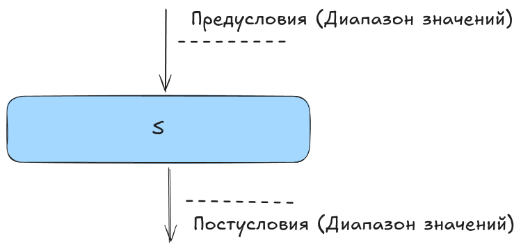

Рассмотрим наглядный пример проблемы использования типов без контроля диапазонов значений — операция деления с `BigDecimal`.

**Проблема:** Стандартная операция деления допускает деление на ноль, что приводит к исключениям во время выполнения. Это нарушает принцип защищенного программирования —
отсутствует контроль диапазона допустимых значений на входе функции.  


**Решение:** 

Ниже представлены две реализации:  

- `divideWithException` — функция **без** контроля диапазона допустимых значений (небезопасная)  
- `divide` — **безопасная** функция с явной валидацией входных данных  

```java
package team.codemonsters;

import java.math.BigDecimal;
import java.math.RoundingMode;

/**
 * Класс для демонстрации защитного программирования на примере операции деления BigDecimal.
 * Показывает два подхода к обработке ошибок:
 * 1. divideWithException - императивный подход с исключениями
 * 2. divide - функциональный подход с Result<T>
 */
public class SafeDivision {

    private static final int DEFAULT_SCALE = 10;
    private static final RoundingMode DEFAULT_ROUNDING_MODE = RoundingMode.HALF_UP;

    /**
     * Выполняет деление с выбросом исключения при делении на ноль.
     * Императивный подход - ошибка обрабатывается через механизм исключений.
     *
     * @param numerator числитель
     * @param denominator знаменатель
     * @return результат деления
     * @throws ArithmeticException если знаменатель равен нулю
     */
    public static BigDecimal divideWithException(BigDecimal numerator, BigDecimal denominator) {
        return numerator.divide(denominator, DEFAULT_SCALE, DEFAULT_ROUNDING_MODE);
    }

    /**
     * Выполняет деление с возвратом Result.
     * Олдскульный безопасный подход - ошибка возвращается как данные через Result<T>.
     * Ошибка явно указана в сигнатуре метода.
     * Гарантирует безопасное программирование, способствует к проектированию Правильно Работающих Программ.
     *
     * @param numerator числитель
     * @param denominator знаменатель
     * @return Result.success с результатом деления или Result.failure с сообщением об ошибке
     */
    public static Result<BigDecimal> divide(BigDecimal numerator, BigDecimal denominator) {
        if (denominator.compareTo(BigDecimal.ZERO) == 0) {
            return Result.failure("Деление на ноль невозможно");
        }
        BigDecimal result = numerator.divide(denominator, DEFAULT_SCALE, DEFAULT_ROUNDING_MODE);
        return Result.success(result);
    }
}
```

Мы спроектировали в процедурном стиле правильную программу [src](https://git.codemonsters.team/guides/correctness-program/-/blob/feature/02-structured-programming-02-errors-result/src/main/java/team/codemonsters/App.java?ref_type=heads). 

Разобрались, что такое "Защищенное программирование" [src](https://git.codemonsters.team/guides/correctness-program/-/blob/feature/02-structured-programming-02-errors-result/src/main/java/team/codemonsters/SafeDivision.java?ref_type=heads#L40).  

**Так как разработчик за счет проверок диапазонов значений в каждом модуле логически доказал правильность программы и покрыл каждый модуль тестами.**

### Важно

**После каждой инструкции задаем общезначимые диапазоны значений в отношения между переменными.**

Слово «общезначимые» следует понимать в смысле **«допустимые для каждого процесса, соответствующего данной программе, и допустимые в той точке, где они встречаются, независимо от ранее выполненных инструкций».**

### Резюме

Мы изучили классический подход к доказательству правильности программ:  

- **Тестирование** показывает наличие ошибок, но не доказывает их отсутствия  
- **Верификация** через утверждения (антецеденты и консеквенты) позволяет доказать правильность  
- **Инварианты циклов** — ключевой инструмент для работы с повторениями  
- **Защищенное программирование** = контроль диапазонов значений до и после выполнения модуля  
- **Модульная декомпозиция** + валидация в каждом модуле = формально доказуемая правильность  

Современные практики (DDD, Type-Driven Development) — это переложение классических идей Дейкстры, Вирта и Миллса на язык сегодняшнего дня. Математическая строгость остается неизменной, меняются только инструменты её применения.

## Что дальше?

Мы рассмотрели математические основы доказательства правильности программ. В следующих статьях применим эти принципы на практике:

### Переход к ООП

Структурное программирование естественным образом переходит в объектно-ориентированное. Модули становятся классами, которые инкапсулируют данные и операции над ними. При этом сохраняются все требования к модулям: единственная функция, один вход и выход, валидация диапазонов значений.

Рассмотрим ООП в духе **Алана Кея** — как систему взаимодействующих объектов-сообщений, а не как набор классов и наследований. Объекты — это независимые «черные ящики», обменивающиеся простыми структурами данных.

### В следующих статьях

**Применение на практике:**  
- Реализация программы регистрации клиента в парадигме ООП  
- Проектирование объектов с контролем инвариантов  
- Написание модульных тестов для каждого объекта  
- Достижение 100% покрытия тестами бизнес-логики  

**Стратегия тестирования:**  
- Модульное тестирование: проверка отдельных модулей (классов)  
- Компонентное тестирование: проверка главного модуля по средствам теста всей программы в изоляции  
- Интеграция с зависимостями благодаря docker  

**Архитектура:**  
- Выделение модулей в отдельные сервисы  
- Композиция правильно работающих программ  

Эти темы образуют единую картину: от математических основ к практическому применению в реальных системах.

## Источники

1. STRUCTURED PROGRAMMING: THEORY AND PRACTICE (RICHARD C. LINGER, HARLAN D. MILLS, BERNARD I. WITT)
2. A DISCIPLINE OF PROGRAMMING (EDSGER W. DIJKSTRA)
3. SYSTEMATIC PROGRAMMING. AN INTRODUCTION. (NIKLAUS WIRTH)
4. A STRUCTURED APPROACH TO PROGRAMMING (JOAN K. HUGHES. Data Processing Consultant, JAY I. MICHTOM. IBM Systems Science Institute)
