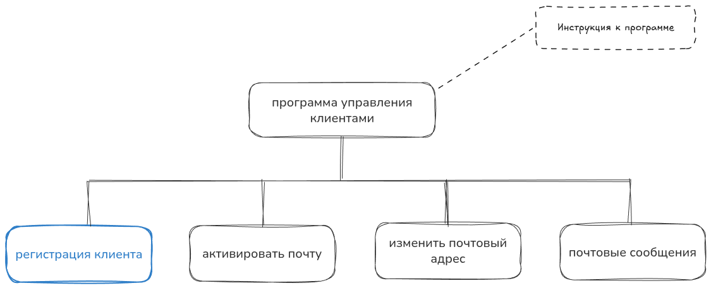
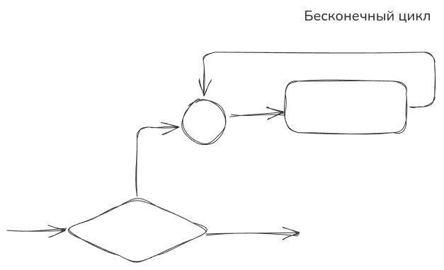
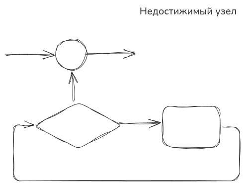
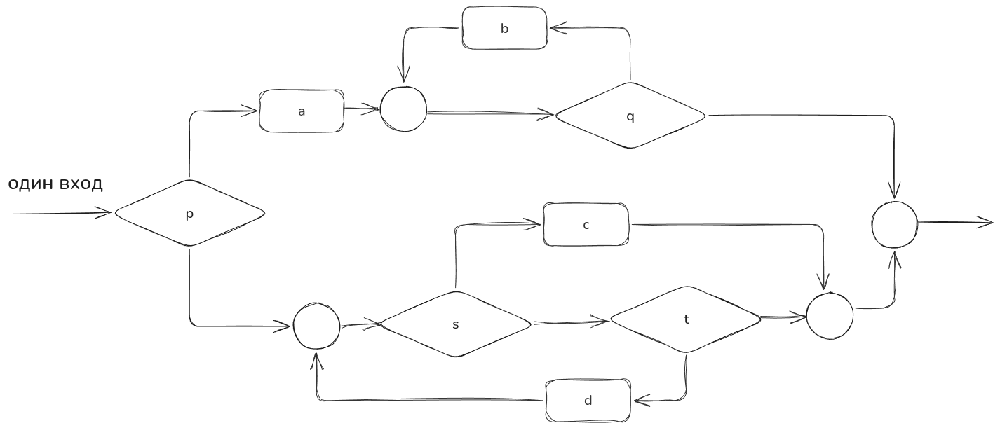
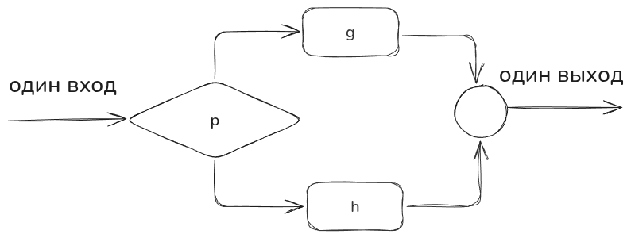
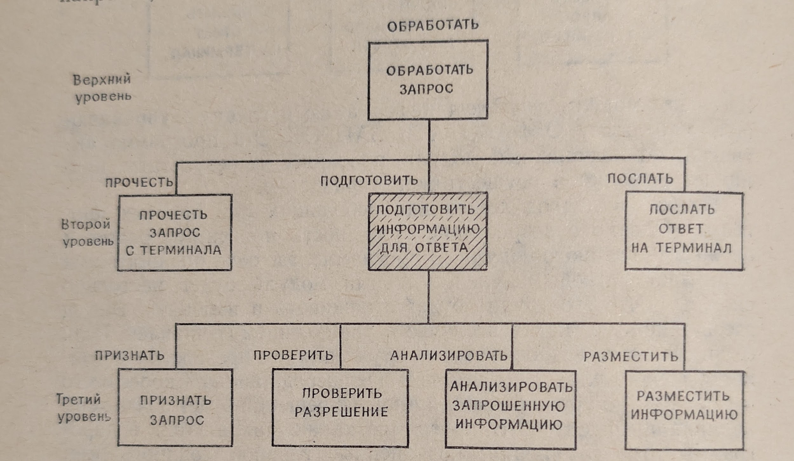
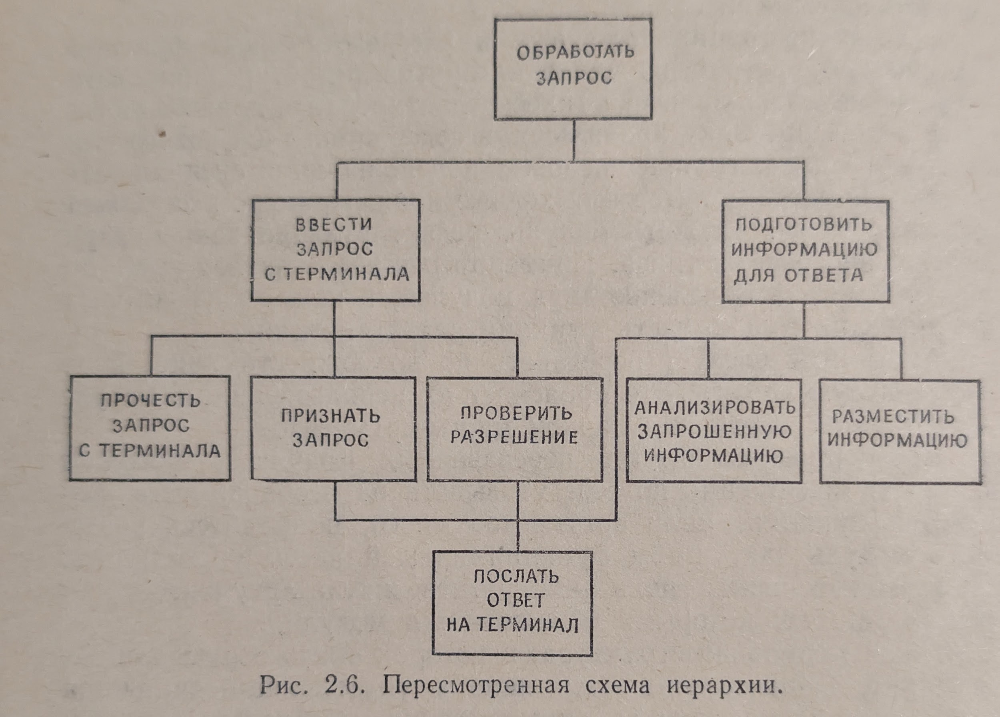
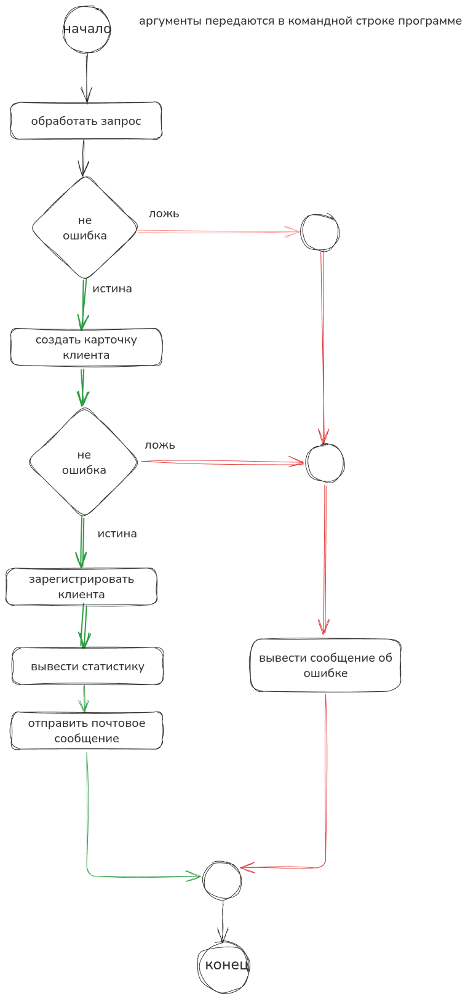

# Модульность программы

> *«Всё не так легко, как кажется...»*
>
> — Закон Мерфи

## Введение

Здоровый интерес к структурному программированию может быть как проявлением постепенного осознания правоты Мерфи, так и наступлением определенной зрелости в вычислительном деле. Структурное программирование возникло именно из-за того, что «все сложно, тянется дольше и стоит дороже, чем ожидалось». Нисходящая разработка призвана уменьшить сложность программы и дать возможность закончить ее вовремя. Если «что-то портится», то предлагаются средства, которые помогают обнаружить такие места как можно раньше и оставить достаточно времени на их устранение.

Нисходящая разработка (top-down design) может применяться на всех фазах проектирования системы, включая как проектирование программ этой системы, так и проектирование модулей для этих программ.

<!-- more -->

В этой главе рассмотрим:

- [Что такое Модуль](#chto-takoe-modul)
- [Свойства Модулей](#svoystva-moduley)
- [Схему иерархий модулей](#shema-ierarhiy-moduley)
- [Нисходящее проектирование](#niskhodyashchee-proektirovanie)
- [Вертикальное управление](#vertikalnoe-upravlenie)

## Система регистрации клиента

На рисунке



показана система регистрации клиента, включающая программы регистрации клиента в системе, подтверждения почты клиента, изменение почты, программа отправки почтовых сообщений.

На этом рисунке верхний прямоугольник не обозначает никакой программы. Это просто имя системы, но можно считать и так, что этот прямоугольник обозначает инструкцию для исполнения программы и всю остальную документацию (лэндинг системы).

Каждая из программ этой системы решает свою часть большой задачи. Некоторые из этих программ могут быть сложны, поскольку должны уметь многое делать.

Я выбрал специально простой пример, но близкий к реальности.

Например, программа регистрации клиента делает как минимум следующее:

1. Обрабатывает запрос на регистрацию
2. Создает учетную запись клиента
3. Сохраняет учетную запись клиента
4. Отправляет на адрес электронной почты письмо, для проверки и активации электронной почты

Подобные программы легче проектировать и реализовать, если их в свою очередь разделить на модули. Тогда программа, решающая большую задачу, состоит из одного или нескольких модулей и является подсистемой.

## Что такое Модуль {#chto-takoe-modul}

**Модуль** — это последовательность логически связанных фрагментов, оформленных как отдельная часть программы (подпрограмма).

Понятие модульности фундаментально. Модульное программирование возникло еще в начале 60-х годов. Оно характеризуется следующими преимуществами:

1. Большую программу могут писать одновременно несколько исполнителей — это позволяет раньше окончить работу.

2. Можно создавать библиотеки наиболее употребительных подпрограмм.

3. Возникает много естественных контрольных точек для наблюдения за продвижением проекта.

4. Облегчается более полное тестирование благодаря модульного и компонентного тестирования.

5. Проще проектирование и последующие изменения программы.

**Из этих пяти преимуществ последние три особо существенны для организаций, которым трудно вовремя создавать хорошо проверенные программы. Важность последнего пункта особенно возросла в связи с тем, что стоимость сопровождения и модификации программ составляет значительную часть общих расходов на обработку данных.**

Наряду с этими преимуществами имеются и некоторые недостатки, которые могут привести к возрастанию стоимости программы.

1. Может увеличиться время исполнения программы (монолитную систему делим на микросервисы).

2. Может возрасти размер требуемых ресурсов для запуска программы.

3. Может увеличиться время сборки и установки обновлений.

4. Проблемы организации межмодульного взаимодействия могут оказаться довольно сложными.

В 2025-м году эти недостатки невелики и обычно окупаются сокращением стоимости разработки и сопровождения.

Предлагаю на блок-схемах посмотреть как программу можно делить на подпрограммы и разберемся, что такое простая программа.

## Простая программа и уровни абстракции в блок-схемах

Простая программа — это программа с управляющей структурой, обладающей следующими особенностями:

1. Имеется только один вход и один выход
2. Через каждый узел проходит путь от входа к выходу структуры

Важно, что простая программа конечна.

Второе свойство определяет недопустимые управляющие структуры, показанные на рисунках:





которые содержат либо недостижимые узлы, либо бесконечные циклы.

Простая программа может быть формально представлена (абстрагирована) в виде одного функционального узла. Функциональный узел обобщает суммарное действие операций и тестов простой программы, которую он представляет. Например, простая программа



может быть представлена в виде



где узел g является абстракцией простой программы, и узел h абстрагирует простую программу.

Полученная простая программа может быть затем сведена к единственному функциональному узлу.

И наоборот, любой функциональный узел программы может быть расширен без оказания влияния на другие части программы.

Например, только что полученный функциональный узел может быть преобразован в следующую схему, которая после раскрытия узлов g и h принимает вид соответствующей детализации.

Части программ, которые сами являются простыми программами, называют простыми подпрограммами.

Примером таких подпрограмм являются подпрограммы g, h, a, b, c, d программы k.

Предикаты p, q, s, t не относятся к простым подпрограммам, так как каждый из них имеет два выхода.

Надеюсь, стало понятней как можно абстрагировать модули в блок-схемах от общего к частному и обратно.

Далее предлагаю изучить материал о свойствах модулей и лучше понять, что такое модуль, чтобы позднее применить эту теорию к разложению нашей программы Регистрации Клиента на модули.

Посмотреть как эти свойства прекрасно ложатся на парадигму Объектно Ориентированного Программирования.

## Свойства модулей {#svoystva-moduley}

В этой главе речь идет о том, как проектировать программу т. е. как разбивать ее на составляющие модули нисходящим (top-down design) способом. Однако прежде, чем об этом говорить, нужно дать читателю четкое представление о том, что такое модуль. Начнем с перечисления некоторых его желательных свойств.

1. Модуль возникает в результате раздельной компиляции (или является частью результата совместной компиляции — функция, класс). Он может активизироваться операционной системой (библиотеки, модули ядра) или быть подпрограммой, вызываемой другим модулем (микросервис).

2. На внутренность модуля можно ссылаться с помощью имени, называемого именем модуля.

3. Модуль должен возвращать управление тому, кто его вызвал.

4. Модуль может обращаться к другим модулям.

5. **Модуль должен иметь один вход и один выход.** Иногда программа с несколькими входами может оказаться короче и занимать меньше места в памяти. Однако изучение опыта организаций, применяющих модульное программирование, показало, что пользователи предпочитают иметь несколько похожих модулей, но не использовать несколько входов или выходов в одном модуле. Объясняют они это тем, что единственность входа и выхода гарантирует замкнутость модуля и упрощает сопровождение программ.

6. **Модуль сравнительно невелик.** В обзоре, упомянутом в предыдущем абзаце, отмечается, что модули содержат от 20 до 2000 предложений. Однако модули, состоящие из более чем нескольких сотен строк, встречаются сравнительно редко. Обычно в них менее 200 строк или даже менее одной двух страниц исполняемого текста на входном языке.

   *«Использование небольших модулей имеет определенные преимущества. Обнаружено, что небольшие модули позволяют строить такие программы, которые легче изменить, такие модули чаще используются, они облегчают оценку в управление разработкой, легче и качественнее тестируются, их можно рекомендовать и достаточно опытным, и неопытным программистам. С другой стороны, небольшие модули дольше проектируются, требуют большего числа связей, медленнее работают, состоят все вместе из большего числа предложений исходного текста, требуют большей документации, их написание может быть менее приятным для программиста».*

7. Модуль не должен сохранять историю своих вызовов для управления своим функционированием.

8. **Модуль обладает единственной функцией:** это вполне определенное преобразование исходных данных в результат, осуществляемое в процессе исполнения данного модуля. В этом должны состоять все изменения, происходящие от момента входа в модуль до момента завершения его работы. **В идеале каждый модуль должен реализовать только одну функцию, причем целиком.**

   **Концепция "один модуль — одна функция" служит ключом к хорошо спроектированным программам.**

   Другими словами, модуль — это элемент программы, выполняющий самостоятельную задачу. Его функция может быть выражена одной фразой. Вот примеры таких функций:
   - Редактировать запрос
   - Загрузить главный файл
   - Вычислить недельный заработок
   - Вычислить среднее число перемещений за девять месяцев
   - Сгенерировать отчет о состоянии запасов

Таким образом, при проектировании программы нужно сначала определить необходимый набор функций, а затем разработать модули программы.

Например, программа Регистрация клиента в рассматриваемой системе могла бы состоять из следующих основных модулей.

1. Модуль обработки запроса
2. Модуль создания карточки клиента
3. Модуль регистрации клиента
4. Модуль оповещения по электронной почте

На рисунке приведены функции каждого модуля, а также связь между этими модулями. В этом примере головной модуль, определенный общей функцией программы, активизирует по мере необходимости другие модули.



Здесь предполагается, что головной модуль работает в условиях, когда выполнены начальные требования для программы Регистрация клиента (система регистрации клиента запущена и доступна, например СУБД или другая система персистенции).

Конечно, каждый из изображенных на рисунке модулей также может требовать специфических начальных условий. Важно понять, что на этом этапе проектирования не нужно думать о том, как выполняет свою функцию каждый модуль. Мы не занимаемся пока логикой программы. Важно лишь то, что вызывающий модуль (т. е. головной модуль на рисунке) рассматривает вызываемый модуль как **«черный ящик»**.

**Черный ящик характеризуется только своим именем и результатами работы. Черный ящик можно использовать, ничего не зная о его устройстве.**

На рисунке "Регистрация Клиента" каждый модуль выполняет единственную функцию. Например, головной модуль получает запрос на регистрацию, передает в модуль обработки запроса, подготавливает карточку клиента и порождает регистрацию клиента. Конечно, этот модуль должен обращаться за помощью к другим модулям.

Модульность, основанная на точном соответствии функциям, особенно выгодна тем, что позволяет получать модули, применимые где угодно. Например, модуль **Подготовки карточки клиента** можно использовать в других системах управления клиентами (но не обязательно), поскольку здесь обрабатываются записи того же формата. Такая модульность хороша еще и тем, что модули легче проверять.

**Поскольку функция — это определенное преобразование входной информации в выходную,** то вход и выход известны уже тогда, когда становится ясно, что именно такой модуль необходим в данной программе. После его изготовления остается только убедиться, что для заданного набора входных данных получаются именно требуемые результаты.

### Ограничение сложности модуля

Если логика реализации отдельных функций становится очень запутанной, сложность модуля растет. Но модули применяются именно затем, чтобы ограничить сложность. Конечно, требование, чтобы модуль реализовал только одну функцию, лишь первый шаг в этом направлении. Другие способы ограничить сложность модуля состоят в том, чтобы ограничить:

1. количество предложений в тексте модуля,
2. размер оперативной памяти,
3. число ветвлений в программе,
4. число возможных путей через модуль,
5. время разработки модуля.

Может применяться одно или сразу несколько из этих ограничений. Стоит отметить, что само по себе ограничение лишь размеров программы не позволяет отделить длинные, но простые фрагменты от коротких, но запутанных.

Здесь нужно остановиться. Мы научились в теории.

Предлагаю отдельно сконцентрировать внимание на очень важной теме — правильности проектирования программ, модулей, функций, классов.

## Нисходящее проектирование программ (top-down design) {#niskhodyashchee-proektirovanie}

Нисходящее проектирование программ основано на идее уровней абстракции, которые становятся уровнями модулей в создаваемой программе. Фрост определяет абстрагирование как процесс «обобщения, при котором внимание концентрируется на сходстве явлений и предметов, и они объединяются в группы на основе этого сходства, давая тем самым нужную абстракцию». Например, абстракция "готовые счета" полезна для тех, кто хочет работать без использования таких понятий, как накладные, чеки, платежи или списки покупателей. Термины «накладные» и др. являются более низкими уровнями абстракции.

### Схема иерархий модулей {#shema-ierarhiy-moduley}

Уровни абстракции определяют уровни модулей в программе. На этапе проектирования строится схема иерархии, изображающая эти уровни. По внешнему виду она напоминает организационную схему. Их логическое сходство усиливается тем, что схема иерархии отражает функции и взаимодействие модулей. Каждый прямоугольник в ней изображает функцию или модуль.

От блок-схемы схема иерархии отличается тем, что не показывает логику принятия решения или точный порядок исполнения. Например, блок-схема головного модуля описывает алгоритм работы головного модуля.

С другой стороны, схема иерархии описывает лишь функции и их взаимосвязь в программе. Проявлена группировка функций, отсутствующая на блок-схеме.

Каждая функция выделена в самостоятельный модуль, и все они являются детализацией более общего ведущего модуля Регистрация Клиента.

**Блок-схема показывает алгоритм процедуры, схема иерархии — функцию.**

Схема иерархии позволяет программисту сначала сконцентрировать внимание на определения того, что нужно сделать в программе, а лишь затем решать, как это нужно делать. Она хороша также тем, что явно группирует взаимосвязанные функции — это ключ к проектированию хороших программ.

### Разработка схемы иерархии модулей

Чтобы создать схему иерархии, т. е. спроектировать структуру модулей, следует начать с вершины и идти вниз. (Отсюда и термин «нисходящее проектирование» top-down design) Нужно, чтобы один модуль в программе управлял выполнением остальных модулей, подобно тому как президент компании управляет служащими фирмы.

Рассмотрим, например, диалоговую банковскую систему, в которой с АТМ терминала вводятся запросы о состоянии счетов вкладчиков. Примерами могут быть запросы о текущем остатке, наибольшем и наименьшем остатках за месяц, размере последнего вклада.

В схеме иерархии для программы обработки этих запросов прежде всего могла бы появиться самая общая функция.

Затем появляются модули, необходимые для идентификации и детализации общей функции. Могли бы, скажем, возникнуть следующие три дополнительные функции:

Здесь все модули передают информацию в главную управляющую программу ОБРАБОТАТЬ ЗАПРОС. Эта программа активизирует подчиненные модули, проверяет их результаты, принимает решения и осуществляет управление.

Подобный подход хорош для небольших или простых программ. Однако с возрастанием сложности программы растет и сложность главного модуля. В программе, где одна подпрограмма управляет сотней модулей, главный модуль будет настолько сложным, что его трудно будет отлаживать и изменять. Выход здесь такой же, как и в случае с управлением компанией. Если ее численность возросла до ста служащих, то президенту становится трудно управлять ими всеми непосредственно. Скорее всего часть работ по управлению и принятию решений будет возложена на вице-президентов. В программе также появляются подпрограммы второго уровня, подчиненные главной подпрограмме. Эти подпрограммы будут осуществлять некоторые функции управления и принятия решений. В этом случае структура модуля становится иерархической.

1-й вице Президент компании по ИТ может распределять обязанности между вице-президентами многими способами. Одним из способов разделения обязанностей между тремя людьми может быть такой:

- 1-й вице-президент управляет всеми служащими, кто разрабатывает платформу DevOps
- 2-й вице-президент управляет всеми служащими, кто разрабатывает кредитные продукты
- 3-й вице-президент управляет всеми служащими, кто разрабатывает дополнительные продукты, которые не связаны с кредитами, а являются комплементарными.

Подобным образом и в программе подпрограммы второго уровня — это ее основные функциональные подразделы. Эти модули затем также могут быть разделены на подчиненные модули.

Возвращаясь к нашему примеру, приведем расширение модуля Подготовить на рисунке. (Имена модулей приведены вне прямоугольников.)

Схемы иерархии не показывают потока данных, порядка исполнения или моментов и частоты активизации каждого модуля. Расположение модулей на заданном уровне не определяет порядок их исполнения. Обычно люди стремятся мыслить «слева направо», и нет ничего плохого в расположении прямоугольников именно так. Во всяком случае в этом примере незачем было умышленно располагать их в другом порядке. Однако, читая схему иерархии, не следует предполагать, что модули всегда будут исполняться слева направо. Управление частотой и порядком выполнения скрыто внутри прямоугольников и не показано на схеме.

Предположим, например, что при чтении запроса с терминала обнаружена ошибка. Следующим будет активизирован не модуль подготовить, а модуль ПОСЛАТЬ, чтобы сообщить пользователю о допущенной ошибке. В этом случае средний модуль подготовить вообще не будет выполняться.

Однако если линии не показывают порядок выполнения, то что же они показывают? Они показывают **подчиненность** модулей.

**Каждый модуль активизируется вышестоящим и, закончив свою работу, возвращает управление вызвавшему модулю.** Таким образом, вызываемая подпрограмма подчинена вышестоящему модулю и подчиняет себе нижестоящие модули. Продолжая аналогию со схемой организации, можно сказать, что она получает «приказы» от «хозяина» и возвращает ему результат своей работы. При этом подпрограмма может до своего завершения активизировать один или несколько подчиненных модулей.

## Вертикальное управление {#vertikalnoe-upravlenie}

Передачи управления происходят лишь по вертикальным линиям, соединяющим модули в схеме иерархии. Это означает, что любой модуль может активизировать подчиненный модуль более низкого уровня и получить управление после завершения его работы. Такое вертикальное управление происходит по следующим правилам:

1. **Модуль должен возвращать управление тому, кто его вызвал.** Единственным исключением из этого правила может быть только обнаружение неисправимых ошибок, требующее немедленного завершения программы.

2. **Модуль может вызывать другой модуль уровнем ниже, он не может вызывать модуль своего уровня или выше.** (Однако он может вызывать сам себя — это случай рекурсивного программирования.) Подобные связи упрощают межмодульный обмен данными. Однако иногда возникает потребность активизировать модуль, расположенный несколькими уровнями ниже. Это разрешено, но в таком случае модуль должен быть указан в схеме несколько раз на соответствующих уровнях. Такие модули следует специально отмечать на схеме иерархии. Например, можно провести дополнительные вертикальные черточки. Конечно, программируется такой модуль только один раз.

3. **Принятие основных решений нужно выносить на максимально высокий уровень.** Обычно основные решения принимает головной модуль (на первом уровне). **Этот головной модуль служит кратким «конспектом» всей программы.**

4. **Модуль низшего уровня не должен принимать решения за модули высшего уровня.** Для иллюстрации обратимся снова к аналогии со схемой организации. Вряд ли мы стали бы думать, что служащий будет принимать решения, которым будут следовать его управляющий, управляющий его управляющего или другие подразделения. Скорее он получит указания своего управляющего и доложит, может ли он успешно их выполнить. Таким образом, модуль не должен производить действий, непосредственно изменяющих порядок работы программы.

   Он не должен, например, активизировать подпрограмму своего (или более высокого) уровня. Он не должен определять, какая подпрограмма должна выполняться следующей, передавая явный адрес (вызов функций, методов объектов) в программу уровнем выше или того же самого уровня. Независимо от того, что произошло при его выполнении, модуль должен всегда возвращать управление в активизировавший его модуль (т. е. в точку, откуда он был вызван). Модуль низшего уровня может передавать модулю высшего уровня характеристику полученных результатов или исследуемых условий. На основании этих данных модуль высшего уровня решает, что делать. Так, если модуль обнаруживает ошибку ввода, он передает сведения о ней в модуль высшего уровня, который и определяет, какой модуль (модули) вызвать.

Вертикальное управление обладает рядом преимуществ:

1. Логика программы становится понятнее.
2. При чтении головного модуля проявляется общая логика всей программы.
3. Программу проще изменять и пополнять.
4. Программирование и проверка вначале модулей высшего уровня, а затем низшего позволяет быстрее обнаруживать логические ошибки.

Модули нижнего уровня нужно детализировать только после определения всех подфункций модулей высшего уровня. Например, модуль Подготовить нужно делить только после выявления всех подфункций модуля ОБРАБОТАТЬ. Это помогает свести к минимуму пропуски или неполный анализ в функциях высшего уровня.

Каждый уровень прямоугольников в схеме иерархии представляет, как уже говорилось, некоторые модули. Например, несмотря на то что модуль ПОДГОТОВИТЬ был изменен за счет добавления четырех модулей более низкого уровня, он по-прежнему остался модулем, который будет в конце концов представлен некоторым фрагментом программы. В самом минимальном варианте этот модуль будет состоять лишь из активизаций соответствующих модулей третьего уровня.

### Оценка схемы иерархий

Разработчик схемы иерархии не может знать, представляет ли каждый прямоугольник достаточно обозримый фрагмент программы. Могут быть выделены такие подфункции, которые либо настолько велики, что требуют дальнейшего деления, либо настолько малы, что неразумно их реализовывать в виде модуля.

Вообще говоря, при разбиении на модули лучше сделать чуть больше требуемого, чем недостаточно продвинуться, так как объединять части функции совсем просто. Однако пропуск необходимых подфункций скорректировать позже очень трудно. Но даже такой пропуск не столь серьезен, как плохо определенные функции, составные функции и функции, оставшиеся рассредоточенными.

Для иллюстрации составных и рассредоточенных функций рассмотрим программирование алгоритма редактирования данных элементов записей. Такое редактирование должно включать в себя проверку правильности содержимого цифрового или литерного поля, границ числовых полей, наличия специальных литер или вставку литер в выходные поля. Примером составной функции может служить модуль, редактирующий записи двух совершенно разных типов. Примером рассредоточенной функции может служить выделение двух модулей, в каждом из которых реализована только часть функции редактирования.

Аргументы следует передавать по возможности явно, а не через общую память. Это проясняет их использование в модуле и заставляет иметь не слишком много аргументов.

Чрезмерное количество передаваемых модулю аргументов (данных) может само по себе указывать на необходимость разделения функции. Если аргументов много, попытайтесь разделить модуль так, чтобы функция каждой части упростилась. При этом основная цель — сократить число аргументов или общих данных, которыми обмениваются модули.

Такая модульная структура, в которой число общих данных невелико, данные передаются явно, а управление подчиняется указанным в предыдущем пункте правилам, обладает тем преимуществом, что становится проще тестирование каждого модуля. Это достигается за счет того, что результаты работы модуля становятся легче предсказуемыми.

Хейни отмечает, что разработчик обязан сделать все возможное для уменьшения взаимозависимости модулей, потому что, когда у них много общих данных, любое изменение становится проблемой. Он рассказывает, как в изготовленную его сотрудником операционную систему задумали внести 296 содержательных изменений, в результате чего потребовалось изменять почти 3000 мест в системе. Таким образом, при сильной зависимости модулей попытка внести даже небольшое количество изменений может привести к самому неожиданному результату. Решению этой потенциальной проблемы может способствовать такое проектирование функций, при котором сводится к минимуму число общих данных. Именно поэтому полезно стремиться передавать данные через список аргументов и разрешать непосредственно взаимодействовать только модулям, расположенным в схеме иерархии непосредственно один над (или под) другим (вертикально и лучше сверху вниз).

**Четкое разделение функций — это ключ к хорошим схемам иерархий,** однако этого не всегда можно добиться. Тогда необходимо идти на компромисс и делать реальный вариант схемы иерархии максимально близким к идеальному.

Процесс разделения на подфункции каждого последующего уровня схемы иерархии заканчивается, когда все модули полностью спроектированы и дальнейшее разделение может привести лишь к рассредоточению функций.

У проблемы разбиения на модули не существует единственного решения. Вполне допустимо вторично выделить в качестве модуля ту же функцию.

## Пример

В качестве примера применения рекомендаций и правил построения схемы иерархии рассмотрим задачу Регистрации Клиента в системе.

### Вспомним наше задание

**Описание задачи**

**Процесс регистрация пользователя (данные храним в памяти)**

Написать консольное приложение, которое решает одну задачу:

**Добавляет информацию о клиенте**

На вход в качестве аргументов поступают данные:
- ФИО
- email
- статус
  - подтвержден email
  - не подтвержден email (программа устанавливает по-умолчанию)
- дата рождения
  - можно добавить только 18+ клиента

### Разбиваем программу на подпрограммы

Учимся выделять в модули функции, которые делают четко одну задачу и делают ее хорошо.

Код состоит из 219 строк

[https://git.codemonsters.team/guides/correctness-program/-/blob/feature/02-structured-programming/src/main/java/team/codemonsters/App.java?ref_type=heads](https://git.codemonsters.team/guides/correctness-program/-/blob/feature/02-structured-programming/src/main/java/team/codemonsters/App.java?ref_type=heads)

Модуль это последовательность логически связанных фрагментов, оформленных как отдельная часть программы (подпоограмма)

````java
package team.codemonsters;

import java.time.LocalDate;
import java.time.Period;
import java.time.format.DateTimeFormatter;
import java.util.ArrayList;
import java.util.List;

// Класс-контейнер для хранения данных о клиенте
class Client {
    String fullName;
    String email;
    boolean isEmailConfirmed;
    String birthDate;

    Client(String fullName, String email, boolean emailConfirmationStatus, String birthDate) {
        this.fullName = fullName;
        this.email = email;
        this.isEmailConfirmed = emailConfirmationStatus;
        this.birthDate = birthDate;
    }
}

public class App {

    public static void main(String[] args) {
        System.out.println(getGreeting());
        // Инициализация хранилища клиентов в памяти
        List<Client> clients = new ArrayList<>();

        // Проверка количества аргументов
        if (args.length < 5) {
            System.out.println("Ошибка: недостаточно аргументов. Требуется: фамилия имя отчество email дата_рождения");
            return;
        }

        // Получение входных данных из аргументов командной строки
        String lastName = args[0];
        String firstName = args[1];
        String patronymic = args[2];
        String email = args[3];
        String birthDateString = args[4];

        // Валидация фамилии
        if (!isValidName(lastName, "фамилия")) {
            return;
        }

        // Валидация имени
        if (!isValidName(firstName, "имя")) {
            return;
        }

        // Валидация отчества
        if (!isValidName(patronymic, "отчество")) {
            return;
        }

        // Формирование полного имени
        String fullName = createFullName(lastName, firstName, patronymic);

        // Валидация email
        if (!isValidEmail(email)) {
            return;
        }

        // Статус подтверждения email по умолчанию
        boolean emailConfirmed = false;

        // Парсинг и валидация даты рождения
        LocalDate birthDate = parseBirthDate(birthDateString);
        if (!isValidBirthDate(birthDate)) {
            return;
        }

        // Вычисление возраста и проверка возрастного ограничения (18+)
        int age = calculateAge(birthDate);
        if (!isAdult(age)) {
            return;
        }

        // Все проверки пройдены - создание и регистрация клиента
        Client client = new Client(fullName, email, emailConfirmed, birthDateString);
        registerClient(clients, client);

        // Вывод статистики
        printStatistics(clients);
    }

    public static String getGreeting() {
        return "Введите через пробел: фамилия имя отчество email дату_рождения(dd.MM.yyyy)";
    }

    /**
     * Формирование полного имени из компонентов
     * @param lastName фамилия
     * @param firstName имя
     * @param patronymic отчество
     * @return полное имя в формате "Фамилия Имя Отчество"
     */
    private static String createFullName(String lastName, String firstName, String patronymic) {
        return lastName + " " + firstName + " " + patronymic;
    }

    /**
     * Валидация имени (фамилия, имя, отчество)
     * @param name проверяемое имя
     * @param fieldName тип поля для информативного сообщения об ошибке
     * @return true если валидно, false если нет
     */
    private static boolean isValidName(String name, String fieldName) {
        if (name == null || name.trim().isEmpty()) {
            System.out.println("Ошибка: " + fieldName + " не может быть пустым");
            return false;
        }
        if (!name.matches("^[А-Я][а-яА-Я\\-]*$")) {
            System.out.println("Ошибка: " + fieldName + " должно содержать только кириллицу и начинаться с заглавной буквы");
            return false;
        }
        return true;
    }

    /**
     * Валидация email адреса
     * @param email проверяемый email
     * @return true если валидно, false если нет
     */
    private static boolean isValidEmail(String email) {
        if (email == null || email.trim().isEmpty()) {
            System.out.println("Ошибка: email не может быть пустым");
            return false;
        }
        if (!email.matches("^[a-zA-Z0-9._%+-]+@[a-zA-Z0-9.-]+\\.[a-zA-Z]{2,}$")) {
            System.out.println("Ошибка: некорректный формат email");
            return false;
        }
        return true;
    }

    /**
     * Парсинг строки даты рождения в LocalDate
     * @param birthDateString строка с датой в формате dd.MM.yyyy
     * @return LocalDate или null если парсинг не удался
     */
    private static LocalDate parseBirthDate(String birthDateString) {
        if (birthDateString == null || birthDateString.trim().isEmpty()) {
            System.out.println("Ошибка: дата рождения не может быть пустой");
            return null;
        }

        DateTimeFormatter formatter = DateTimeFormatter.ofPattern("dd.MM.yyyy");
        try {
            return LocalDate.parse(birthDateString, formatter);
        } catch (Exception e) {
            System.out.println("Ошибка: некорректный формат даты рождения. Используйте формат dd.MM.yyyy");
            return null;
        }
    }

    /**
     * Валидация даты рождения (не в будущем)
     * @param birthDate дата рождения
     * @return true если валидна, false если нет
     */
    private static boolean isValidBirthDate(LocalDate birthDate) {
        if (birthDate == null) {
            return false;
        }

        LocalDate currentDate = LocalDate.now();
        if (birthDate.isAfter(currentDate)) {
            System.out.println("Ошибка: дата рождения не может быть в будущем");
            return false;
        }

        return true;
    }

    /**
     * Вычисление возраста по дате рождения
     * @param birthDate дата рождения
     * @return возраст в годах
     */
    private static int calculateAge(LocalDate birthDate) {
        return Period.between(birthDate, LocalDate.now()).getYears();
    }

    /**
     * Проверка возрастного ограничения 18+
     * @param age возраст
     * @return true если клиент совершеннолетний, false иначе
     */
    private static boolean isAdult(int age) {
        if (age < 18) {
            System.out.println("Регистрация отклонена: клиент младше 18 лет");
            return false;
        }
        return true;
    }

    /**
     * Регистрация клиента в системе
     * @param clients список клиентов
     * @param client клиент для регистрации
     */
    private static void registerClient(List<Client> clients, Client client) {
        clients.add(client);
        System.out.println("Клиент успешно зарегистрирован: " + client.fullName);
    }

    /**
     * Вывод статистики зарегистрированных клиентов
     * @param clients список клиентов
     */
    private static void printStatistics(List<Client> clients) {
        System.out.println("Всего зарегистрировано клиентов: " + clients.size());
    }

}
````

### Проектируем схему иерархий модулей нисходящим способом

Посмотрим на задачу в общем.

Например, программа Регистрация клиента в рассматриваемой системе могла бы состоять из следующих основных модулей:

1. Модуль обработки запроса
2. Модуль создания карточки клиента
3. Модуль регистрации клиента
4. Модуль оповещения по электронной почте

На рисунке приведены функции каждого модуля, а также связь между этими модулями. В этом примере головной модуль, определенный общей функцией программы, активизирует по мере необходимости другие модули.



### Проектируем блок-схему головного модуля


### Реализуем на Java модульную программу

Код программы:

[https://git.codemonsters.team/guides/correctness-program/-/blob/feature/02-structured-programming-02-errors-exception/src/main/java/team/codemonsters/App.java?ref_type=heads](https://git.codemonsters.team/guides/correctness-program/-/blob/feature/02-structured-programming-02-errors-exception/src/main/java/team/codemonsters/App.java?ref_type=heads)

Итоговый результат: код программы структурирован на лаконичные модули.

```java
package team.codemonsters;

import java.time.Clock;
import java.time.LocalDate;
import java.time.Period;
import java.time.format.DateTimeFormatter;
import java.time.format.DateTimeParseException;
import java.util.ArrayList;
import java.util.List;

// Класс-контейнер для хранения данных о клиенте
record Client(String fullName, String email, boolean isEmailConfirmed, LocalDate birthDate) {
}

// Класс-контейнер для хранения невалидированных данных запроса
record Request(String lastName, String firstName, String patronymic, String email, String birthDateString) {
}

// Базовое исключение для ошибок валидации
class ValidationException extends IllegalArgumentException {
    ValidationException(String message) {
        super(message);
    }
}

public class App {

    // Константы для валидации
    private static final String DATE_FORMAT = "dd.MM.yyyy";
    private static final String NAME_PATTERN = "^[А-Я][а-яА-Я\\-]*$";
    private static final String EMAIL_PATTERN = "^[a-zA-Z0-9._%+-]+@[a-zA-Z0-9.-]+\\.[a-zA-Z]{2,}$";

    public static void main(String[] args) {
        System.out.println(getGreeting());
        // Передача управления головному модулю регистрации
        processClientRegistration(args);
    }

    /**
     * Головной модуль регистрации клиента
     * Координирует весь процесс: парсинг запроса, валидацию, создание и регистрацию клиента
     * @param args аргументы командной строки
     */
    private static void processClientRegistration(String[] args) {
        // Инициализация хранилища клиентов в памяти
        List<Client> clients = new ArrayList<>();

        try {
            // Обработка аргументов командной строки в невалидированную структуру Request
            Request request = processRequest(args);

            // Создание валидированного Client из Request
            Client client = createClient(request, Clock.systemUTC());

            // Регистрация клиента
            registerClient(clients, client);

            // Вывод статистики
            printStatistics(clients);
        } catch (ValidationException e) {
            // Обработка ошибок валидации
            printError(e.getMessage());
        }
    }

    public static String getGreeting() {
        return "Введите через пробел: фамилия имя отчество email дату_рождения(" + DATE_FORMAT + ")";
    }

    /**
     * Модуль обработки аргументов командной строки в структуру Request
     * Выполняет базовую проверку количества аргументов и создает невалидированный объект Request
     * @param args аргументы командной строки
     * @return объект Request с невалидированными данными
     * @throws ValidationException если недостаточно аргументов
     */
    private static Request processRequest(String[] args) {
        // Проверка количества аргументов
        if (args.length < 5) {
            throw new ValidationException("Ошибка: недостаточно аргументов. Требуется: фамилия имя отчество email дата_рождения");
        }

        // Получение входных данных из аргументов командной строки
        String lastName = args[0];
        String firstName = args[1];
        String patronymic = args[2];
        String email = args[3];
        String birthDateString = args[4];

        // Создание невалидированного объекта Request
        return new Request(lastName, firstName, patronymic, email, birthDateString);
    }
    
    /**
     * Модуль создания валидированного Client из невалидированного Request
     * Выполняет валидацию всех полей Request и создает объект Client
     * @param request невалидированный запрос с данными клиента
     * @param clock часы для получения текущей даты (для тестируемости)
     * @return объект Client
     * @throws ValidationException если валидация не прошла
     */
    private static Client createClient(Request request, Clock clock) {
        // Формирование и валидация полного имени
        String fullName = createFullName(request.lastName(), request.firstName(), request.patronymic());

        // Валидация email
        String validEmail = createValidEmail(request.email());

        // Статус подтверждения email по умолчанию
        boolean emailConfirmed = false;

        // Парсинг и валидация даты рождения с учетом всех ограничений
        LocalDate validBirthDate = createValidClientBirthDate(request.birthDateString(), clock);

        // Все проверки пройдены - создание клиента
        return new Client(fullName, validEmail, emailConfirmed, validBirthDate);
    }

    /**
     * Модуль вывода сообщений об ошибках
     * Централизованный вывод всех ошибок валидации и регистрации
     * @param errorMessage сообщение об ошибке
     */
    private static void printError(String errorMessage) {
        System.out.println(errorMessage);
    }

    /**
     * Модуль формирования полного имени из компонентов
     * Выполняет валидацию всех компонентов ФИО и формирует полное имя
     * @param lastName фамилия
     * @param firstName имя
     * @param patronymic отчество
     * @return полное имя в формате "Фамилия Имя Отчество"
     * @throws ValidationException если валидация не прошла
     */
    private static String createFullName(String lastName, String firstName, String patronymic) {
        // Валидация фамилии, имени и отчества
        String validLastName = validateName(lastName, "фамилия");
        String validFirstName = validateName(firstName, "имя");
        String validPatronymic = validateName(patronymic, "отчество");

        // Все компоненты валидны - формирование полного имени
        return validLastName + " " + validFirstName + " " + validPatronymic;
    }

    /**
     * Модуль парсинга даты рождения в допустимую дату рождения клиента с учетом ограничений
     * Выполняет парсинг, проверку формата, проверку что дата не в будущем и проверку возраста 18+
     * @param birthDateString строка с датой в формате dd.MM.yyyy
     * @param clock часы для получения текущей даты (для тестируемости)
     * @return LocalDate если все проверки прошли успешно
     * @throws ValidationException если любая из проверок не прошла
     */
    private static LocalDate createValidClientBirthDate(String birthDateString, Clock clock) {
        // Парсинг даты
        LocalDate birthDate = parseBirthDate(birthDateString);

        // Проверка что дата не в будущем
        LocalDate validBirthDate = validateBirthDateNotInFuture(birthDate, clock);

        // Проверка возрастного ограничения 18+
        int age = calculateAge(validBirthDate, clock);
        validateAgeIsAdult(age);

        return validBirthDate;
    }

    /**
     * Валидация имени (фамилия, имя, отчество)
     * @param name проверяемое имя
     * @param fieldName тип поля для информативного сообщения об ошибке
     * @return валидированное имя
     * @throws ValidationException если валидация не прошла
     */
    static String validateName(String name, String fieldName) {
        if (name == null || name.trim().isEmpty()) {
            throw new ValidationException("Ошибка: " + fieldName + " не может быть пустым");
        }
        if (!name.matches(NAME_PATTERN)) {
            throw new ValidationException("Ошибка: " + fieldName + " должно содержать только кириллицу и начинаться с заглавной буквы");
        }
        return name;
    }

    /**
     * Валидация email адреса
     * @param email проверяемый email
     * @return валидированный email
     * @throws ValidationException если валидация не прошла
     */
    static String createValidEmail(String email) {
        if (email == null || email.trim().isEmpty()) {
            throw new ValidationException("Ошибка: email не может быть пустым");
        }
        if (!email.matches(EMAIL_PATTERN)) {
            throw new ValidationException("Ошибка: некорректный формат email");
        }
        return email;
    }

    /**
     * Парсинг строки даты рождения в LocalDate
     * @param birthDateString строка с датой в формате dd.MM.yyyy
     * @return LocalDate
     * @throws ValidationException если парсинг не удался
     */
    static LocalDate parseBirthDate(String birthDateString) {
        if (birthDateString == null || birthDateString.trim().isEmpty()) {
            throw new ValidationException("Ошибка: дата рождения не может быть пустой");
        }

        DateTimeFormatter formatter = DateTimeFormatter.ofPattern(DATE_FORMAT);
        try {
            return LocalDate.parse(birthDateString, formatter);
        } catch (DateTimeParseException e) {
            throw new ValidationException("Ошибка: некорректный формат даты рождения. Используйте формат " + DATE_FORMAT);
        }
    }

    /**
     * Валидация даты рождения (не в будущем)
     * @param birthDate дата рождения
     * @param clock часы для получения текущей даты (для тестируемости)
     * @return валидированная дата рождения
     * @throws ValidationException если валидация не прошла
     */
    static LocalDate validateBirthDateNotInFuture(LocalDate birthDate, Clock clock) {
        LocalDate currentDate = LocalDate.now(clock);
        if (birthDate.isAfter(currentDate)) {
            throw new ValidationException("Ошибка: дата рождения не может быть в будущем");
        }
        return birthDate;
    }

    /**
     * Вычисление возраста по дате рождения
     * @param birthDate дата рождения
     * @param clock часы для получения текущей даты (для тестируемости)
     * @return возраст в годах
     */
    static int calculateAge(LocalDate birthDate, Clock clock) {
        return Period.between(birthDate, LocalDate.now(clock)).getYears();
    }

    /**
     * Валидация возраста (проверка возрастного ограничения 18+)
     * @param age возраст
     * @return валидированный возраст
     * @throws ValidationException если клиент младше 18 лет
     */
    static int validateAgeIsAdult(int age) {
        if (age < 18) {
            throw new ValidationException("Регистрация отклонена: клиент младше 18 лет");
        }
        return age;
    }

    /**
     * Регистрация клиента в системе
     * @param clients список клиентов
     * @param client клиент для регистрации
     */
    private static void registerClient(List<Client> clients, Client client) {
        clients.add(client);
        System.out.println("Клиент успешно зарегистрирован: " + client.fullName());
    }

    /**
     * Вывод статистики зарегистрированных клиентов
     * @param clients список клиентов
     */
    private static void printStatistics(List<Client> clients) {
        System.out.println("Всего зарегистрировано клиентов: " + clients.size());
    }

}
```

## Памятка кодописца

Выпишу ключевые требования к модулям, которые важно использовать при проектировании программы. Дальше мы посмотрим как эти требования прекрасно применимы к ООП.

**Модуль** возникает в результате раздельной компиляции (или является частью результата совместной компиляции: модуль есть функция, процедура, класс). Он может активизироваться операционной системой (библиотеки, модули ядра) или быть подпрограммой, вызываемой другим модулем (микросервис).

**Модуль** — это последовательность логически связанных фрагментов, оформленных как отдельная часть программы (подпрограмма)

### Требования к модулям {#trebovaniya-k-modulyam}

- Модуль может быть библиотекой, модулем ядра операционной системы, быть подпрограммой (процедура, класс, функция). На более высоком уровне абстракции может быть сервисом, который вызывает другой сервис в распределенной программе.
- Модуль должен иметь один вход и один выход
- Модуль должен возвращать управление тому, кто его вызвал
- Модуль может вызывать другой модуль уровнем ниже, он не может вызывать модуль своего уровня или выше
- Каждый модуль активизируется вышестоящим и, закончив свою работу, возвращает управление вызвавшему модулю. Таким образом, вызываемая подпрограмма подчинена вышестоящему модулю и подчиняет себе нижестоящие модули.
- Принятие основных решений нужно выносить на максимально высокий уровень. Обычно основные решения принимает головной модуль (на первом уровне). Этот головной модуль служит краткой «инструкцией» всей программы.
- Модуль низшего уровня не должен принимать решения за модули высшего уровня.
- Модуль сравнительно невелик.
- Модуль обладает единственной функцией: это вполне определенное преобразование исходных данных в результат, осуществляемое в процессе исполнения данного модуля. Модуль делает одну задачу и делает ее хорошо.
- Модуль не должен сохранять историю своих вызовов для управления своим функционированием
- Вызывающий модуль (например: головной модуль) рассматривает вызываемый модуль как «черный ящик»
- Опиши контракт взаимодействия для каждого модуля (структуру, которая поступает на вход в модуль, структура, которую возвращает модуль в качестве ответа)
- Необходимо стремиться к одному аргументу на вход у модуля
- Примени проверку диапазонов значений в модулях для гарантий правильности программы

### Делай раз

Используй нисходящее проектирование для структурирования программы

### Делай два

Опиши схему иерархий модулей для своей задачи

### Делай три

Опиши блок-схему головного модуля

### Делай четыре

Реализуй программу

### Делай пять

Примени [**требования к модулям**](#требования-к-модулям) для проверки своих модулей

### Делай шесть

Опиши на Языке Программирования модуль за модулем с модульными тестами

### Делай семь

Головной модуль протестируй компонентными тестом

## Что же такое правильная программа? Можно ли доказать правильность программы?

Для того, чтобы получить ответ на этот вопрос, в следующей части обратимся к трудам отцов основателей дисциплины программирования.

## Источники

1. STRUCTURED PROGRAMMING: THEORY AND PRACTICE (RICHARD C. LINGER, HARLAN D. MILLS, BERNARD I. WITT)
2. A DISCIPLINE OF PROGRAMMING (EDSGER W. DIJKSTRA)
3. SYSTEMATIC PROGRAMMING. AN INTRODUCTION. (NIKLAUS WIRTH)
4. A STRUCTURED APPROACH TO PROGRAMMING (JOAN K. HUGHES. Data Processing Consultant, JAY I. MICHTOM. IBM Systems Science Institute)

