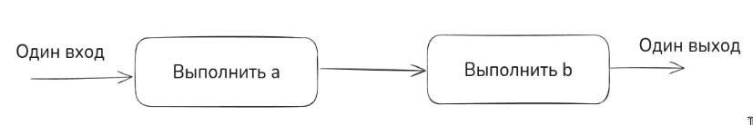
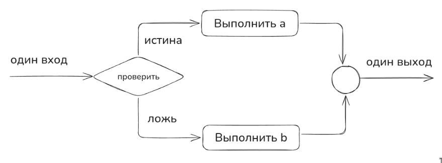
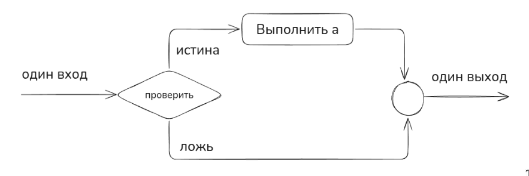
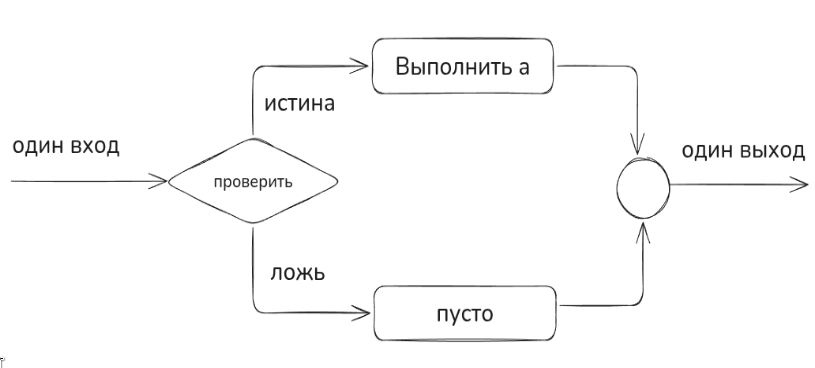
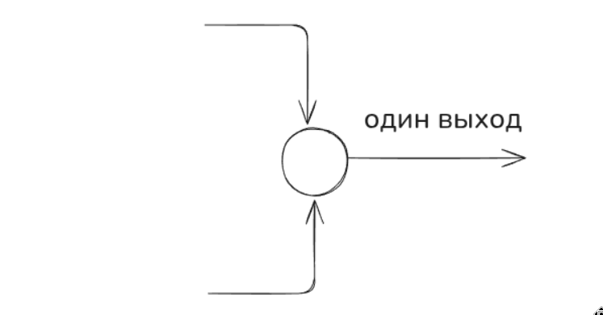
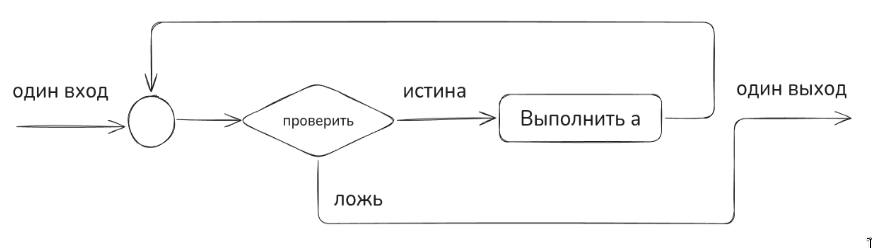
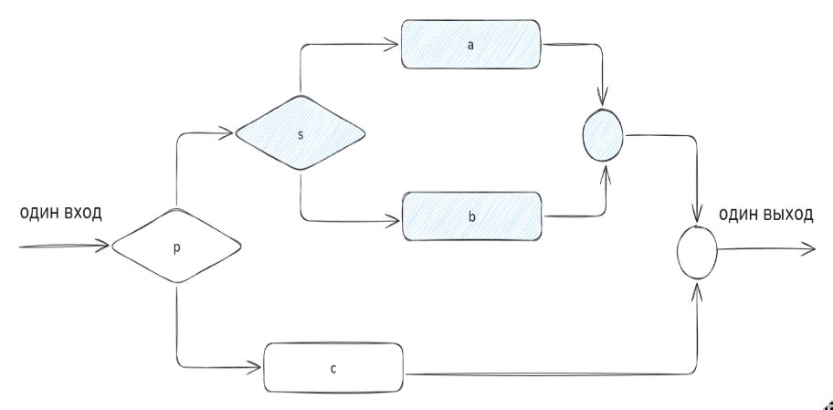
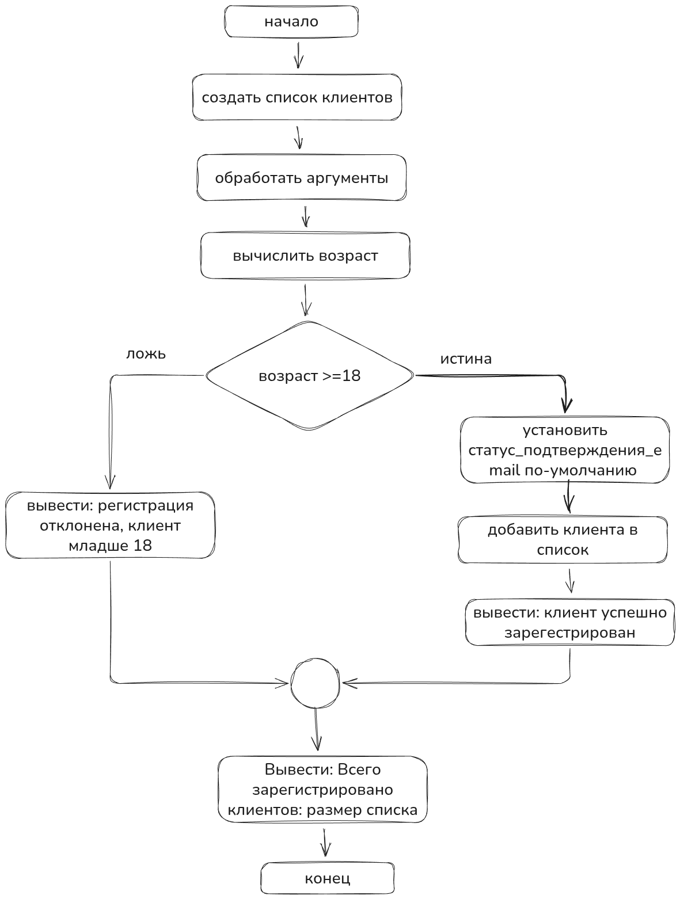

# Структурирование программ

> *Программы не люди, а ошибки не микробы программа не может нахвататься ошибок, общаясь с другими дефектными программами. Ошибки всегда допускают программисты.*
>
> — Харлан Милла (Harlan Mills)

## Введение

По-моему, программирование с изначальными тестами — одна из самых эффективных методик разработки ПО, возникших в 90-х. Но это не панацея, потому что такой подход тоже страдает от общих ограничений тестирования (описаны ниже), выполняемого разработчиками. Что мы сделаем — рассмотрим доказательства правильности программ от отцов-основателей из IBM и других авторов, которые описывали структурное программирование в (70,80)-х годах. Увидим, что надежное ПО — это хорошо спроектированное ПО.

**Хорошо спроектированное ПО — это правильно структурированное ПО.**

**Правильно структурированное ПО** — ПО, модули (классы) которого отвечают требованиям (описаны в Характеристики Модулей).

Модули спроектированы с верификацией диапазонов значений входных (антецедент) и выходных (консеквент) данных с проверочными тестами. Не все может быть сразу понятно — это нормально, далее будет раскрыт каждый пункт.
<!-- more -->

## Мифы тестирования

Если у программиста спросить, какой из этапов разработки ПО менее всего похож на другие, он наверняка ответит «Тестирование». По ряду описанных ниже причин большинство разработчиков испытывают при тестировании затруднения.

Тестирование — важная часть любой программы контроля качества, а зачастую и единственная. Это печально, так как разнообразные методики совместной разработки помогают находить больше ошибок, чем тестирование, и в то же время обходятся более чем вдвое дешевле в расчете на одну обнаруженную ошибку (Card, 1987; Buell 1991; Kaplan, 1995). Каждый из отдельных этапов тестирования (юнит-тестирование, тестирование компонентов и системное тестирование) обычно позволяет найти менее 50% ошибок. Комбинация этапов тестирования часто приводит к обнаружению менее 60% ошибок (Jones, 1998).

Цель тестирования противоположна целям других этапов разработки. Его целью является нахождение ошибок. Успешным считается тест, нарушающий работу ПО. Все остальные этапы разработки направлены на предотвращение ошибок и недопущение нарушения работы программы.

**Тестирование никогда не доказывает отсутствия ошибок.** Если вы тщательно протестировали программу и обнаружили тысячи ошибок, значит ли это, что вы нашли все ошибки или в программе все еще остались тысячи других ошибок? Отсутствие ошибок может указывать как на безупречность программы, так и на неэффективность или неполноту тестов.

**Тестирование не повышает качества ПО** — оно указывает на качество программы, но не влияет на него. Стремление повысить качество ПО за счет увеличения объема тестирования подобно попытке снижения веса путем более частого взвешивания. То, что вы ели, прежде чем встать на весы, определяет, сколько вы будете весить, а использованные вами методики разработки ПО определяют, сколько ошибок вы обнаружите при тестировании. Если вы хотите снизить вес, нет смысла покупать новые весы — измените вместо этого свой рацион. **Если вы хотите улучшить ПО, вы должны не тестировать больше, а программировать лучше.**

Тестирование требует, чтобы вы рассчитывали найти ошибки в своем коде. В противном случае вы, вероятно, на самом деле их не найдете, но это будет всего лишь самоисполняющимся пророчеством. Если вы запускаете программу в надежде, что она не содержит ошибок, их будет слишком легко не заметить. В исследовании, которое уже стало классическим, Гленфорд Майерс попросил группу опытных программистов протестировать программу, содержащую 15 известных дефектов. В среднем программисты нашли лишь 5 из 15 ошибок. Лучший программист обнаружил только 9. Главной причиной неэффективного обнаружения ошибок было **недостаточно внимательное изучение ошибочных выходных данных**. Ошибки были видны, но программисты их не заметили (Myers, 1978).

Вы должны надеяться обнаружить ошибки в своем коде. Это может казаться неестественным, но вам нужно найти свои ошибки самому. Нужно проверять себя, корректировать и оттачивать мастерство.

Следующие разделы включают методы и математическое доказательство корректности программы, которое мы успешно упакуем в скромный, но крайне ценный вывод и применим на практике при разработке бизнес-приложения.

**Важно отметить, что в последующих разделах будет сделано три важных вывода для инженеров:**

1. Экспериментальное тестирование программ может служить для доказательства наличия ошибок, но никогда не докажет их отсутствия. От количества тестов не зависит качество ПО.

2. Если вы хотите улучшить качество ПО, вы должны не тестировать больше, а проектировать лучше.

3. Проектировать лучше — значит структурировать программу на модули с верификацией каждого модуля путем верификации диапазонов значений входных (антецедент) и выходных (консеквент) данных.

## Методы разработки правильных программ

С современным программированием тесно связаны старый миф и новая реальность. Миф утверждает, что при составлении программ ошибки неизбежны и программирование есть не что иное, как процесс проб и ошибок. Реальность же выдвигает требование научиться последовательно проектировать и писать такие программы, которые были бы правильными с самого начала и не содержали ошибок на этапах тестирования и последующей эксплуатации.

Пользуясь практическими принципами и методами структурного программирования, можно научиться не только создавать правильные программы, но и доказывать их правильность, причем не экспериментальную, а путем логических рассуждений. При этом программа обычно выполняется правильно с первого испытания. У профессионального программиста ошибки в логической структуре программы крайне редки, что объясняется активной ролью профессионалов в процессе разработки программы. Объективно программам не присущи ошибки, если только последние не являются следствием влияния ошибок в смежных программах. Следовательно, ошибки в программы могут вноситься только их разработчиками.

Существует простое объяснение необходимости писать программы, которые заведомо не имеют ошибок. Оно заключается в том, что путем тестирования никогда нельзя установить отсутствие ошибок в программе. Дело в том, что невозможно определенно утверждать, что при проверке найдена последняя ошибка в программе; следовательно, никогда нельзя быть уверенным, что может быть найдена и первая ошибка. В конце концов, уверенность в правильности некоторой программы основана на доверии к творческому процессу ее создания. С каждой ошибкой, обнаруженной при проверке и эксплуатации программы, эта уверенность уменьшается. Даже если найдена действительно последняя ошибка, оставшаяся в программе, нельзя быть полностью убежденным в том, что она последняя.

Таким образом, требования реальности состоят в том, чтобы **обычные программисты с заурядными способностями смогли научиться писать программы, которые с самого начала не содержали бы ошибок**.

Важно отметить, что на этапе MVP, прототипирования целесообразно, как говорится, накидать тестовый образец, чтобы он просто работал. И если образец соответствует образу результата, который ожидает заказчик — можно доработать программу в соответствии с данной методикой.

## Структурированные программы и хороший проект

Структурированные программы следует писать таким образом, чтобы они легко читались и были понятны. На первый взгляд может показаться, что структурированную программу написать не намного труднее, чем неструктурированную. Но даже обычная программа требует гораздо больших усилий при чтении, чем при написании (включая чтение программы ее автором). В связи с этим мы будем уделять большое значение созданию удобочитаемых структурированных программ. Такие программы есть результат качественно выполненного проектирования и соответствующего стиля изложения.

Хороший проект означает, что найдено удачное решение задачи, которая часто бывает не полностью определена. В связи с этим проектирование обычно выполняется в два этапа: 1) правильно формулируется проблема и 2) отыскивается подходящее решение.

Существует не так много задач, которые достаточно изучены и универсальны, а потому могут быть легко сформулированы, например сортировка одномерного массива, вычисление суммы значений чисел списка и т. д.

Большинство задач требует тщательного формулирования как того, что должно быть сделано, так и способов, которыми этого нужно достичь. Например, формулировка задачи вычисления суммы чисел списка принимает один вид, если используется операция суммирования, другой вид, если прибегнуть к операции умножения, и третий вид, если воспользоваться только операциями над символами.

Структурированная программа сама по себе не является гарантией того, что разработка будет выполнена успешно. Структурное программирование только предоставляет возможность для успешного проектирования программ.

В хорошем проекте заложено решение задачи, не более сложное, чем сама задача, которую следует решить. **Составление проекта базируется на нахождении достаточно простых решений, а отнюдь не на примитивном мышлении.** Обычно хорош последний вариант разработки, но никак не первый. Известным примером чрезмерного усложнения задачи является попытка описать Солнечную систему как систему, вращающуюся вокруг Земли. Две тысячи лет человечество безуспешно пыталось решить эту неверно поставленную задачу, пока не догадалось поместить Солнце в центр системы. Это позволило существенно упростить формулировку задачи. Если лучшие умы человечества потратили тысячелетия, чтобы решить указанную проблему, то не следует сожалеть по поводу часа, израсходованного на тщательное обдумывание проекта программы.

**Хороший проект программы является результатом глубоких упрощений в сложной логике задания и ведет в конечном счете к сокращению трудоемкости разработки.** Возможно, например, сократить программу, состоящую из 500 операторов и имеющую определенный смысл, до программы, содержащей 100 операторов и наделенной тем же смыслом.

Хороший проект может позволить свести программу из 50 000 операторов, сложную для кодирования, к программе из 20 000 операторов, не содержащей ошибок.

Для того, чтобы хорошо проектировать — необходимо научиться структурировать программу.

Этим мы и займемся для начала. Важно отметить, что такой подход крайне полезен при проектировании программ с синтетическими ассистентами.

## Структурное программирование

**Структурное программирование** — это методология разработки программ, основанная на использовании трёх базовых **управляющих конструкций**: последовательности, ветвления (if-then-else) и циклов (while, for), с отказом от оператора безусловного перехода (goto).

### Ключевые принципы:

- Программа строится из вложенных блоков с одной точкой входа и одной точкой выхода
- Декомпозиция задач на подпрограммы (процедуры и функции)
- Нисходящее проектирование — от общего к частному
- Читаемость и понятность кода

Основоположник — Эдсгер Дейкстра (1968).

## Блок-схема программ

Блок-схема — это направленный граф, который указывает порядок выполнения операторов программы. Каждый оператор программы представляют как узел графа, а каждое возможное направление передачи управления как линию. Если узел имеет более одной выходящей линии, то соответствующий оператор является оператором управления. Если оператор управления при своем выполнении не воздействует на данные, то он является чистым оператором управления в противном случае выполнение оператора управления сопровождается побочным эффектом, изменяющим значения данных.

## Три базовые конструкции

Логическая структура программы может быть выражена комбинацией трех базовых структур. Здесь эти структуры вводятся для того, чтобы дать общее представление о них, предваряющее подробные описания. В применяемых для этого диаграммах прямоугольник изображает оператор или функцию (например, оператор READ или подпрограмму извлечения квадратного корня), ромб изображает проверку, а кружок — слияние двух или более путей.

### Следование (функциональный узел, функция)

Это самая важная из структур; она означает, что два действия должны быть выполнены друг за другом.



Эти прямоугольники могут представлять как один-единственный оператор типа READ или PUT, так и множество операторов, необходимых для выполнения сложных вычислений (функция, метод).

### Развилка (предикатный узел, предикат)

Эта структура, называемая также «ЕСЛИ-ТО-ИНАЧЕ», обеспечивает выбор между двумя альтернативами. Делается проверка и затем выбирается один из путей.



Каждый из путей (альтернатива ТО, альтернатива ИНАЧЕ) ведет к общей точке слияния, так что обработка продолжается независимо от того, какой путь был выбран. Выбираемые пути могут помечаться метками истина/ложь, да/нет, вкл/выкл и т. п.

Может оказаться, что для одного из результатов проверки ничего предпринимать не надо. В этом случае можно применять только один обрабатывающий блок,



или можно указывать блок без действий и помечать его **пусто**.

### Узел слияния

Обозначение слияния. Символ слияния — это кружок, где соединяются пути управления.



В этом узле ничего не делается. Это просто соединение, как правило, с двумя входами и одним выходом. Обычно внутри узла слияния ничего не пишется.

### Цикл или повторение

Эта структура предусматривает повторное выполнение или циклическую деятельность, необходимую для большинства вычислительных программ. Она изображается следующим образом:



Управление через точку слияния попадает на проверку. Здесь вычисляется логическое выражение, если оно истинно, то изображенная обработка выполняется и выражение вычисляется снова. Такая итерационная деятельность продолжается до тех пор, пока проверяемое выражение истинно. Как только оно становится ложным, управление покидает эту структуру. Так как выражение, управляющее циклом, проверяется в самом начале (до выполнения какой-либо обработки), то проверяемое условие может сразу оказаться ложным, и в этом случае операторы обработки могут вообще не выполниться.

Операторы, представленные блоком обработки, должны изменять управляющую переменную, влияющую на проверку — иначе программа зациклится. Эта структура повторения могла бы включать много операторов (возможно, даже большую программу). Она называется ЦИКЛ-ПОКА и означает повторять (т.е. выполнять операторы обрабатывающего блока), пока указанное логическое выражение остается истинным.

Эти три структуры могут комбинироваться одна с другой, как того требует программа. Таким образом, где бы на диаграмме ни появился отдельный прямоугольник, он может быть заменен любой из базовых структур.



Таким образом, эти строительные блоки могут комбинироваться сколь угодно разнообразно для выражения логики любой программы. Хотя на наших рисунках программа выполняется слева направо, эти структуры можно нарисовать и так, что основное направление будет сверху вниз.

Используя только что определенные структуры, возможно (в зависимости от используемого языка программирования) писать программы без операторов GOTO. По этой причине структурное программирование иногда определяется как программирование без GOTO. Однако это слишком узкое определение, непригодное для некоторых языков программирования. Суть в том, что ликвидация операторов GOTO — лишь побочный продукт выражения логики программ с помощью только перечисленных выше структур.

## Вывод

Программист, использующий при проектировании и кодировании рассмотренные в этой главе базовые структуры, выигрывает втройне: программа становится понятней, повышается ее надежность и облегчается ее сопровождение. Пра овладения структурным подходом становится возможным программировать почти без ошибок. Необходимость в детальных блок-схемах для объяснения программ уменьшается или вообще отпадает. Сокращается время на документирование, так как сами программы становятся документами. Наконец уменьшаются затраты на содержание персонала, так как возрастает производительность.
(Тут хочется пошутить, да кому в корпорациях нужна эта производительность. Сидим и пилим келокод который даже машина не разберет. God safe the job.)

Структурный подход предполагает стиль работы, который поощряет или даже заставляет программистов по возможности откладывать детализацию. Каждая стадия разработки должна выполняться очень тщательно, кроме, возможно, самых ранних. К сожалению, в области программирования имеется тенденция поскорее перейти к кодированию, что объясняется тремя причинами:

1. Для многих программистов это наиболее интересная и захватывающая часть их работы.

2. Некоторые администраторы и руководители проектов считают, что сотрудники работают только тогда, когда они пишут конкретные команды.

3. Этапы кодирования (например, создание модуля ОТЧЕТ О СОСТОЯНИИ ЗАПАСОВ) хорошо определены, тогда как точные методы или какие-либо правила обдумывания проекта в целом и общего взаимодействия модулей отсутствуют.

И тем не менее, по словам Х. Милса, очень важно **«настойчиво сопротивляться кодированию»** для того, чтобы стадия разработки завершилась успешно.

Если ты работал в корпорациях, как я, можно смело сказать: "Кого это останавливало"

## Пример простой программы регистрации клиента

Формат текста без страниц поможет наглядно увидеть как разрастается сложность на учебном простом проекте. Если не управлять сложностью и не работать с фундаментальными принципами при проектировании, то это всегда приводит к усложнению решений и месиву из кода.

### Описание задачи

**Процесс регистрация пользователя (данные храним в памяти)**

Написать консольное приложение, которое решает одну задачу:

**Добавляет информацию о клиенте**

На вход в качестве аргументов поступают данные:
- ФИО
- email
- статус
  - подтвержден email
  - не подтвержден email (программа устанавливает по-умолчанию)
- дата рождения
- можно добавить только 18+ клиента

### Псевдокод описания алгоритма

Пишем псевдокод, как работает программа

```
НАЧАЛО программы

// Инициализация хранилища клиентов в памяти
СОЗДАТЬ список клиентов (пустой список для хранения данных о клиентах)

// Получение входных данных из аргументов командной строки
ПОЛУЧИТЬ аргументы: ФИО, email, дата_рождения

// Парсинг даты рождения
ПРЕОБРАЗОВАТЬ дата_рождения из строки в объект Дата

// Вычисление возраста клиента
ПОЛУЧИТЬ текущую_дату
ВЫЧИСЛИТЬ возраст = текущая_дата - дата_рождения (в годах)

// Проверка возрастного ограничения
ЕСЛИ возраст >= 18 ТО
  // Создание записи о клиенте
  УСТАНОВИТЬ статус_подтверждения_email в false (значение по-умолчанию)
  СОЗДАТЬ запись_клиента с данными: ФИО, email, статус_подтверждения_email,
    дата_рождения

  // Добавление клиента в хранилище
  ДОБАВИТЬ запись_клиента в список_клиентов

  // Вывод успешного результата
  ВЫВЕСТИ "Клиент успешно зарегистрирован: " + ФИО
ИНАЧЕ
  // Вывод сообщения об отказе
  ВЫВЕСТИ "Регистрация отклонена: клиент младше 18 лет"
КОНЕЦ ЕСЛИ

// Вывод информации о всех зарегистрированных клиентах
ВЫВЕСТИ "Всего зарегистрировано клиентов: " + размер(список_клиентов)

КОНЕЦ программы
```

### Лаконичный псевдокод в стиле unix pipe

Бизнес-процесс программы можно записать в упрощенном псевдокоде как последовательность команд в unix пайп стиле:

```
| Обработать запрос
| Создать карточку клиента
| Зарегистрировать клиента
| Вывести статистику
| Отправить почтовое сообщение

> Вывод сообщения об ошибке, которая возникла при выполнении операции
```

### Блок-схема



### Код

Реализуем на Java наше приложение просто, чтобы оно работало (straightforward) и выполняло описанный в блок-схеме алгоритм.

[https://git.codemonsters.team/guides/correctness-program/-/blob/feature/straightforward-00/src/main/java/team/codemonsters/App.java?ref_type=heads](https://git.codemonsters.team/guides/correctness-program/-/blob/feature/straightforward-00/src/main/java/team/codemonsters/App.java?ref_type=heads)

Получаем **75 строк кода**
```java
package team.codemonsters;

import java.time.LocalDate;
import java.time.Period;
import java.time.format.DateTimeFormatter;
import java.util.ArrayList;
import java.util.List;

// Класс-контейнер для хранения данных о клиенте
class Client {
    String fullName;
    String email;
    boolean emailConfirmationStatus;
    String birthDate;

    Client(String fullName, String email, boolean emailConfirmationStatus, String birthDate) {
        this.fullName = fullName;
        this.email = email;
        this.emailConfirmationStatus = emailConfirmationStatus;
        this.birthDate = birthDate;
    }
}

public class App {

    public static void main(String[] args) {
        System.out.println(getGreeting());
        // Инициализация хранилища клиентов в памяти
        List<Client> clients = new ArrayList<>();

        // Получение входных данных из аргументов командной строки
        String lastName = args[0];
        String firstName = args[1];
        String patronymic = args[2];
        String fullName = lastName + " " + firstName + " " + patronymic;
        String email = args[3];
        String birthDateString = args[4];

        // Статус подтверждения email по умолчанию
        boolean emailConfirmationStatus = false;

        // Парсинг даты рождения
        DateTimeFormatter formatter = DateTimeFormatter.ofPattern("dd.MM.yyyy");
        LocalDate birthDate = LocalDate.parse(birthDateString, formatter);

        // Вычисление возраста клиента
        LocalDate currentDate = LocalDate.now();
        int age = Period.between(birthDate, currentDate).getYears();

        // Проверка возрастного ограничения
        if (age >= 18) {
            // Создание объекта клиента
            Client client = new Client(fullName, email, emailConfirmationStatus, birthDateString);

            // Добавление клиента в хранилище
            clients.add(client);

            // Вывод успешного результата
            System.out.println("Клиент успешно зарегистрирован: " + fullName);
        } else {
            // Вывод сообщения об отказе
            System.out.println("Регистрация отклонена: клиент младше 18 лет");
        }

        // Вывод информации о всех зарегистрированных клиентах
        System.out.println("Всего зарегистрировано клиентов: " + clients.size());
    }

    public static String getGreeting() {
        return "Введите через пробел: фамилия имя отчество email дату_рождения(dd.MM.yyyy)";
    }
}
```
Приложение написано в лоб, работает.
Если мы начнем развивать приложение и дорабатывать полотно кода метода `main`, мы обязательно получим код, который в перспективе будет трудно читать, а значит поддерживать.
А это в свою очередь приведет к тому, что инженер тратит больше времени на погружение и доработку кода, а значит мы тратим на это больше времени организации (или своих, все зависит от ситуации).

### Добавить проверку входных данных

Обрати внимание, как разрастается кодовая база, если мы добавим в код проверку входных значений на принадлежность к диапазону допустимых значений.

**Что значит проверить данные на принадлежность к диапазону допустимых значений?**

В примере `String lastName = args[0];`

Формируем фамилию из аргументов командной строки. А именно из самого первого аргумента, который мы передаем (об этом говорит 0 индекс в массиве).

Мы задаем ограничения, что имя, фамилия и отчество должны состоять из кириллицы и начинаться с большой буквы.

```java
// Получение входных данных из аргументов командной строки
String lastName = args[0];

// Валидация фамилии: не пустая, кириллица, начинается с заглавной буквы
if (lastName == null || lastName.trim().isEmpty()) {
    System.out.println("Ошибка: фамилия не может быть пустой");
    return;
}
if (!lastName.matches("^[А-Я][а-яА-Я\\-]*$")) {
    System.out.println("Ошибка: фамилия должна содержать только кириллицу и " +
        "начинаться с заглавной буквы");
    return;
}
```

Если мы добавим проверку диапазонов допустимых значений на все наши данные, чтобы собрать корректную карточку клиента, то получим код приложения, который состоит из **140 строк**.

[https://git.codemonsters.team/guides/correctness-program/-/blob/feature/01-acceptable-values/src/main/java/team/codemonsters/App.java?ref_type=heads](https://git.codemonsters.team/guides/correctness-program/-/blob/feature/01-acceptable-values/src/main/java/team/codemonsters/App.java?ref_type=heads)

```java
package team.codemonsters;

import java.time.LocalDate;
import java.time.Period;
import java.time.format.DateTimeFormatter;
import java.util.ArrayList;
import java.util.List;

// Класс-контейнер для хранения данных о клиенте
class Client {
    String fullName;
    String email;
    boolean emailConfirmationStatus;
    String birthDate;

    Client(String fullName, String email, boolean emailConfirmationStatus, String birthDate) {
        this.fullName = fullName;
        this.email = email;
        this.emailConfirmationStatus = emailConfirmationStatus;
        this.birthDate = birthDate;
    }
}

public class App {

    public static void main(String[] args) {
        System.out.println(getGreeting());
        // Инициализация хранилища клиентов в памяти
        List<Client> clients = new ArrayList<>();

        // Проверка количества аргументов
        if (args.length < 5) {
            System.out.println("Ошибка: недостаточно аргументов. Требуется: фамилия имя отчество email дата_рождения");
            return;
        }

        // Получение входных данных из аргументов командной строки
        String lastName = args[0];
        String firstName = args[1];
        String patronymic = args[2];
        String email = args[3];
        String birthDateString = args[4];

        // Валидация фамилии: не пустая, кириллица, начинается с заглавной буквы
        if (lastName == null || lastName.trim().isEmpty()) {
            System.out.println("Ошибка: фамилия не может быть пустой");
            return;
        }
        if (!lastName.matches("^[А-Я][а-яА-Я\\-]*$")) {
            System.out.println("Ошибка: фамилия должна содержать только кириллицу и начинаться с заглавной буквы");
            return;
        }

        // Валидация имени: не пустое, кириллица, начинается с заглавной буквы
        if (firstName == null || firstName.trim().isEmpty()) {
            System.out.println("Ошибка: имя не может быть пустым");
            return;
        }
        if (!firstName.matches("^[А-Я][а-яА-Я\\-]*$")) {
            System.out.println("Ошибка: имя должно содержать только кириллицу и начинаться с заглавной буквы");
            return;
        }

        // Валидация отчества: не пустое, кириллица, начинается с заглавной буквы
        if (patronymic == null || patronymic.trim().isEmpty()) {
            System.out.println("Ошибка: отчество не может быть пустым");
            return;
        }
        if (!patronymic.matches("^[А-Я][а-яА-Я\\-]*$")) {
            System.out.println("Ошибка: отчество должно содержать только кириллицу и начинаться с заглавной буквы");
            return;
        }

        String fullName = lastName + " " + firstName + " " + patronymic;

        // Валидация email: проверка формата
        if (email == null || email.trim().isEmpty()) {
            System.out.println("Ошибка: email не может быть пустым");
            return;
        }
        if (!email.matches("^[a-zA-Z0-9._%+-]+@[a-zA-Z0-9.-]+\\.[a-zA-Z]{2,}$")) {
            System.out.println("Ошибка: некорректный формат email");
            return;
        }

        // Статус подтверждения email по умолчанию
        boolean emailConfirmationStatus = false;

        // Валидация даты рождения: не пустая
        if (birthDateString == null || birthDateString.trim().isEmpty()) {
            System.out.println("Ошибка: дата рождения не может быть пустой");
            return;
        }

        // Парсинг даты рождения с обработкой ошибок
        DateTimeFormatter formatter = DateTimeFormatter.ofPattern("dd.MM.yyyy");
        LocalDate birthDate;
        try {
            birthDate = LocalDate.parse(birthDateString, formatter);
        } catch (Exception e) {
            System.out.println("Ошибка: некорректный формат даты рождения. Используйте формат dd.MM.yyyy");
            return;
        }

        // Проверка, что дата рождения не в будущем
        LocalDate currentDate = LocalDate.now();
        if (birthDate.isAfter(currentDate)) {
            System.out.println("Ошибка: дата рождения не может быть в будущем");
            return;
        }

        // Вычисление возраста клиента
        int age = Period.between(birthDate, currentDate).getYears();

        // Проверка возрастного ограничения (18+)
        if (age < 18) {
            System.out.println("Регистрация отклонена: клиент младше 18 лет");
            return;
        }

        // Все проверки пройдены - создание объекта клиента
        Client client = new Client(fullName, email, emailConfirmationStatus, birthDateString);

        // Добавление клиента в хранилище
        clients.add(client);

        // Вывод успешного результата
        System.out.println("Клиент успешно зарегистрирован: " + fullName);

        // Вывод информации о всех зарегистрированных клиентах
        System.out.println("Всего зарегистрировано клиентов: " + clients.size());
    }

    public static String getGreeting() {
        return "Введите через пробел: фамилия имя отчество email дату_рождения(dd.MM.yyyy)";
    }
}
```
**Вывод:** при поддержке и развитии системы кодовая база разрастается быстро, читать такой код и понимать становится сложно из-за плохой структуры и ограничений нашего сознания. Количество строк кода имеет значение.

Мы плавно приходим к инструменту управления сложностью в программировании — к структурированию программы.

**Вирт:**

> Представление сложной программы в виде лишенной структуры линейной последовательности команд было самой неподходящей формой для человеческого восприятия и выражения. В дальнейшем мы покажем, что структуризация является принципиальным инструментом, помогающим программисту систематически синтезировать сложные программы, сохраняя полное о них представление.

### В следующей части нас ждет:

- Модульность
- Характеристики модуля
- Нисходящее проектирование
- Правильность программы
- Пример структурирования программы

## Источники

1. STRUCTURED RROGRAMMING: THEORY AND PRACTICE (RICHARD C. LINGER, HARLAN D. MILLS, BERNARD I. WITT)
2. A DISCIPLINE OF PROGRAMMING (EDSGER W. DIJKSTRA)
3. SYSTEMATIC PROGRAMMING. AN INTRODUCTION. (NIKLAUS WIRTH)
4. A STRUCTURED APPROACH TO PROGRAMMING (JOAN K. HUGHES. Data Processing Consultant, JAY I. MICHTOM. IBM Systems Science Institute)
